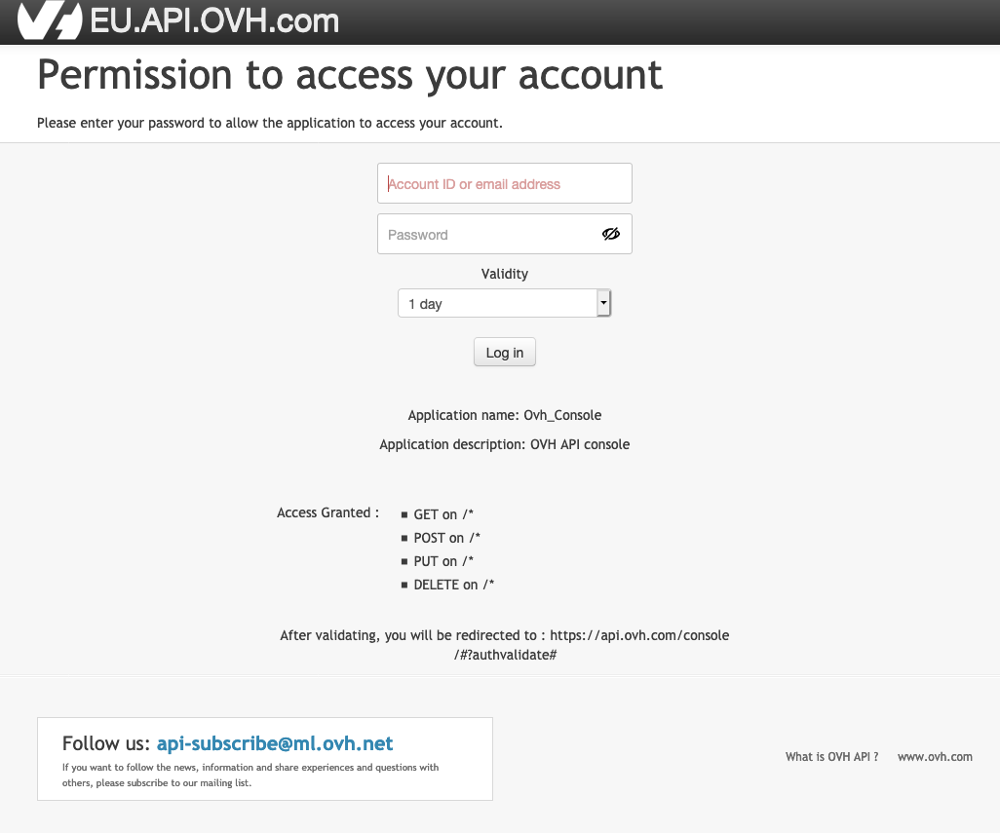
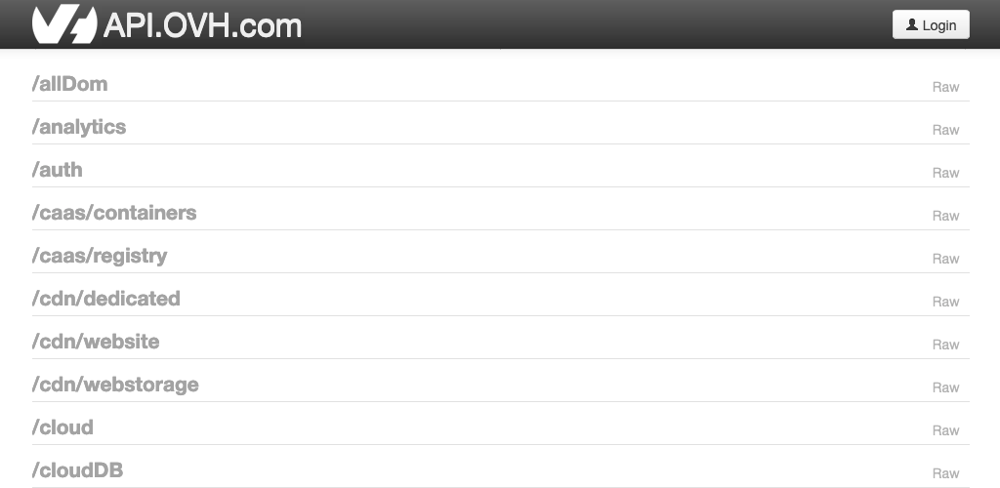
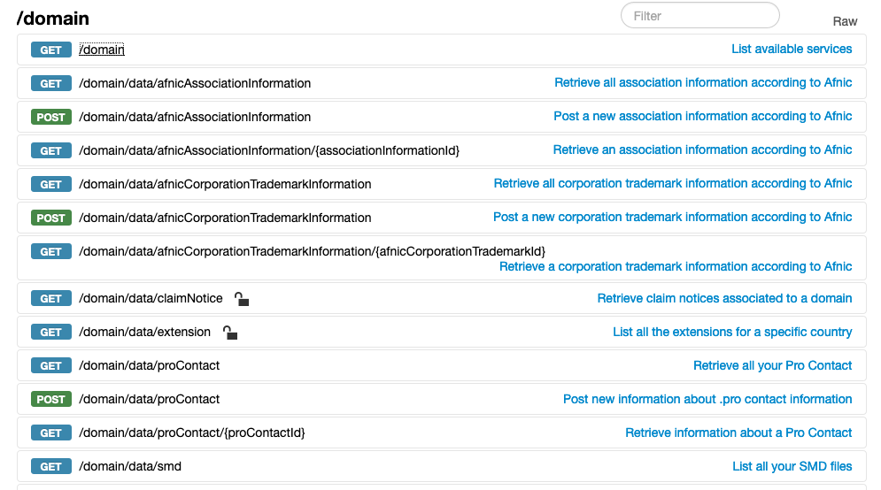
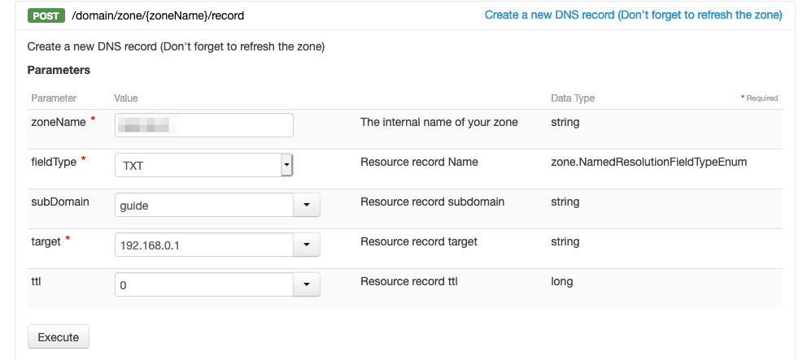

**Dernière mise à jour le 02/06/2020**

## Objectif

OVHcloud permet à ses clients, grâce à ses [API](https://api.ovh.com/){.external}, d'acheter, gérer, mettre à jour et configurer des produits OVHcloud sans utiliser l'interface graphique qu'est l'espace client.

**Découvrez comment utiliser les API OVHcloud mais aussi comment les coupler avec vos applications**

## Prérequis

- Disposer d'un compte OVHcloud actif et connaître ses identifiants.
- Être sur la page web des [API OVHcloud](https://api.ovh.com/){.external}.

## En pratique

### Utilisation simple

#### Se connecter aux API OVHcloud

Sur la page des [API OVHcloud](https://api.ovh.com/), cliquez sur `Explore the OVH API`{.action} pour afficher la liste des API. 

Pour utiliser les API sur vos produits, vous devez vous connecter sur ce site grâce à vos identifiants OVHcloud.

- Cliquez sur `Login`{.action} en haut à droite, 
- Saisissez vos identifiants OVHcloud. 
- Définissez une temporalité, sous la mention **Validity**, pendant laquelle vous autorisez les actions via les API OVHcloud.

{.thumbnail} 

> [!primary]
>
> Si votre compte OVHcloud est protégé par une [double authentification](../../customer/securiser-son-compte-avec-une-2FA/),  vous devrez également saisir le code généré par SMS ou application OTP ou clé U2F.
>

#### Explorer les produits disponibles sur les API

Une fois connecté, vous retrouvez la liste des produits OVHcloud disposant des API. Cette liste est classé par ordre alphabétique.

{.thumbnail} 

Pour afficher, par exemple, les API liées aux noms de domaine, cliquez sur **/domain** dans la liste.

Après avoir cliqué sur le produit, la liste des API de ce dernier s'affiche en dessous. 

{.thumbnail} 

#### Exécuter une API

Il existe 4 types d'API disponibles qui emploient ce que l'on appelle des verbes HTTP : 

**GET** 

La methode GET a pour but de récupérer les données d'une ressource.

Par exemple, pour récupérer la liste de vos noms de domaine, utilisez l'API suivante :
 
> [!api]
>
> @api {GET} /domain
>

**POST**

La méthode POST est utilisée pour envoyer des données supplémentaires vers la ressource. 

Par exemple, pour ajouter un enregistrement à votre zone DNS, utilisez l'API suivante :

> [!api]
>
> @api {POST} /domain/zone/{zoneName}/record
>

**PUT**

La méthode PUT sert à remplacer les données actuelles de la ressource par les données de la requête.

Par exemple, si vous vous êtes trompé dans un enregistrement de votre zone DNS, utilisez l'API suivante :

> [!api]
>
> @api {PUT} /domain/zone/{zoneName}/record/{id}
>

**DELETE**

La méthode DELETE est utilisée pour supprimer la ressource appelée.

Par exemple, si vous ne souhaitez finalement pas conserver l'enregistrement DNS que vous avez ajouté à votre zone DNS, utilisez l'API suivante :

> [!api]
>
> @api {DELETE}  /domain/zone/{zoneName}/record/{id}
>

Après avoir cliqué sur l'API de votre choix, la section **Parameters** permet d'attribuer les variables relatives à son application.
 
Par exemple, pour l'ajout d'un enregistrement TXT dans votre zone DNS, vous optiendrez les paramètres suivants :
 	
{.thumbnail} 
 
Une fois les paramètres définis, vous pouvez lancer l'API en cliquant sur `Execute`{.action}. 

L'onglet `Result` alord affiché vous donnera le rapport d'éxécution de l'API.

{.thumbnail} 

Les onglets `PHP` et `Python` contiennent les éléments à ajouter dans votre script en fonction du language utilisé.

### Utilisation avancée : coupler les API OVHcloud avec votre application

#### Créer vos identifiants

##### Créer les clés de votre application

L'authentification fait appel à deux clés. La première est la clé d'application. Toute application souhaitant communiquer avec l'API OVHcloud doit être déclarée à l'avance.

Cliquez sur le lien suivant : [https://eu.api.ovh.com/createApp/](https://eu.api.ovh.com/createApp/){.external},  entrez votre identifiant client, votre mot de passe et le nom de votre application. Le nom sera utile plus tard si vous voulez autoriser d'autres personnes à l'utiliser.

Vous obtiendrez deux clés :

- la clé d'application, appelée **AK,** par exemple:

```sh
7kbG7Bk7S9Nt7ZSV
```

- votre clé d'application secrète, appelée **AS**, par exemple:

```sh
EXEgWIz07P0HYwtQDs7cNIqCiQaWSuHF
```

##### Obtenir un token d'authentification OVHcloud

Une fois vos clés obtenues, vous devez à présent obtenir un token OVHcloud pour vous permettre d'interagir avec l'API. Pour ce faire, utilisez le lien suivant [https://eu.api.ovh.com/1.0/auth/credential](https://eu.api.ovh.com/1.0/auth/credential){.external} pour spécifier l'accès requis. 

Dans notre exemple, nous demandons un token OVHcloud en lecture seule pour l'ensemble des API.

Exemple en cURL :

```sh
$ curl -XPOST -H"X-Ovh-Application: 7kbG7Bk7S9Nt7ZSV" -H "Content-type: application/json" \
https://eu.api.ovh.com/1.0/auth/credential  -d '{
    "accessRules": [
        {
            "method": "GET",
            "path": "/*"
        }
    ],
    "redirection":"https://www.monsiteweb.com/"
}'
{"validationUrl":"https://eu.api.ovh.com/auth/?credentialToken=iQ1joJE0OmSPlUAoSw1IvAPWDeaD87ZM64HEDvYq77IKIxr4bIu6fU8OtrPQEeRh","consumerKey":"MtSwSrPpNjqfVSmJhLbPyr2i45lSwPU1","state":"pendingValidation"}
```

###### Connecter le token d'authentification à un compte OVHcloud

Dans la réponse obtenue, vous recevrez une URL de validation et une **consumerKey** (le token, appelé **CK**). Ce token n'est initialement lié à aucun client. Vous (ou un autre client) allez lier votre compte OVHcloud à ce token en vous connectant à l'aide de l'URL.

Cette étape vous permettra d'identifier tout client OVHcloud et d'obtenir des droits sur son compte. Cela peut être utile si vous voulez développer une application pour la communauté. Sinon, vous pouvez vous connecter directement sur la page.

Pour l'instant, ce token a une durée de vie illimitée (vous pouvez donc le placer dans vos scripts). Les tokens à durée de vie limitée seront proposés ultérieurement. Une fois l'utilisateur authentifié, il est automatiquement redirigé vers l'URL que vous avez renseignée lors de la création du jeton (*https://www.monsiteweb.com/* dans l'exemple ci-dessus).

#### Première utilisation de l'API

##### Signature des demandes d'API

Une fois vos trois clés obtenues (**AK**, **AS**, **CK**), vous pouvez signer les demandes d'API. La signature est calculée ainsi :

```sh
"$1$" + SHA1_HEX(AS+"+"+CK+"+"+METHOD+"+"+QUERY+"+"+BODY+"+"+TSTAMP)
```

Par exemple, si vous exécutez une commande GET sur l'adresse https://eu.api.ovh.com/1.0/domain/, la signature de « pre-hash » est la suivante :

```sh
EXEgWIz07P0HYwtQDs7cNIqCiQaWSuHF+MtSwSrPpNjqfVSmJhLbPyr2i45lSwPU1+GET+https://eu.api.ovh.com/1.0/domain/++1366560945
```

et « post-hash » :

```sh
$1$6a77f43f2871db97a029f1d1d81c4dcd3c6f7265
```

##### Gestion des horodatages

Vous pouvez constater que, dans le paragraphe précédent, la signature inclut l'horodatage actuel.

Afin de pouvoir fonctionner, même si votre machine n'est pas à jour, vous pouvez récupérer le « l'heure OVHcloud » en effectuant un **GET** sur l'URL suivante: <https://eu.api.ovh.com/1.0/auth/time>.

```sh
$ curl https://eu.api.ovh.com/1.0/auth/time
1366561236
```
Vous pouvez également calculer le décalage entre l'heure "OVHcloud" et l'horloge de votre système et l'appliquer aux signatures.


##### Exécution d'une demande

Une fois que vous avez la signature, vous pouvez faire la demande à l'API. Pour ce faire, ajoutez, dans l'en-tête de la demande, la clé d'application publique, le token, la date et la signature.

Exemple en cURL :

```sh
$ curl -H 'X-Ovh-Application:7kbG7Bk7S9Nt7ZSV'                   \
-H 'X-Ovh-Timestamp:1366560945'                                  \
-H 'X-Ovh-Signature:$1$6a77f43f2871db97a029f1d1d81c4dcd3c6f7265' \
-H 'X-Ovh-Consumer:MtSwSrPpNjqfVSmJhLbPyr2i45lSwPU1'             \
https://eu.api.ovh.com/1.0/domain/
["ovh.com","ovh.net"]
```

##### Wrappers API OVHcloud

Afin de simplifier le développement de vos applications, OVHcloud vous fournit des wrappers API dans plusieurs langages. Les utiliser vous permettra de ne pas vous préoccuper du calcul de la signature et de vous concentrer sur le développement de votre application.

- *Perl* : <https://eu.api.ovh.com/wrappers/OvhApi-perl-1.1.zip>
- *Python* : <https://github.com/ovh/python-ovh>
- *PHP* : <https://github.com/ovh/php-ovh>
- *Node.js* : <https://github.com/ovh/node-ovh>
- *Swift* : <https://github.com/ovh/swift-ovh>
- *C#* : <https://github.com/ovh/csharp-ovh>

## Aller plus loin

[Utilisation des API sur Private Cloud](../../private-cloud/connexion-a-l-api-ovh/)

[Comment gérer le compte d'un client OVHcloud via les API](https://docs.ovh.com/gb/en/api/api-rights-delegation/) (guide en anglais)

Échangez avec notre communauté d'utilisateurs sur [https://community.ovh.com](https://community.ovh.com).
