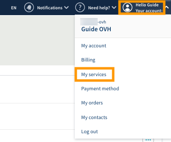
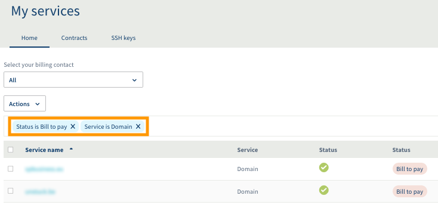
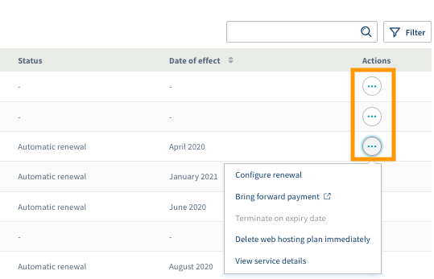
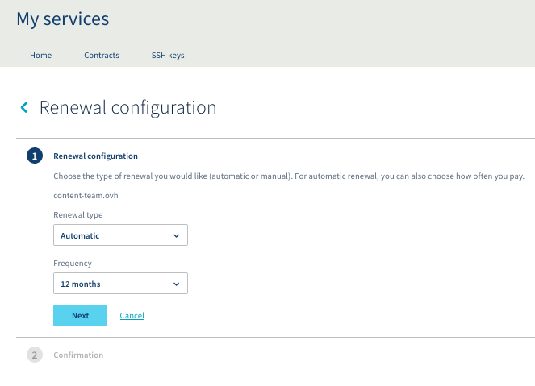

**letzter Stand 21.11.2019**

## Ziel

Sie können die Verlängerung und die Kündigung Ihrer Dienste in Ihrem Kunden Center verwalten

**Hier erfahren Sie, wie Sie im OVH Kunden Center die automatische Verlängerung Ihrer Dienste verwalten.**

> [!primary]
>
> Je nach Ihrem Wohnsitz, der örtlichen Gesetzgebung und auch den betreffenden Lösungen können manche Details dieses Leitfadens variieren oder in ihrem Fall nicht passend sein. Wenn Sie Zweifel haben konsultieren Sie Ihre OVHCloud-Verträge. Diese sind von Ihrem [Kunden Center](https://www.ovh.com/auth/?action=gotomanager){.external} aus verfügbar, in dem Sie auf  `Meine Dienstleistungen`{.action} und dann auf `Meine Verträge`{.action} gehen.
>

## Voraussetzungen

- Sie haben Zugriff auf Ihr [OVH Kunden Center](https://www.ovh.com/auth/?action=gotomanager){.external}.
- Sie haben aktive OVH Dienstleistungen.
- Sie sind in Fakturierungskontakt mit Ihren OVHCloud-Dienstleistungen

## In der Praxis:

Beim Kauf sind die von Ihnen bezogenen Dienstleistungen so , dass diese automatisch beim Ablaufdatum erneuert  werden; die Zahlung erfolgt durch die in Ihrem Kunden Center eingestellte Zahlungsart.  Sie können diese Dienstleistungen wenn Sie möchten in Ihrem Kunden Center kündigen, damit sie nicht nach Beendigung Ihrer Gültigkeitsdauer verlängert werden.

Aber es ist auch möglich, manche Produkte (Domäne, Beherbergungen, VPS, vorgesehene Server) mit „manueller“ Erneuerung einzustellen wenn Sie keine Erneuerungen und automatische Kontoeinzüge wünschen.

Folgen Sie dieser Anleitung nun entsprechend der von Ihnen gewünschten Aktionen: 

- [ Verlängerungsstatus Ihrer Dienste anzeigen  ](https://docs.ovh.com/de/billing/anleitung_zur_nutzung_der_automatischen_verlangerung_bei_ovh/){.external}Dieser Leitfaden hilft Ihnen zu überprüfen, ob Ihre Dienstleistungen automatisch verlängert werden. Er ermöglicht Ihnen auch die Abfrage der Daten bezüglich des Ablaufs und der Verlängerung.

- [Die Erneuerung Ihrer Dienstleistungen verwalten.](https://docs.ovh.com/de/billing/anleitung_zur_nutzung_der_automatischen_verlangerung_bei_ovh/){.external} Dieser Leitfaden hilft Ihnen, die automatische Erneuerung zu aktivieren oder zu deaktivieren, die Zahlungsfrequenz einer Dienstleistung zu ändern und auch Ihre Erneuerungen vor dem Ablauf zu bezahlen.

- [Ihre Zahlungsarten verwalten.](https://docs.ovh.com/gb/en/billing/manage-payment-methods/){.external} Dieser Leitfaden ermöglicht Ihnen, sich zu vergewissern, dass Sie über eine eingetragene Zahlungsart für die künftigen Erneuerungen verfügen. Sie können auch wenn notwendig Zahlungsarten hinzufügen oder löschen.

### Zur Einstellung Ihrer Dienstleistungen gelangen Sie wie folgt:

Loggen Sie sich in Ihr [Kunden Center](https://www.ovh.com/auth/?action=gotomanager){.external} ein. Klicken Sie oben rechts auf den zu Ihrer Kundenkennung gehörigen Namen und wählen Sie dann `Meine Dienste`{.action} aus.

{.thumbnail}

### Verlängerungsstatus Ihrer Dienste anzeigen

Die Seite „Meine Dienstleistungen“ enthält eine Tabelle zur Verwaltung Ihrer Dienstleistungen OVHCloud. Sie können deren Namen, die Dienstleistungsart, die Verfügbarkeit der Dienstleistung (ob Sie zum Beispiel aufgehoben ist), deren Status (Erneuerungsart, durchzuführende Aktion usw. ...) sowie das Datum der durchzuführenden Aktion wiederfinden.

{.thumbnail}

Sie können die Spalten auf- oder absteigend sortieren, das Suchfeld benutzen oder auch einen Filter anwenden, um nur manche Ihrer Dienstleistungen je nach Ihrer Wahl anzuzeigen.

{.thumbnail}

Ihre Filterkriterien sind dann über der Tabelle angezeigt. Hier finden Sie ein Beispiel eines Filters, der die Anzeige der Domänennamen ermöglicht, für die eine zu bezahlende Rechnung aussteht.

{.thumbnail}

### Die Erneuerung bei OVHCloud

#### **Automatische Verlängerung**

Standardmäßig sind bei Anmeldung Ihre Dienstleistungen mit en **automatischer Erneuerung eingestellt. Dieser Modus ermöglicht Ihnen sicherzugehen, dass Ihre Dienstleistungen bei Ablauf automatisch verlängert werden. Darüber hinaus werden sofern Sie in Ihrem Kundenkonto eine Zahlungsart eingetragen haben Ihre Rechnungen automatisch mit dieser eingezogen.

Wenn Sie keine Zahlungsart eingetragen haben wird Ihnen eine Rechnung per E Mail zugesandt. Sie brauchen die Rechnung dann lediglich online zu begleichen. 

Für Dienstleistungen, die eine automatische Erneuerungsfrequenz haben welche 1 Monat übersteigt (3 Monate, 6 Monate, 12 Monate), wird Ihnen im vorherigen Monat eine Erinnerung per E- Mail zugesandt welche die bald zu erneuernden Dienstleistungen zusammenfasst. 

Wenn Sie eine dieser Dienstleistungen nicht verlängern möchten dann genügt es diese in Ihrem Kunden Center zu kündigen.

#### **Die manuelle Erneuerung**

Sie können auch für manche OVH-Produkte (Domäne, Beherbergungen, VPS, vorgesehene Server) zur manuellen Erneuerung den Status **manuelle Erneuerung** definieren.  Dieser Erneuerungsmodus ist nützlich, wenn Sie nicht sicher sind, die Dienstleistung beim Ablauf behalten zu wollen oder wenn Sie nicht wünschen, dass Ihre Zahlungen automatisch mit der definierten Zahlungsart eingezogen werden. 

Wenn Sie diesen Modus wählen erhalten Sie vor Ablauf mehrere Mahnungen per E Mail, jede erhält einen Link welcher es ermöglicht die Dienstleistungen vor dem Ablauf zu erneuern. Sie können auch die Zahlung ganz einfach von Ihrem Kunden Center aus durchführen.

> [!warning]
>
>Wenn Sie keine Zahlung für eine Dienstleistung mit manueller Erneuerung durchführen wird diese am Ablaufdatum automatisch aufgehoben und nach ein paar Tagen gelöscht.
>
>Hierbei ist es wenn Sie die Beibehaltung dieser Dienstleistung nicht wünschen nicht notwendig deren Kündigung zu beantragen.
>

### Verlängerung verwalten

Auf der rechten Seite jeder Dienstleistung klicken Sie auf den Schalter `...`{.action} in der Spalte „Handlungen“, um die Verlängerungseinstellungen vorzunehmen. 

{.thumbnail}

> [!primary]
>
>Je nach Dienstleistung sind manche Aktionen nicht verfügbar was davon abhängt ob für diese manuelle Verlängerung möglich ist. 
>
 
#### **Die Verlängerung einstellen**

{.thumbnail}

Je nach der ausgewählten Dienstleistungen können Sie die manuelle Verlängerung einstellen oder die Periodizität der automatischen Verlängerung auswählen. Im vorliegenden Fall können Sie die Verlängerungsart wählen und auch dessen Frequenz.

{.thumbnail}

Entsprechend der getroffenen Wahl werden die künftigen Daten der Einzugsermächtigung, die Zahlungsart, die angewendet wird sowie auch das Ablaufdatum präzisiert werden.

#### **Verlängerung der Dienstleistung**

Diese Aktion wird nur für die Dienstleistungen vorgeschlagen, die für die manuelle Verlängerung eingestellt sind; hier werden Sie dann an eine  Benutzeroberfläche für Onlinezahlung weiter geleitet. Sie können diese Dienstleistungen jederzeit vor dem Ablauf erneuern und auch die Dauer ihrer Verlängerung wählen.

#### **die Zahlung antizipieren**

Diese Aktion wird nur für die Dienstleistungen vorgeschlagen für die automatische Verlängerung eingestellt sind; hier werden Sie dann an eine Benutzeroberfläche für Onlinezahlung weitergeleitet.  Sie können diese Dienstleistungen jederzeit vor dem Ablauf erneuern und auch die Dauer ihrer Verlängerung wählen. In diesem Fall wird die eingetragene Gültigkeitsdauer der laufenden Gültigkeitsdauer hinzugefügt. Sie verlieren die verbleibende Gültigkeitsdauer nicht.

#### **Bei Ablauf kündigen**

Diese Aktion wird für Dienstleistungen vorgeschlagen welche für automatische Verlängerung eingestellt sind. In dem Sie diese Aktion wählen, werden die automatische Verlängerung und die Zahlung per Lastschrift für die ausgewählte Dienstleistung deaktiviert.

#### **Meine Rechnung bezahlen**

Wenn Sie Dienstleistungen mit automatischer Verlängerung beziehen jedoch  keine Zahlungsart zur Begleichtung Ihrer Rechnungen eingetragen haben, wird eine Notiz „zu bezahlende Rechnung“ angezeigt wenn eine Rechnung auf ihre Bezahlung wartet.  Hierfür wählen Sie lediglich die Aktion `Meine Rechnung bezahlen `{.action} um zu einer Plattform für Onlinezahlung weiterleitet zu werden.

#### **Gruppierte Aktionen**

Sie können gruppierte Aktionen durchführen in dem Sie mehrere Dienstleistungen in der Tabelle auswählen und dann auf den Schalter `Aktionen`{.action} klicken.

{.thumbnail}

Die unten stehende Tabelle detailliert die möglichen gruppierten Aktionen.

|  Mögliche Aktion  |  Beschreibung  |
|  :-----          |  :-----          |
|  Verlängern |  Mehrere Dienstleistungen gleichzeitig verlängern. Sie werden auf eine Seite weitergeleitet, die es ermöglicht, die Dauer der gewünschten Verlängerung auszuwählen und eine Onlinezahlung durchzuführen. |
|  Automatische Zahlung deaktivieren |  Die automatische Zahlung für mehrere Dienstleistungen gleichzeitig deaktivieren. Wenn eine oder mehrere Dienstleitungen mit der manuellen Erneuerung nicht kompatibel sind wird dies während der Bestätigung angezeigt.  |
|  Automatische Zahlung aktivieren |  Die automatische Zahlung für mehrere Dienstleistungen gleichzeitig reaktivieren. Nur die wählbaren Dienstleistungen werden aktualisiert. |
|  Als CSV Datei exportieren |  Diese Dienstleistung wird bis zu ihrem Verfall verfügbar sein. Anschließend wird sie aufgehoben und dann gelöscht. |
|  Die Ablaufdaten aneinander angleichen. |  Erlaubt es das Ablaufdatum Ihrer Dienstleistungen an einen Kalendertag anzugleichen. Nur die wählbaren Dienstleistungen werden aktualisiert. |

## Weiterführende Informationen

Für den Austausch mit unserer User Community gehen Sie auf <https://community.ovh.com/en/>.