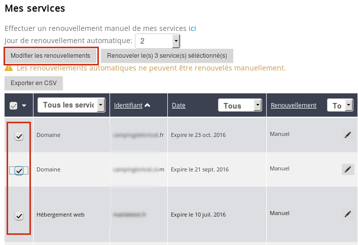

## Informacje ogólne
Wyboru sposobu płatności dokonuje się w [panelu klienta](https://www.ovh.com/manager/web/), w zakładce "Płatności, "Moje sposoby płatności".
Kliknij na "Dodaj sposób płatności".

- Uwaga, jeśli nie wybierzesz żadnego sposobu płatności i wybierzesz usługi do automatycznego odnawiania, Twoje konto w OVH zostanie obciążone i będziesz musiał uregulować płatność, aby uniknąć zawieszenia usług.

Automatyczne odnowienie można włączyć w zakładce "Moje usługi".

{.thumbnail}

## Rejestracja karty bankowej
Opcja niedostępna dla klientów polskiego oddziału OVH.

{.thumbnail}
Opcja niedostępna dla klientów polskiego oddziału OVH.

{.thumbnail}

## Rejestracja konta bankowego
Opcja niedostępna dla klientów polskiego oddziału OVH.

{.thumbnail}
Opcja niedostępna dla klientów polskiego oddziału OVH.

{.thumbnail}

## Rejestracja konta PayPal
Możesz dodać konto Paypal. Kliknij na "Dodaj". Pojawi się nowe okno.

- Uwaga: musisz włączyć obsługę pop-up, aby pojawiło się zamówienie.[/i

{.thumbnail}
Na kolejnej stronie wpisz informacje dotyczące płatności.

{.thumbnail}

## Status odnawiania usług
Przejdź do zakładki "Moje usługi", aby wybrać usługi, które będą odnawiane automatycznie.

{.thumbnail}
W tabeli znajdują się poniższe elementy:

- Dzień automatycznego odnowienia: Wybierz dzień miesiąca, w którym ma zostać pobrana płatność.

- Identyfikator: W tej kolumnie znajduje się nazwa usługi.

- Odnowienie: W tej kolumnie znajduje się informacja o rodzaju odnowienia dla danej usługi.

- 1. Wszystkie: Możesz filtrować usługi.

- 2. Data: Możesz filtrować usługi według daty wygasania.

- 3. Odnowienie: Możesz filtrować usługi według rodzaju odnowienia: ręczne, automatyczne.

{.thumbnail}
Kliknięcie na przycisk "Rezygnacja" powoduje wyłączenie automatycznego odnowienia. Usługa jest zawieszana w dniu wygaśnięcia.

## Wybór automatycznego odnowienia
Klikając na ikonkę długopisu z prawej strony w kolumnie "Odnowienie", możesz zmienić typ odnowienia. 

- Odnowienie: Wybierz "Automatyczne", aby zdefiniować odnowienie automatyczne.

- Częstotliwość: W zależności od usługi można określić częstotliwość pobierania opłaty.

Jeśli w kolumnie Częstotliwość wybierzesz "2 miesiące", opłata za odnowienie usługi na 2 miesiące będzie wykonywana co 2 miesiące.

{.thumbnail}

## Aktywacja automatycznego odnowienia dla kilku usług
Możesz zmienić typ odnowienia dla kilku usług zaznaczając je w kolumnie z lewej strony.

Następnie kliknij na "Zmień informacje o odnowieniach".

{.thumbnail}

## Sposób działania
Jest 2 lutego 2014. Uruchamiam automatyczne odnowienie na dzień 12 na okres 1 roku dla każdej usługi.

{.thumbnail}
Uwaga: Zamówienie wyrównujące nie zostanie zrealizowane 2 lutego 2014, lecz w wybranym przez Ciebie dniu, czyli 12 lutego 2014!

Pierwsze zamówienie wyrównujące podczas aktywacji usługi automatycznego odnawiania to zamówienie na 1 miesiąc. Będziesz mógł zmienić długość odnowień i to dlatego zamówienie wyrównujące jest na okres miesiąca. 

Wyrównanie zostanie wykonane tylko dla usług OVH (takich jak hosting, prywatny serwer SQL, opcje, itp...).

/!\ Domeny mogą być odnawiane na minimum 1 rok. Nie można przygotować zamówienia na wyrównanie daty wygasania dla tych usług. Należy więc poprawnie wybrać ogólną datę odnawiania.

O czym należy wiedzieć?
Niezależnie od wybranego okresu odnowienia nasz robot będzie przechodził co miesiąc w tym dniu, aby sprawdzić, jakie usługi wygasają między tą datą i tą samą datą miesiąc później tak, aby odnowić usługi wygasające w tym okresie. 

W naszym przypadku 12 lutego 2014 zamówienie będzie zawierać:
Wyrównanie dla: 
. Usługa 3: na 1 miesiąc + 1 dzień (od 11 lutego do 12 marca 2014);
. Usługa 5: na 27 dni (od 13 lutego do 12 marca 2014);
ustawiając datę wygaśnięcia tych usług na 12 marca 2014.

12 marca 2014Usługi 3 & 5 zostaną odnowione na 1 rok (wybrany okres).

Uwaga, Usługa 3 wygasająca 11 lutego 2014 będzie nieaktywna aż do 12 lutego 2014!

Usługa 2 wygasa 12 lutego 2014. Zostanie ona automatycznie odnowiona na 1 rok (wybrany okres).

W przypadku Usługi 4, która wygasa 15 lutego2014, robot wykryje, że wygasa ona między 12 lutego 2014 i 12 marca 2014. Usługa ta zostanie odnowiona na 1 rok i ten 1 rok zostanie dodany do daty zakończenia usługi.

12 lutego 2014 moja Usługa 4 zostanie odnowiona na 1 rok a jej data wygaśnięcia zmieni się na 15 lutego 2015.

Usługa 1 będzie niedostępna od 10 do 12 lutego 2014 ale zostanie odnowiona przez robota na 1 rok (wybrany okres) dnia 12 lutego 2014.

Podsumowując, zamówienie z 12 lutego 2014 będzie zawierać:
Wyrównanie dla następujących usług:
. Usługa 3: na 1 miesiąc + 1 dzień (od 11 lutego do 12 marca 2014)
. Usługa 5: na 27dni (od 13 lutego do 12 marca 2014)
Odnowienie następujących usług:
. Usługa 1: na 1 rok (od 10 lutego 2014 do 10 lutego 2015)
. Usługa 2: na 1 rok (od 12 lutego 2014 do 12 lutego 2015)
. Usługa 4: na 1 rok (od 15 lutego 2014 do 15 lutego 2015)

Zamówienie z 12 marca 2014 będzie zawierać:

Odnowienie usług:
. Usługa 3: na 1 rok (od 12 marca 2014 do 12 marca 2015)
. Usługa 5: na 1 rok (od 12 marca 2014 do 12 marca 2015)

Uwaga: Automatyczne odnowienie ustawione na 28, 29, 30 lub 31 dnia miesiąca zostanie automatycznie zrealizowane 1 dnia kolejnego miesiąca, w zależności od liczby dni w miesiącu (na przykład w lutym).

## Ważność nazwy domeny
Przedstawiamy informacje w formie graficznej:

{.thumbnail}

