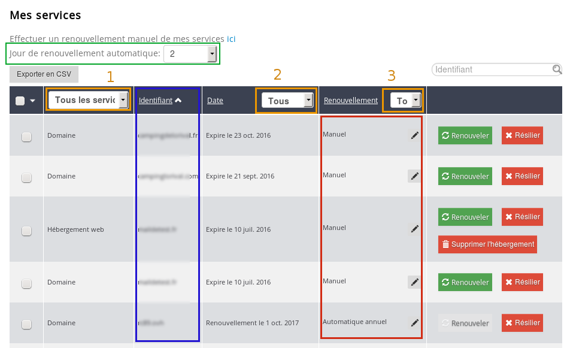
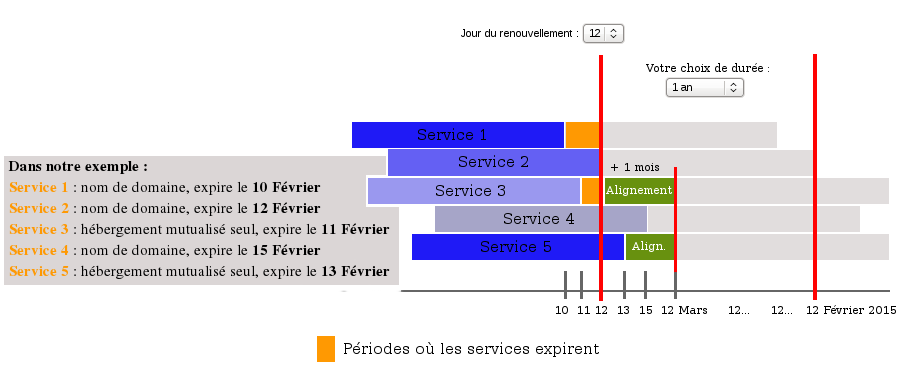

## Generalidades
A escolha do método de pagamento efetua-se a partir do [Manager](https://www.ovh.com/manager/web/), na Rubrica "Faturação" e de seguida em "Os meus métodos de pagamento... Clique de seguida em "Adicionar um método de pagamento".

- Atenção, se nenhum método de pagamento está ativo e pede a renovação automática para um dos seus serviços, a sua conta OVH será debitada e deverá depois regularizá-la para evitar qualquer corte no serviço.

A ativação do débito automático efetua-se na rubrica "Os meus serviços".

{.thumbnail}

## Registo de um cartão de crédito
Deve escolher "Cartão de crédito" e depois deve clicar em "Adicionar".

- Atenção, é necessário ativar as pop-ups para que a nota de encomenda lhe seja apresentada.

{.thumbnail}
Para que possa validar o seu cartão de crédito, vai-lhe ser debitado inicialmente um valor de 1€ s/IVA.
Este momento será imediatamente creditado na sua conta OVH e poderá deduzi-lo na próxima fatura gerada.
O cartão será visível imediatamente.

{.thumbnail}

## Registo de um Cartão de Crédito
Num primeiro tempo complete as informações pedidas. Clique em "Adicionar" para continuar a operação.

{.thumbnail}
Ao clicar no botão "Adicionar", um documento será descarregado.

- Atenção, é necessário ativar as pop-ups para que a nota de encomenda lhe seja apresentada.

Queira seguir o procedimento descrito no documento para validar o método de pagamento. A sua conta bancária será validada nas próximas 24 a 48h a contar a partir da receção da sua autorização de débito bancário.

- Método atualmente indisponível para Portugal.

{.thumbnail}

## Registo de uma conta Paypal
Pode adicionar uma conta Paypal. Clique em "Adicionar", e irá ser aberto uma nova janela.

- Atenção, é necessário ativar as pop-ups para que a nota de encomenda lhe seja apresentada.

{.thumbnail}
Nessa nova página introduza as suas informações de pagamento.

{.thumbnail}

## Estado da renovação dos seus serviços
Deve num primeiro tempo aceder a "Os meus serviços" de forma a selecionar os serviços a colocar em renovação automática.

{.thumbnail}
Encontrará nesta tabela os seguintes elementos:

- Dia de renovação automática: Deve escolher o dia no qual deseja que a OVH efetue o débito no seu método de pagamento.

- Identificador: Esta coluna corresponde ao nome do serviço a que corresponde.

- Renovação: Esta coluna permite-lhe conhecer o tipo de renovação em curso para o seu serviço.

- 1. Todos os serviços: Pode solicitar a filtragem a tabela por tipo de serviço.

- 2. Data: Pode solicitar a filtragem da lista para apresentar apenas os serviços que "expiram dentro de uma semana", "expiram dentro de um mês" ou que "já expiraram".

- 3. Renovação: Pode solicitar aqui a filtragem para apresentar apenas os serviços que estão com "renovação automática anual", "renovações automática mensal", "renovação mensal".

{.thumbnail}
Ao clicar em "Eliminar", esta opção desativa a renovação automáticas e o seu serviço será eliminado na sua data de expiração.

## Escolha da renovação automático
Ao clicar no "lápis" à direita do seu serviço na coluna "Renovação", poderá modificar o tipo de renovação.

- Renovação: Deve escolher aqui "Automática" para que o seu serviço seja renovado automaticamente.

- Frequência: Pode escolher, em função do tipo de serviço, a frequência da renovação.

Se escolher "3 meses" como frequência, a renovação de 3 meses será debitada e a renovação do seu serviço far-se-á a cada 3 meses.

{.thumbnail}

## Ativação da renovação automática em vários serviços
Pode modificar o tipo de renovação para vários serviços ao escolher os serviços em questão na coluna da esquerda.

Basta de seguida clicar em "Modificar as renovações"

{.thumbnail}

## Funcionamento
Estamos a 2 de Fevereiro de 2014 e configurado a renovação automática para o dia12, por um período de 1 ano para cada serviço.

{.thumbnail}
Atenção: A encomenda de alinhamento não será realizada a 2 de Fevereiro de 2014 mas na data escolhida, ou seja, dia 12!

A primeira encomenda de alinhamento aquando da ativação de serviços em renovação automática é forçosamente de 1 mês. Pode ter de modificar posteriormente  a duração das suas renovações, e é por esse motivo que a renovação é mensal.
Os alinhamentos serão unicamente efetuados para os serviços próprios à OVH (como alojamentos, SQL Privado, opções..etc).

/!\ Os nomes de domínio não podem ser renovados senão por períodos mínimos de 1 ano e como tal não pode ser criada uma nota de encomenda de alinhamento. É do seu interesse escolher uma data de renovação "global" conveniente.

O que é importante saber :
Independentemente do período de renovação escolhido, o nosso robô fará todos os meses uma verificação dos serviços que expiram entre essa data (inclusive) e a mesma data no mês seguinte a fim de renovar os serviços encontrados para esse período e para os quais ativou a renovação automática.

No nosso caso, no dia 12 de Fevereiro, a nota de encomenda conteria:
Os alinhamentos de : 
. Serviço 3: por 1 mês + 1 dia (de 11 de Fevereiro a 12 de Março de 2014);
. Serviço 5: por 27 dias (de 13 de Fevereiro a 12 de Março de 2014);
colocando as suas datas de expiração como 12 de Março de 2014.

No dia 12 de Março de 2014, os Serviços 3 & 5 serão renovados por 1 ano (período escolhido).

Atenção, o Serviço 3 expira no dia 11 de Fevereiro de 2014 e, consequentemente, será cortado e ficará indisponível em 12 de Fevereiro de 2014 !

O Serviço 2 expira a 12 de Fevereiro de 2014, e será renovado por 1 ano (período escolhido).

Quanto aoServiço 4 que expira no dia 15 de Fevereiro de 2014, o robô detetará que o mesmo expira entre 12 de Fevereiro de 2014 e 12 de Março de 2014, portanto o mesmo será renovado por 1 ano e esse 1 ano adicional será creditado na data de expiração do Serviço.

Ou seja, no dia 12 de Fevereiro de 2014 o meu Serviço 4 será renovado por 1 ano suplementar e a sua nova data de expiração será 15 de Fevereiro de 2015.

O Serviço 1 ficará indisponível de 10 a 12 de Fevereiro de 2014 mas será renovado pelo robô por 1 ano (duração escolhida) no dia 12 de Fevereiro de 2014.

Para resumir, a nota de encomenda de 12 de Fevereiro conterá:
Os alinhamentos de :
. Serviço 3: por 1 mês + 1 dia (de 11 de Fevereiro de a 12 de Março de 2014)
. Serviço 5: por 27 dias (de 13 de Fevereiro a 12 de Março  de 2014)
A renovação de:
. Serviço 1: por 1 ano (de 10 de Fevereiro de  2014 a 10 de Fevereiro de 2015)
. Serviço 2: por 1 ano (du 12 de Fevereiro de 2014 a 12 de Fevereiro de 2015)
. Serviço 4: por 1 ano (du 15 de Fevereiro de 2014 a 15 de Fevereiro de 2015)

A nota de encomenda de 14 de Março conterá :

A renovação de:
. Serviço 3: por 1 ano (de 12 de Março de 2014 a 12 de Março de 2015)
. Serviço 5: por 1 ano (de 12 de Março de 2014 a 12 de Março de 2015)

A ter em conta: Una renovação automática solicitada a 29, 30 ou 31 será efetuada automaticamente no 1º dia do mês seguinte, em função do número de dias do mês em curso (Fevereiro, por exemplo).

## Duração de vida de um nome de domínio
Consulte o gráfico explicativo.

{.thumbnail}

