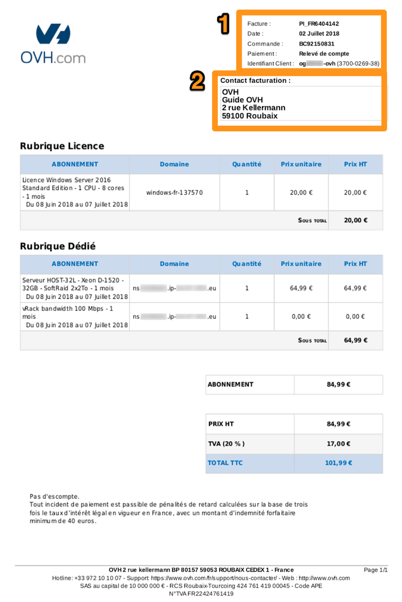
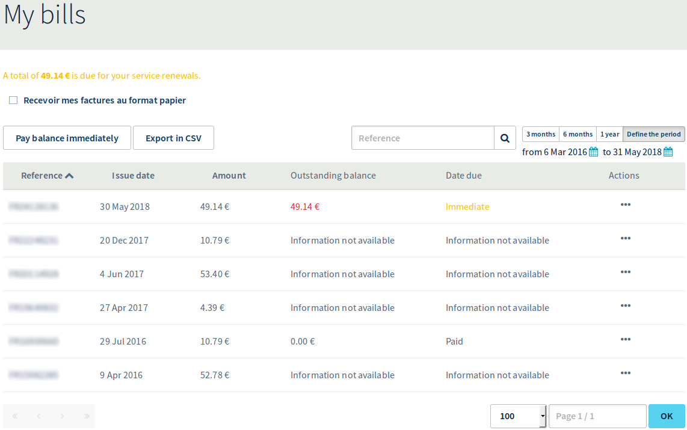
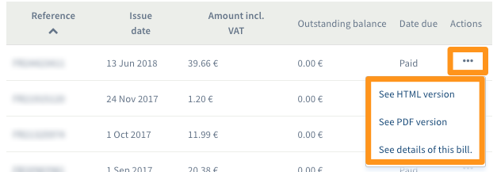
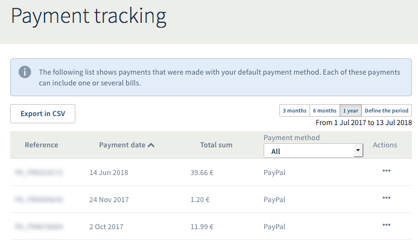

**Última atualização: 09/01/2020**

## Sumário

A OVHcloud disponibiliza-lhe um espaço que lhe permite consultar, gerir e pagar as suas várias faturas, sem interromper o seu serviço.

**Este manual explica-lhe como realizar todas estas ações relativas à faturação.**

> [!primary]
>
> Dependendo do seu local de residência e da legislação em vigor, assim como dos produtos afetados, é possível que algumas secções deste manual variem e/ou não sejam aplicáveis à sua situação. Caso tenha alguma dúvida, consulte os contratos da OVHcloud disponíveis na sua [Área de Cliente](https://www.ovh.com/auth/?action=gotomanager){.external}. Para isso, clique no seu ID de cliente no canto superior direito e selecione `Serviços`{.action} > `Contratos`{.action}.
>

## Requisitos

- Ter acesso à [Área de Cliente OVHcloud](https://www.ovh.com/auth/?action=gotomanager){.external}.
- Estar conectado como contacto de faturação do serviço (para mais informações sobre os vários tipos de contacto, consulte o manual “[Como gerir os contactos (gestores) dos serviços OVH](https://docs.ovh.com/pt/customer/gestao_dos_contactos/){.external}”).

## Instruções

### Secções de uma fatura da OVHcloud

A fatura é o documento que é gerado ao pagar uma encomenda ou quando se efetua uma renovação automática de um serviço. Este documento reúne os produtos pagos ou com pagamento pendente, juntamente com o período de renovação e o montante correspondentes. A referência das faturas da OVHcloud emitidas pela filial portuguesa da OVHcloud começa sempre por “PT”.

{.thumbnail}

|Número|Descrição|
|---|---|
|1|Informações relativas à fatura: referência, número SAF-T, data de emissão, data de vencimento, nota de encomenda, tipo de pagamento e ID de cliente.|
|2|Resumo das informações do contacto de faturação.|

Abaixo, a fatura também inclui os detalhes dos serviços faturados:

- “Assinatura” ou “Consumo”: descrição do serviço e do período de faturação;
- “Domínio”: referência do serviço faturado;
- “Quantidade”: número de unidades do serviço faturado; 
- “Preço unitário” e “Preço s/IVA”: preço dos serviços.

O preço com IVA aparece no final da tabela, com a menção “Total c/IVA”.

> [!primary]
>
> Se a menção “Extracto de conta” aparece na linha correspondente ao pagamento, isto significa que se trata de uma renovação automática. O método de pagamento utilizado será obrigatoriamente aquele que foi validado na [Área de Cliente OVHcloud](https://www.ovh.com/auth/?action=gotomanager){.external}.
>

### Descobrir a área de faturação

#### Consultar e gerir faturas

Para consultar as suas faturas, aceda à sua [Área de Cliente OVHcloud](https://www.ovh.com/auth/?action=gotomanager){.external} e aceda à secção `Faturação`{.action} clicando no seu ID de cliente no canto superior direito. Aparecerá uma página onde poderá consultar todas as suas faturas. 

{.thumbnail}

Em cada linha da tabela, encontrará as seguintes informações:

- referência da fatura (exemplo: PT264479);
- data de emissão da fatura;
- montante da fatura;
- saldo a pagar;
- data de vencimento; 
- `...`{.action}\: diferentes ações possíveis.

> [!primary]
>
> Se o saldo a pagar aparecer a vermelho, isto significa que a fatura ainda não foi paga. A data de vencimento da fatura irá permitir-lhe saber se tem de realizar algum pagamento de forma imediata.
>

Se aparecer a menção “Informações indisponíveis”, isto significa que a fatura não está associada a uma renovação automática. Poderá consultar essas informações clicando em `...`{.action}. Poderá escolher entre as seguintes opções:

{.thumbnail}

- `Ver a versão HTML`{.action}\: a fatura irá abrir num novo separador do seu browser;
- `Ver a versão PDF`{.action}\: será gerado um ficheiro PDF que poderá descarregar;
- `Consultar os detalhes desta fatura`{.action}\: pode consultar o histórico de operações realizadas na fatura.

Para facilitar a leitura, pode utilizar os filtros que aparecem na parte superior da tabela:

{.thumbnail}

Pode procurar uma determinada fatura introduzindo a sua referência ou filtrar as faturas por data de antiguidade: três meses, seis meses, um ano ou um determinado período de tempo.

O botão `Exportar em CSV`{.action} permite-lhe descarregar um ficheiro Excel em formato CSV com as faturas selecionadas. Neste ficheiro, aparecerá o montante, a referência e a data de emissão dessas faturas.

#### Pagar o montante pendente

Para pagar o montante pendente das suas faturas, clique no botão `Pagar a minha dívida imediatamente`{.action}.

{.thumbnail}

Será criada uma [nota de encomenda](https://docs.ovh.com/pt/billing/gerir-as-encomendas-ovh/#a-nota-de-encomenda){.external} de regularização. Uma vez realizado o pagamento, a situação ficará regularizada.

### Seguir os pagamentos

Pode seguir todos os pagamentos efetuados na secção `Faturação` > `Pagamentos`{.action}. Isto mostra-lhe as faturas e os respetivos pagamentos. A referência dos comprovativos de pagamento começa sempre por “PA”.

{.thumbnail}

Nesta página, pode também exportar os comprovativos de pagamento em formato CSV. Tal como para a gestão das faturas, pode filtrar os resultados em função do período.

> [!primary]
>
> Se detetar uma discrepância entre um pagamento e o montante de uma fatura, significa que um crédito foi automaticamente aplicado.
>

## Quer saber mais?

Fale com a nossa comunidade de utilizadores em <https://community.ovh.com/en/>.