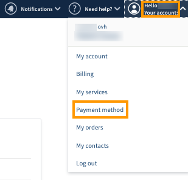
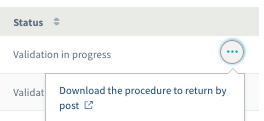

**Última atualização: 20/11/2019**

## Objetivo

A Área de Cliente OVHcloud permite-lhe guardar e gerir vários métodos de pagamento.

## Requisitos
- Ter acesso à [Área de Cliente OVHcloud](https://www.ovh.com/auth/?action=gotomanager){.external}.
- Dispor de um método de pagamento válido.

## Instruções

Ligue-se à sua [Área de Cliente OVHcloud](https://www.ovh.com/auth/?action=gotomanager){.external}, clique no seu nome em cima à direita, e selecione `Métodos de pagamento`{.action}.

{.thumbnail}

A página que é apresentada contém um quadro que indica os métodos de pagamento guardados na sua Área de Cliente, nomeadamente os métodos utilizados durante as suas encomendas. Nela pode:

- Adicionar um método de pagamento
- Alterar o seu método de pagamento padrão
- Eliminar um método de pagamento

### Adicionar um método de pagamento

Durante a sua primeiríssima encomenda de um produto OVH, é-lhe pedido que guarde um método de pagamento para garantir a renovação do seu serviço por débito automático.

Este método de pagamento é, então, usado por defeito para todas as suas renovações, sendo proposto durante novas compras.

Tem, claro, a possibilidade de guardar novos métodos de pagamento para que eles lhe sejam propostos durante as suas novas encomendas, ou para os seus futuros débitos.

É possível registar 3 tipos de métodos de pagamento:

- Cartão bancário
- Conta bancária
- Conta PayPal

Para isso, basta clicar no botão `Adicionar um método de pagamento`{.action}.

{.thumbnail}

Siga as etapas sucessivas de registo do método de pagamento. Na primeira etapa, ser-lhe-á proposto que defina este novo método de pagamento como "método de pagamento padrão", para que ele seja utilizado para as suas futuras compras ou débitos automáticos.

Em caso de registo de uma conta bancária, terá de enviar uma autorização de débito por correio postal. Para transferir este documento, clique no botão `...`{.action} à direita da sua conta bancária, e em `Transferir o procedimento a enviar por correio postal`{.action}.

{.thumbnail}

> [!primary]
>
Enquanto esta autorização não for recebida pelos nossos serviços, a nota "A aguardar receção" estará indicada junto à sua conta bancária, pelo que esta não poderá ser considerada para os seus pagamentos.
>

### Alterar o seu método de pagamento padrão

As faturas de renovação dos seus serviços são sempre debitadas no seu método de pagamento padrão. Se pretender alterar este método, terá primeiro de adicionar um novo método de pagamento na sua Área de Cliente.

Clique, então, no botão `...`{.action} à direita do novo método de pagamento, e em `Definir este método de pagamento padrão`{.action}.

{.thumbnail}

### Eliminar um método de pagamento

Se já não quiser usar um dos métodos de pagamento, poderá eliminá-lo clicando no botão `...`{.action} à direita do método de pagamento. Clique, então, em `Eliminar este método de pagamento`{.action}.

{.thumbnail}

> [!warning]
>
O método de pagamento padrão não pode ser eliminado. Se pretender eliminar este método, deve primeiro definir outro método de pagamento padrão.
>

### Eliminar um método de pagamento através das API OVHcloud

A eliminação de um método de pagamento pode ser realizada através das API, ligando-se a [https://eu.api.ovh.com/](https://eu.api.ovh.com/){.external}.

Comece por obter a ID do método de pagamento: 

> [!api]
>
> @api {GET} /me/payment/method 
>

Elimine então o método de pagamento, utilizando a ID que obteve no passo anterior /

> [!api]
>
> @api {DELETE} /me/payment/method/{paymentMethodId}
>

## Quer saber mais?

Fale com a nossa comunidade de utilizadores: <https://community.ovh.com/en/>