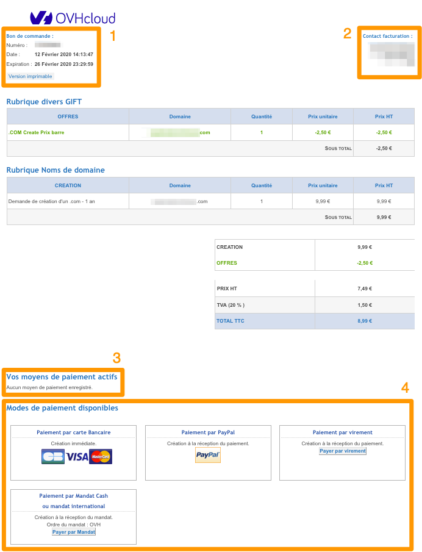
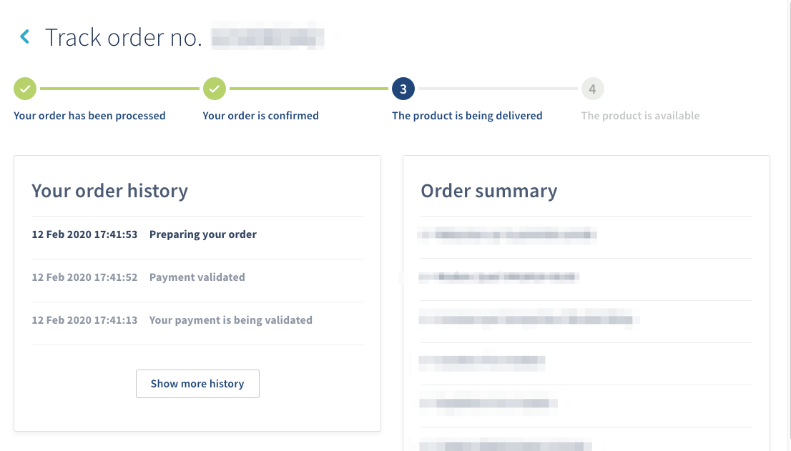

**Last updated 29th May 2020**

## Objective

When you place an order, you can track and manage it from your [OVHcloud Control Panel](https://www.ovh.com/auth/?action=gotomanager).

**This guide will explain how to manage your orders.**

> [!primary]
>
> Depending on your place of residence and its local legislation, as well as the products concerned, some details may vary from the information provided in this guide, and some information may not apply to your situation. If you need to, please refer to your OVHcloud contracts, which you can access from the [Control Panel](https://www.ovh.com/auth/?action=gotomanager){.external} by going to `My services`{.action}, then `Contracts`{.action}.
>

## Requirements

- access to the [OVHcloud Control Panel](https://www.ovh.com/auth/?action=gotomanager)
- at least one OVHcloud product order

## Instructions

### Purchase order

A purchase order is generated when you place an order. It lists the products ordered, their price, and any reductions or promo offers that have been applied.

{.thumbnail}

|Number|Description|
|---|---|
|1|All of the information related to the purchase order is listed here: its number, its creation date and its expiry date. Please note that expired purchase orders will no longer appear in your Control Panel.|
|2|If you are logged in to the Control Panel when you place the order, the billing contact will appear here. For further information on the different contact types, please read [this guide](../../customer/managing-contacts/).|
|3|If you have set a default payment method, it will be offered here. If your product is renewed automatically, a default payment method is required.|
|4|Here, you will find the available payment methods. We can only offer the payment methods authorised in the account’s country of origin, or those linked to the account type.|

You can view your purchase order at any time in the [OVHcloud Control Panel](https://www.ovh.com/auth/?action=gotomanager){.external}, as explained below.

### Accessing purchase orders via the OVHcloud Control Panel

To access the area for managing orders, go to the [OVHcloud Control Panel](https://www.ovh.com/auth/?action=gotomanager){.external}, then click `View my orders`{.action} in your `Dashboard`.

{.thumbnail}

A summary of the non-expired orders made will appear as below.

{.thumbnail}

On this page, you will see the following information:

- the date on which the order was placed
- the order number
- the order status
- the purchase order amount, including VAT

The various order statuses are listed below:

|Status|Definition|
|---|---|
|Unpaid|This status means that the payment has not been received for the purchase order. Payment is not obligatory. The order will not be finalised, and it will disappear on its expiry date.|
|Confirmation|Your order is in the process of being verified manually by our internal services (working days only). The validation will be complete once this step is finalised. If the operation cannot be finalised, you will be sent an email request to provide supporting documents.|
|Being processed|Your order is in the process of being delivered — please wait. Depending on the service you have ordered, this step may last a few minutes or a few hours.|
|Complete|You have received your order, and your access details have been sent to you by email (if access details are required).|

You can also view the purchase order in HTML format by clicking on `...`{.action} to the right of your order, then `View order in HTML format`{.action}.

{.thumbnail}

### Tracking your order

After generating your purchase order, you can track your order from your [OVHcloud Control Panel](https://www.ovh.com/auth/?action=gotomanager){.external}. Navigate to the `Dashboard`, then click `View my orders`{.action}. Click on `...`{.action} next to your order and select `Order tracking`{.action}. You can also track your order by clicking on the order’s status in the “Status” column.

{.thumbnail}

The below window will appear, allowing you to track it at 4 stages.

{.thumbnail}

### Applying the right of withdrawal

The terms and conditions for the right of withdrawal can be found in our [General terms and conditions of services](https://www.ovh.ie/support/contracts/).

If the eligibility criteria for the withdrawal period are met, you can withdraw from a service using the [OVHcloud Control Panel](https://www.ovh.com/auth/?action=gotomanager){.external}. Navigate to the `Dashboard`, then click `View my orders`{.action}. Click on `...`{.action} next to your order and select `Cancel the order`{.action}.

{.thumbnail}

You can confirm the order cancellation by simply ticking the box saying `Yes, I want to cancel that order`{.action}, then clicking `Confirm`{.action}.

{.thumbnail}

> [!primary]
>
> You will be refunded the amount initially paid within 30 days after the withdrawal request, but the days on which the service was consumed are deducted from the refund amount on a pro rata basis.
>

## Go further

Join our community of users on <https://community.ovh.com>.