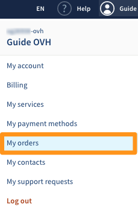
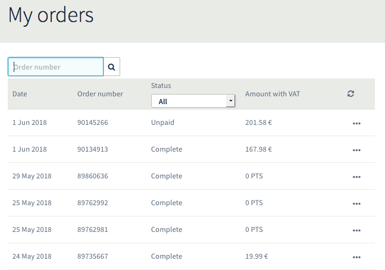

**Ultimo aggiornamento: 27/03/2019**

## Obiettivo

L’elaborazione completa degli ordini effettuati in OVH include diversi step, a ognuno dei quali corrisponde uno stato differente. 

**Questa guida ti mostra le informazioni riportate nell’ordine e come verificare la fase in cui si trova dallo Spazio Cliente OVH.**

> [!primary]
>
> Ti ricordiamo che in base al luogo di residenza, alla normativa vigente e ai servizi attivati è possibile che alcune sezioni di questa guida varino o non siano applicabili alla tua situazione. In caso di difficoltà o dubbi consulta i contratti disponibili nel tuo [Spazio Cliente OVH](https://www.ovh.com/auth/?action=gotomanager){.external}, sezione `I tuoi servizi`{.action}> `I tuoi contratti`{.action}.
>

## Prerequisiti

- Avere accesso allo [Spazio Cliente OVH](https://www.ovh.com/auth/?action=gotomanager){.external}
- Aver effettuato almeno un ordine in OVH

##  Procedura

### Il buono d’ordine

Il buono d’ordine viene generato nel momento in cui si effettua l’ordine. Contiene la lista dei servizi selezionati, il loro prezzo e gli eventuali sconti commerciali applicabili.

{.thumbnail}

|Numero|Descrizione|
|---|---|
|1|In questa sezione sono riportate tutte le informazioni relative all’ordine: numero, data di creazione e data di scadenza. Ti ricordiamo che i buoni d’ordine scaduti non sono visibili nello Spazio Cliente.|
|2|Se durante il processo d’ordine sei connesso al tuo Spazio Cliente OVH, in questa sezione comparirà il contatto di fatturazione. Per maggiori informazioni sui diversi contatti, consulta [questa guida](https://docs.ovh.com/it/customer/gestisci_i_tuoi_contatti/){.external}.|
|3|Se hai salvato un metodo di pagamento predefinito, verrà riportato in questa sezione. In caso di rinnovo automatico, è necessario impostare un metodo di pagamento predefinito.|
|4|In questa sezione vengono mostrati i metodi di pagamento accettati nel Paese di origine dell’account o quelli associati al tipo di account registrato.|

È possibile recuperare il buono d’ordine in qualsiasi momento direttamente nello [Spazio Cliente OVH](https://www.ovh.com/auth/?action=gotomanager){.external}, come spiegato nel paragrafo successivo.

### Visualizza i tuoi ordini nello Spazio Cliente OVH

Accedi allo [Spazio Cliente OVH](https://www.ovh.com/auth/?action=gotomanager){.external}, clicca sul tuo nome utente in alto a destra e seleziona `Fatturazione`{.action} >  `I tuoi ordini`{.action}

{.thumbnail}

Visualizzi una tabella con il riepilogo degli ordini ancora validi effettuati con il tuo account OVH.

{.thumbnail}

In questa pagina vengono riportate le seguenti informazioni:

- data di creazione del buono d’ordine 
- numero dell'ordine
- stato dell’ordine
- importo totale dell’ordine, IVA inclusa

Ecco i diversi stati dell’ordine:

|Stato|Descrizione|
|---|---|
|Pagamento non ricevuto|Questo stato corrisponde a un ordine per cui non è stato ancora effettuato il pagamento. Il saldo non è obbligatorio: se non viene eseguito, l’ordine non viene completato e verrà eliminato alla data di scadenza.|
|Convalida|Il tuo ordine è in corso di verifica manuale da parte dei nostri operatori e verrà confermato a operazione conclusa. Nel caso in cui non sia possibile completare l’operazione, riceverai un’email in cui vengono richiesti alcuni documenti giustificativi.|
|Consegna in corso|L’ordine è in fase di consegna, non ti resta che attendere. In base al servizio ordinato la consegna potrebbe richiedere pochi minuti o qualche ora.|
|Completato|Il servizio è stato consegnato e le credenziali di accesso (se necessarie) inviate via email.|

Se lo stato è “Consegna in corso” o “Pagamento non ricevuto”, l’ordine è visibile nello Spazio Cliente OVH. Per aprirlo clicca sui tre puntini in corrispondenza dell’ordine in questione e seleziona `Visualizza l’ordine in formato HTML`{.action}.

{.thumbnail}

### Esercita il diritto di recesso

Le modalità e le condizioni per esercitare il diritto di recesso vengono stabilite nell’articolo 10 delle [Condizioni Generali di Servizio](https://www.ovh.it/supporto//documenti_legali/condizioni_generali_servizio.pdf){.action}.
Per maggiori informazioni o richiedere assistenza, contatta il nostro supporto telefonicamente o apri un ticket dallo Spazio Cliente OVH.

## Per saperne di più

Contatta la nostra Community di utenti all’indirizzo <https://www.ovh.it/community/>.
