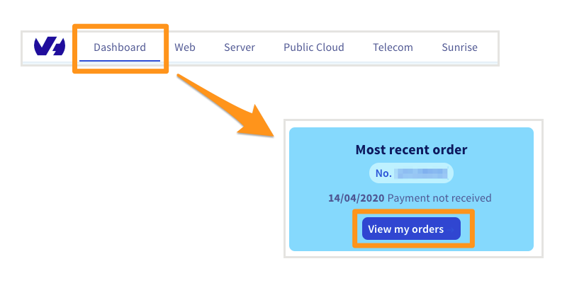

**Última atualização: 20/05/2020**

## Objetivo

Sempre que efetuar uma encomenda, pode segui-la e interagir com ela a partir da sua [Área de Cliente OVHcloud](https://www.ovh.com/auth/?action=gotomanager){.external}.

**Este guia explica-lhe como gerir as suas encomendas.**

> [!primary]
>
> Dependendo do seu local de residência e da legislação em vigor, assim como dos produtos afetados, é possível que algumas secções deste manual variem e/ou não sejam aplicáveis à sua situação. Caso tenha alguma dúvida, consulte os contratos OVHcloud disponíveis na sua [Área de Cliente](https://www.ovh.com/auth/?action=gotomanager){.external}. Para isso, clique no seu ID de cliente no canto superior direito e selecione `Produtos e serviços`{.action} > `Contratos`{.action}.
>

## Requisitos

- Ter acesso à [Área de Cliente OVHcloud](https://www.ovh.com/auth/?action=gotomanager){.external}.
- Ter realizado, pelo menos, uma encomenda na OVHcloud.

##  Instruções

### A nota de encomenda

A nota de encomenda é criada quando efetua uma encomenda. Indica os produtos encomendados, os respetivos preços e os possíveis descontos aplicados.

{.thumbnail}

|Número|Descrição|
|---|---|
|1|Todas as informações relativas à nota de encomenda são apresentadas aqui: o número, data de criação e data de expiração. Tenha em conta que as notas de encomenda expiradas já não aparecerão na sua Área de Cliente.|
|2|Se estiver ligado à sua Área de Cliente no momento da encomenda, o contacto de faturação aparecerá nesta área. Para obter mais informações sobre os diferentes contactos, consulte [esta documentação](../../customer/gestao_dos_contactos/){.external}.|
|3|Caso tenha registado um método de pagamento por predefinição, aparecerá nesta secção. No âmbito de uma renovação automática, é necessário registar um método de pagamento predefinido.|
|4|Nesta secção, encontrará os métodos de pagamento disponíveis. Apenas serão sugeridos os métodos de pagamento autorizados no país de origem da conta ou os que estão associados ao tipo de conta registada.|

Pode consultar a sua nota de encomenda a qualquer momento através da [Área de Cliente OVHcloud](https://www.ovh.com/auth/?action=gotomanager){.external}, conforme explicado abaixo.

### Aceder às notas de encomenda na Área de Cliente OVHcloud

Para aceder ao painel de gestão das encomendas, deverá clicar no seu `Paneil de controlo`{.action} no canto superior esquerdo da sua [Área de Cliente OVHcloud](https://www.ovh.com/auth/?action=gotomanager){.external}, e clicar em `Ver as minhas encomendas`{.action}.

{.thumbnail}

De seguida, será redirecionado para uma página que resume as diferentes encomendas válidas que foram efetuadas na conta da OVHcloud.

{.thumbnail}

Aqui, encontrará as seguintes informações:

- a data em que a nota de encomenda foi criada;
- o número da encomenda;
- o estado de pagamento da encomenda;
- o montante que inclui as taxas da nota de encomenda.

Estes são os diferentes estados da encomenda:

|Estado|Explicação|
|---|---|
|Sem pagamento|Este estado corresponde a uma nota de encomenda cujo pagamento não foi recebido. Não é obrigatório efetuar o pagamento - a encomenda não será concluída e irá desaparecer na data de expiração.|
|Validação|A nossa equipa está a realizar uma verificação manual do pedido (apenas em dias úteis). Uma vez finalizada esta verificação, o pedido será validado. Caso não seja possível finalizar a verificação, receberá um e-mail indicando-lhe os documentos comprovativos que deve enviar.|
|Entrega em curso|A entrega do serviço está em curso, só precisa de aguardar. Dependendo do tipo de serviço, a entrega poderá demorar alguns minutos ou algumas horas.|
|Concluída|O serviço já foi entregue e as credenciais foram-lhe enviadas por e-mail (caso seja necessário).|

Se o estado do pedido for “Entrega em curso” ou “Aguardar pagamento”, poderá visualizá-lo clicando nos três pontos (`...`{.action}) que aparecem no final da linha correspondente e selecionando a opção `Ver encomenda em formato HTML`{.action}.

{.thumbnail}

### Seguir a sua encomenda.

Após criar a sua nota de encomenda, pode seguir a sua encomenda a partir da sua [Área de Cliente OVHcloud](https://www.ovh.com/auth/?action=gotomanager){.external}. Clique em `Paneil de controlo`{.action}, depois em `Ver as minhas encomendas`{.action} e por fim em `...`{.action} junto à sua encomenda. Selecione `Seguir encomenda`{.action}. O acompanhamento de encomendas pode ser igualmente exibido, clicando no estado de uma encomenda na coluna "Estado".

{.thumbnail}

A janela seguinte permite um acompanhamento em 4 etapas. 

{.thumbnail}

### Direito de retratação

O artigo 12.º das nossas [Condições gerais de serviço](https://www.ovh.pt/suporte/documentos_legais/OVH_COND_GERAIS.pdf){.external} estabelece que *os clientes, enquanto consumidores e utilizadores ao abrigo da legislação portuguesa em vigor, poderão exercer o seu direito de retratação durante os primeiros 7 dias a partir da contratação do produto ou serviço correspondente.*

Para mais informações, consulte as nossas Condições gerais de serviço.

Se o cliente cumprir os requisitos necessários para exercer o seu direito de retratação, poderá fazê-lo diretamente na [Área de Cliente OVHcloud](https://www.ovh.com/auth/?action=gotomanager){.external}. Clique em `Paneil de controlo`{.action}, depois em `Ver as minhas encomendas`{.action} e por fim em `...`{.action} junto à sua encomenda. Selecione `Anular a encomenda`{.action}.

{.thumbnail}

Por último, selecione a opção `Sim, desejo cancelar esta encomenda`{.action} e confirme.

{.thumbnail}

> [!primary]
>
> A OVHcloud garante o reembolso dos montantes pagos, com dedução proporcional dos dias de serviço consumidos, no prazo de trinta dias após a data em que o Cliente exerceu o seu direito de retratação.
>

## Quer saber mais?

Fale com a nossa comunidade de utilizadores em [https://community.ovh.com/en/](https://community.ovh.com/en/){.external}.