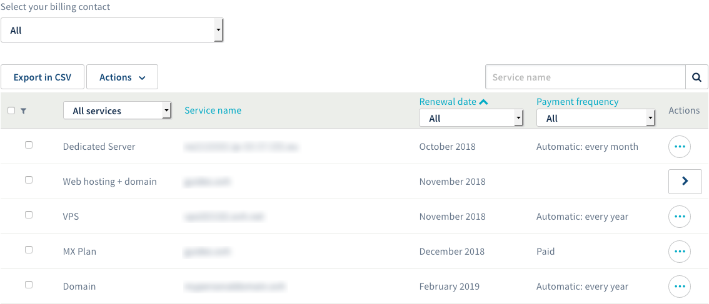

**Last updated 5th December 2018**

## Objective

In the OVH Control Panel, you can manage all of your OVH services. 

**Find out how to view and manage your solutions via the “Manage my services” section of the OVH Control Panel.**

> [!primary]
>
> Depending on your place of residence and its local legislations, as well as the products concerned, some details may vary from the information provided in this guide, and some information may not apply to your situation. If you have any doubts, please refer to your OVH contracts, which you can access via the [OVH Control Panel](https://www.ovh.com/auth/?action=gotomanager){.external} by going to `My services`{.action} then `My contracts`{.action}.
>

## Requirements

- access to the [OVH Control Panel](https://www.ovh.com/auth/?action=gotomanager){.external}
- active OVH services

## Instructions

Before you begin, please note that in the “Manage my services” interface, you can view all of your OVH solutions. You can also manage them all here, with the exception of the following services:

- telecom services (e.g. xDSL, VoIP, etc. - not available in the UK)
- [Microsoft services](https://www.ovh.co.uk/office-365/){.external} (e.g. Exchange, Office 365 and SharePoint solutions)
- the MX plan email service

We recommend reading the following guides, and focusing on the operation you wish to carry out:

- [View your services via the “Manage my services” interface](https://docs.ovh.com/gb/en/billing/manage-ovh-services/#view-your-services-via-the-manage-my-services-interface){.external}.
- [Manage your services via the “Manage my services” interface](https://docs.ovh.com/gb/en/billing/manage-ovh-services/#manage-your-services-via-the-manage-my-services-interface){.external}.

### View your services via the “Manage my services” interface.

Log in to the [OVH Control Panel](https://www.ovh.com/auth/?action=gotomanager){.external}, click on the name linked to your NIC handle (Customer ID) in the menu bar in the top right-hand corner, then click `My services`{.action}.

{.thumbnail}

The page that appears will contain a table for managing your OVH solutions. In this table, you will see:

- the service’s name
- its name at OVH (may look like a reference ID)
- its renewal or expiry date
- its renewal frequency

Some services may be connected (e.g. a Web Hosting plan and a domain name). If this is the case, you can disconnect them from one another by clicking on the arrow button in the table.

{.thumbnail}

If you have several solutions, the table may be more than one page long. You can use filters to:

- show a particular service by entering its name in the search field above the table, in the right-hand corner
- sort your services by several criteria, using the filters located at the top of the table 
- change the number of services displayed per page, by selecting a number from the drop-down menu below the table

{.thumbnail}

### Manage your services via the “Manage my services” interface.

Log in to the [OVH Control Panel](https://www.ovh.com/auth/?action=gotomanager){.external}, click on the name linked to your NIC handle (Customer ID) in the menu bar in the top right-hand corner, then click `My services`{.action}.

{.thumbnail}

The page that appears will contain a table for managing your OVH solutions. If applicable for the service in question, you can:

- cancel a service on its expiry date
- delete a service immediately
- perform other actions related to payment for the service For these options, please refer to the instructions listed in our guide to [Using automatic renewal at OVH](https://docs.ovh.com/gb/en/billing/how-to-use-automatic-renewal-at-ovh/){.external}.

As a reminder, some solutions cannot be managed via the “Manage my services” interface.

#### Cancel a service on its expiry date.

This action disables automatic renewal for the service concerned. The service will be cancelled automatically on its expiry date. **Please note that all of the data associated with this service will be permanently deleted.** 

To cancel a service, click on the three dots to the right of it. Then click `Terminate on expiry date`{.action}, read the information that appears, and confirm your request.

You can undo this action up to 24 hours before the expiry date by clicking again on the three dots, then `Undo termination`{.action}.

{.thumbnail}

#### Delete a service immediately.

This action is only available for [Web Hosting plans](https://www.ovh.co.uk/web-hosting/){.external}, and deletes the service immediately. This means that the service is deleted before its expiry date, without waiting for the contract duration to end.

**Since this action is immediate, all of the data associated with this service is permenantly deleted, and the action cannot be undone.** Also, no refund is issued for the time between the service’s deletion and its expiry date.** 

To delete a service immediately, click on the three dots to the right of it, and click `Delete web hosting plan immediately`{.action}. Read the information that appears, then launch your request by pressing `confirm`{.action}. Follow the instructions you receive via email to complete the action.

{.thumbnail}

## Go further

Join our community of users on <https://community.ovh.com/en/>.