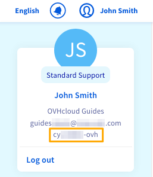
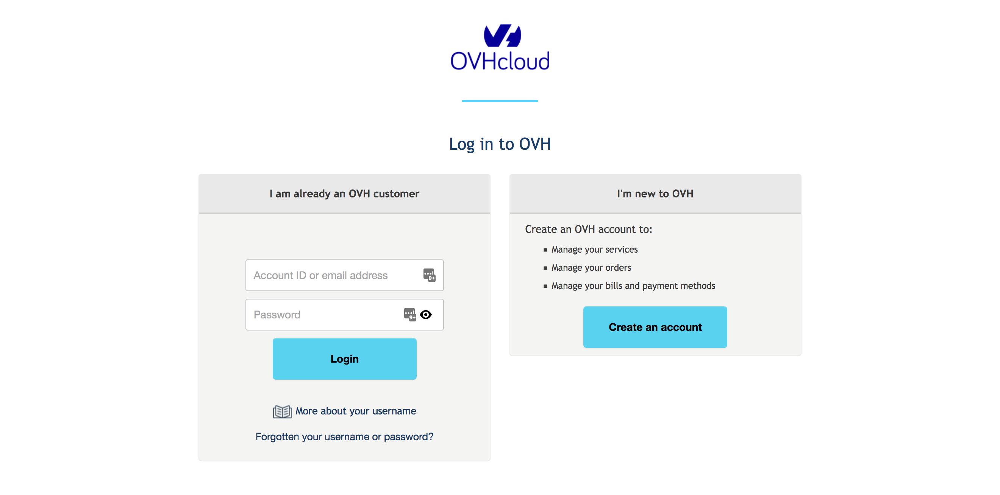
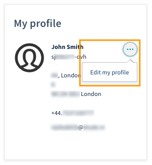

**Ultimo aggiornamento: 20/05/2020**

## Obiettivo

L’identificativo cliente ti permette di:

- effettuare ordini online
- accedere al tuo Spazio Cliente OVHcloud e gestire facilmente tutti i tuoi servizi 
- identificarti quando contatti il nostro supporto e semplificare la gestione delle tue richieste

È composto da due lettere seguite da diversi numeri e ha un formato di questo tipo: **xx11111-ovh**

Viene anche chiamato NIC-handle. 

**Questa guida ti mostra come creare l’identificativo cliente, accedere al tuo account, gestire le tue informazioni personali, nonché gli accessi al tuo account.**

## Come creare un identificativo cliente?

Se non disponi ancora di un identificativo cliente, accedi alla pagina [creazione dell’account OVHcloud](https://www.ovh.com/auth/?action=gotomanager&from=https://www.ovh.com/fr/&ovhSubsidiary=fr){.external} 

e inserisci i tuoi dati, facendo attenzione a comunicarci **un indirizzo email valido**.

> [!primary]
>
> Ti consigliamo di inserire un indirizzo email esterno al tuo dominio e un indirizzo email di recupero. Quest’ultimo deve essere **obbligatoriamente** diverso dall’indirizzo principale. 
> 

Una volta completato il modulo, riceverai un’email di conferma della creazione dell’account.  Conserva con la massima cura il tuo identificativo cliente (NIC-handle) e in particolare la password associata. 

Per migliorare la sicurezza del tuo account, ti consigliamo di:

- consultare [la guida su come impostare e gestire la password del tuo account](../gestire-la-password/).
- rendi più sicuro l’accesso al tuo account attivando la doppia autenticazione. Per conoscere la procedura di attivazione, consulta questa guida: [Rendere sicuro il tuo account OVHcloud con la doppia autenticazione](../proteggi_il_tuo_account_con_2FA/).

## Come recuperare l’identificativo cliente?

L’identificativo cliente è richiesto per accedere al tuo account o per contattare l’assistenza tecnica di OVHcloud e, proprio per questo, può essere recuperato con diverse modalità.

### Nelle email inviate da OVHcloud

Il tuo identificativo cliente è indicato nell’email di conferma della creazione del tuo account, nei messaggi di conferma della generazione dei tuoi ordini, nei reminder di rinnovo dei tuoi servizi e nelle notifiche di connessione al tuo account.

### Sulle tue fatture

l tuo identificativo cliente è indicato su tutte le tue fatture, in alto a destra, insieme a tutte le informazioni utili.

{.thumbnail}

### Nel tuo Spazio Cliente 

Nello Spazio Cliente il tuo identificativo cliente è indicato in alto a destra, accanto al tuo nome.

{.thumbnail}

## Come accedere allo Spazio Cliente?

Apri la[pagina di login di OVHcloud](https://www.ovh.com/auth/?action=gotomanager){.external} e inserisci identificativo cliente e password.

{.thumbnail}

Se necessario, completa la procedura di [doppia autenticazione](../proteggi_il_tuo_account_con_2FA/), che si aggiunge alle tue credenziali di accesso (nome utente e password) ed è gestita dal tuo dispositivo: telefono, tablet o chiave di sicurezza.

> [!primary]
> Se non hai protetto il tuo account con la doppia autenticazione, potresti ricevere un codice di verifica per confermare l’accesso. Questo codice ti verrà inviato via email **all’indirizzo email principale** associato al tuo account.  
>
> Se non hai ricevuto il codice, controlla la cartella spam e/o di posta indesiderata del tuo indirizzo email.
>

### Se hai perso la password

Se hai dimenticato o perso la password, [questa guida ti spiega la procedura da seguire per modificarla](../gestire-la-password/#modifica-la-password).

### Se il tuo indirizzo email non risulta più accessibile

Se hai indicato un indirizzo email di recupero, puoi[contattare il supporto OVHcloud](https://www.ovhcloud.com/it/contact/) per chiedere di impostarlo come indirizzo principale. Una volta effettuata questa operazione, è necessario indicare un nuovo indirizzo di recupero.

Se non hai indicato un indirizzo email di recupero o se quest’ultimo è inaccessibile, puoi seguire questa [procedura](http://www.ovh.it/cgi-bin/it/procedure/procedureChangeEmail.cgi){.external} e inviarci il form tramite email. Quando lo riceveremo, procederemo a modificare il tuo indirizzo e-mail di contatto, a patto che tutti i documenti forniti sono validi.

## Come gestire le tue informazioni personali?

### Modifica le tue informazioni personali

Puoi modificare le informazioni del tuo account dal tuo Spazio Cliente OVHcloud.  Per farlo, clicca sul tuo nome in alto a destra e poi sulle tue iniziali.

{.thumbnail}

Clicca sui `...`{.action} nella sezione “Il tuo profilo” e infine su `Modifica il tuo profilo`{.action}.

{.thumbnail}

Modifica le informazioni e clicca su `Conferma`{.action}.

> [!warning]
>
> È fondamentale che le tue informazioni siano **aggiornate** e **corrette** poiché dovrai comunicarle nel momento in cui ti metterai in contatto con il team di supporto OVHcloud ed essere eventualmente in grado di giustificarne l’esattezza (ad esempio: un giustificativo di domicilio identico all’indirizzo indicato sul tuo account può essere richiesto durante la procedura di modifica dell’indirizzo email).
>

### Modifica l’indirizzo email principale

Per modificare l’indirizzo che hai inserito come contatto principale, è necessario confermare la nuova email inserendo il codice ricevuto all’indirizzo del contatto principale attuale. Una volta ricevuto il codice, clicca sul pulsante “Ho ricevuto il codice di conferma”.

{.thumbnail}

Quindi, inserisci il codice nel campo “Codice di conferma” e conferma l’operazione.

{.thumbnail}

### Esercita i tuoi diritti sui tuoi dati personali

In conformità con il Regolamento generale sulla protezione dei dati (GDPR), è possibile esercitare i propri diritti in materia di protezione dei dati personali, compilando [questo form](https://www.ovh.it/protezione-dati-personali/esercita-i-tuoi-diritti){.external}.

### Elimina il tuo identificativo cliente

È possibile richiedere la rimozione dell’identificativo cliente e i relativi dati, compilando [il modulo per l’esercizio dei diritti GDPR](https://www.ovh.it/protezione-dati-personali/esercita-i-tuoi-diritti){.external} e selezionando il ”Diritto alla cancellazione”.

> [!warning]
>
La cancellazione del tuo identificativo cliente richiede il rispetto delle seguenti condizioni:
>
> - il tuo account non deve più contenere alcun servizio 
>
> - il tuo account deve essere privo di ordini o fatture in attesa di pagamento.
>
>

## Gestisci gli accessi al tuo account

Le credenziali del tuo account non devono essere condivise né divulgate.

Tuttavia, potresti avere la necessità di delegare l’accesso ai tuoi servizi OVHcloud a terzi, sia che si tratti di membri della tua azienda (ad esempio, il webmaster) che di persone esterne (ad esempio, uno studio di contabilità).

In questo caso, OVHcloud ti consente di fornire l’accesso al tuo account, continuando a proteggere i tuoi dati (password, doppia autenticazione).

### Crea nuovi utenti

Un utente ha la possibilità di detenere diritti di lettura o scrittura sul tuo account e su tutti i tuoi servizi. È possibile creare, gestire e rimuovere questi utenti dal tuo Spazio Cliente. Per saperne di più, consulta [la guida sulla gestione degli utenti](../gestisci_gli_utenti/). 

### Gestisci i contatti

È possibile delegare la gestione amministrativa **o** tecnica **o** di fatturazione di uno o più servizi del tuo account a un altro identificativo cliente. Per saperne di più, consulta [la guida sulla gestione dei contatti](../gestisci_i_tuoi_contatti/).

## Che fare in caso di sospetta usurpazione d’identità?

Se ricevi una email che indica un accesso sconosciuto al tuo Spazio Cliente, ti consigliamo di [modificare immediatamente la password del tuo account](../gestire-la-password/#modifica-la-password) e di [proteggerlo tramite l’attivazione della doppia autenticazione](../proteggi_il_tuo_account_con_2FA/).

Se noti un’attività sospetta sul tuo account, [contatta il supporto OVHcloud]https://www.ovhcloud.com/it/contact/) per ricevere assistenza da parte dei nostri consulenti.

## Per saperne di più

Contatta la nostra Community di utenti all’indirizzo <https://community.ovh.com/en/>.