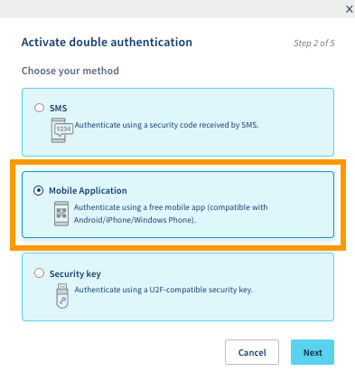
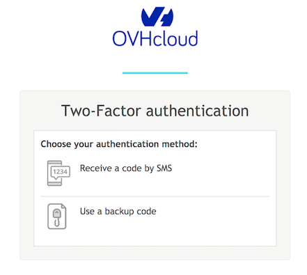

**Última actualización: 15/11/2019**

## Objetivo

La doble autenticación con el sistema de *OTP* (abreviatura en inglés de «one-time password» y que significa contraseña de un solo uso) disponible a través de una aplicación móvil es uno de los métodos que OVHcloud propone para permitirle proteger el acceso a su área de cliente. 

**Esta guía explica cómo activar la doble autenticación a través de la aplicación OTP y cómo utilizarla cada vez que inicie sesión en su área de cliente en el futuro.**

## Requisitos

- Haber consultado los [diferentes métodos de doble autenticación que ofrece OVHcloud](https://docs.ovh.com/es/customer/proteger-su-cuenta-con-una-2FA/).
- Haber iniciado sesión en el [área de cliente de OVHcloud](https://www.ovh.com/auth/?action=gotomanager){.external}.
- Haber instalado una aplicación de OTP en un teléfono inteligente o una tableta con sistema operativo Android o iOS.

> [!primary]
>**Las aplicaciones móviles de OTP**
>
> Existen numerosas aplicaciones de OTP. A continuación, dos de ellas, gratuitas:
> 
> - Para Android: Free OTP
> - Para iOS: OTP Auth
> 

## Procedimiento

### Etapa 1: activar la doble autenticación

Inicie sesión en el [área de cliente de OVHcloud](https://www.ovh.com/auth/?action=gotomanager){.external}, Haga clic en su nombre en la esquina superior derecha (primer paso en la siguiente imagen) y, seguidamente, en `«Mi cuenta»`{.action} (segundo paso). A continuación, haga clic en `«Seguridad»`{.action} (tercer paso) y, seguidamente, en `«Activar la doble autenticación»`{.action} (cuarto paso).

{.thumbnail}

### Etapa 2: elegir el método mediante aplicación móvil

Elija el método mediante aplicación móvil y valide.

{.thumbnail}

### Etapa 3: aceptar la doble autenticación

Escanee el código QR con su aplicación de OTP. Introduzca el código generado por la aplicación en el campo destinado para tal fin (a la derecha del código QR). También puede añadir una descripción a este método de autenticación. Dicha descripción puede ser muy útil para identificar las personas susceptibles de utilizar este método en su cuenta.

{.thumbnail}

### Etapa 4: guardar los códigos de seguridad

Al agregar por primera vez un método de seguridad por doble autenticación, se le comunicarán los códigos de seguridad que deberá guardar cuidadosamente. En consecuencia, le aconsejamos guardarlos en un gestor de contraseñas.

{.thumbnail}

Podrá eliminarlos o regenerarlos iniciando sesión en su área de cliente:

{.thumbnail}

> [!warning]
>
> Le recordamos que es indispensable guardar estos códigos de seguridad y asegurarse de que sean válidos. En caso de indisponibilidad de su/s método/s de seguridad seleccionado/s (debido al robo o pérdida de su teléfono o de su llave de seguridad), el acceso a su área de cliente podría quedar bloqueado.
> 
> 

### Etapa 5: iniciar sesión en el área de cliente con la doble autenticación

Tras activar la autenticación de doble factor, la pantalla de identificación le mostrará uno de sus métodos de seguridad. Si desea utilizar otro, haga clic en el botón `«Intentarlo con otro método»`{.action}.

{.thumbnail}

A continuación, aparecerán todas las opciones que activó:

{.thumbnail}

## Más información

Interactúe con nuestra comunidad de usuarios en <https://community.ovh.com/en/>https://community.ovh.com/en/</https://community.ovh.com/en/>.