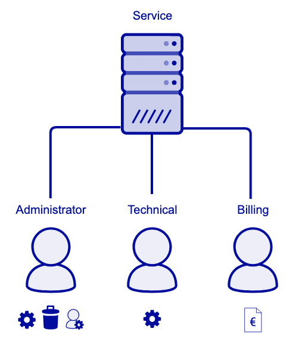
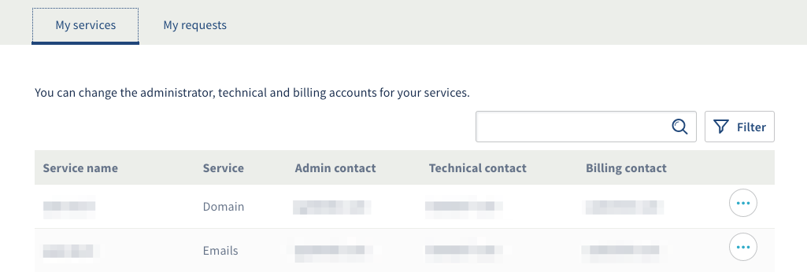
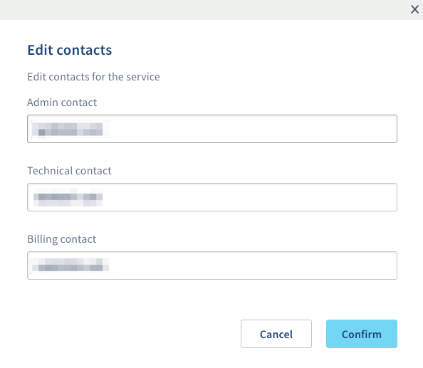
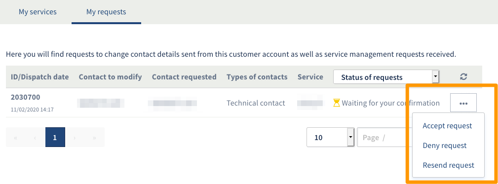

**Última atualização no dia 20/05/2020**

## Objetivo

A maioria dos serviços OVHcloud são geridos por vários contactos. Cada um desses contactos encontra-se associado a um nome de utilizador. 

**Saiba como definir ou alterar os contactos (gestores) dos serviços OVHcloud.**

## Definição

Há três tipos de contactos:

- **Administrador**: conta com permissões para gerir todos os aspetos do serviço (administrativos, técnicos e faturação). Permite definir os contactos (atribuir diferentes funções a diferentes utilizadores) e, no caso dos domínios, atualizar as informações associadas ao proprietário de um serviço (endereço postal, telefone, e-mail).
- **Técnico**: conta com permissões para gerir aspetos técnicos de um serviço.
- **Faturação**: conta com permissões para gerir aspetos relacionados com a faturação de um serviço. O responsável pela faturação recebe notificações relacionadas com a renovação do serviço, pagamentos, etc. 

O Identificador de Cliente (ID) é um código pessoal. Trata-se de um nome de utilizador enviado por e-mail logo após a criação da conta de cliente. Este deve ser usado para aceder à Área de Cliente ou no contacto com os serviços OVHcloud. Costuma ser composto por duas letras iniciais, seguidas de algarismos, e termina com «-ovh». Por exemplo: **xx11111-ovh**. Quando contrata serviços OVHcloud, este nome de utilizador é definido como contacto (gestor) dos serviços selecionados.

{.thumbnail}

## Requisitos

- Estar ligado à [Área de Cliente OVHcloud](https://www.ovh.com/auth/?action=gotomanager){.external}.
- Ter as permissões de acesso necessárias para este tipo de operação.
- Ter acesso ao Identificador de Cliente (ID de Cliente) do utilizador que irá ser definido como contacto.
- Todos os utilizadores envolvidos na alteração de um contacto devem ter acesso à conta de e-mail associada aos seus perfis.
- O antigo e o novo contacto faturação devem ter os pagamentos em dia.

## Instruções

### Aceder à área de gestão dos contactos

Aceda à sua [Área de Cliente OVHcloud](https://www.ovh.com/auth/?action=gotomanager){.external}, clique no nome do cliente no canto superior direito e, em seguida, clique em `Gestão dos contactos`{.action}.

{.thumbnail}

Irá visualizar uma tabela. A tabela inclui a lista de serviços associados ao seu ID de cliente, e a lista dos contactos responsáveis pela gestão dos vários aspetos do serviço.

{.thumbnail}

### Alterar contactos (gestores) de um serviço

Na página de gestão dos contactos, clique em `...`{.action} à direita do serviço a alterar e, a seguir, em `Modificar os contactos`{.action}. Faça as alterações desejadas e, a seguir, clique em `Validar`{.action}.

{.thumbnail}

{.thumbnail}

Os contactos implicados no processo de modificação vão receber um e-mail para confirmarem a alteração.

#### Sou administrador

Enquanto administrador, pode efetuar todo o tipo de ações relacionadas com a definição dos contactos.

- Definir contactos para a gestão da faturação ou para a gestão técnica do serviço. Esta ação requer a sua confirmação e a confirmação do utilizadores indicados como novos contactos. Todos os utilizadores abrangidos por esta alteração irão receber um e-mail para confirmarem o processo.

- Recuperar as permissões de gestão técnica e/ou de faturação. O administrador pode recuperar as funções de técnico e de faturação. Para tal, terá de efetuar e confirmar a alteração. O utilizador que está para ser eliminado da lista de contactos (gestores) irá receber um e-mail para confirmar ou não a alteração. 

- Definir um novo administrador. Esta ação requer a sua confirmação e a confirmação do utilizador definido como novo administrador. 

#### Sou o responsável (contacto) técnico

Este acesso só permite alterar o utilizador definido como contacto técnico A ação requer a sua confirmação e a confirmação do novo contacto.

#### Sou o responsável pela faturação

Este acesso só permite alterar o utilizador definido como contacto de faturação. A ação requer a sua confirmação e a confirmação do novo contacto.

> [!warning]
> Esta operação só pode ser realizada se os utilizadores afetados pela alteração do contacto de faturação tiverem os pagamentos em dia.

### Gerir pedidos em curso: confirmar, recusar ou consultar uma alteração de contacto

Área de Cliente: para gerir os pedidos em curso, clique no separador `Os meus pedidos`{.action}. Aqui pode aceitar ou recusar um pedido.

{.thumbnail}

Para tal, tem que usar o código de validação (i.e. <i>token</i>) enviado por e-mail.

> [!primary]
> Este código é pessoal, de utilização única e diferente para cada utilizador.

O e-mail recebido também inclui um link para a página onde poderá confirmar ou recusar o pedido de alteração. Se usar o link incluído no e-mail, o código de validação (<i>token</i>) estará automaticamente preenchido.

Se um dos contactos não tiver recebido o e-mail, é possível que o endereço associado ao perfil não esteja atualizado. Como tal, o utilizador deverá verificar o endereço de e-mail indicado perfil. Se necessário, pode modificá-lo e solicitar o reenvio do e-mail. Para isso, basta clicar em `Reenviar o pedido`{.action}.

{.thumbnail}

Se apenas um dos contactos confirmar a alteração, será mostrada uma mensagem para informar que o pedido precisa de ser confirmado por outro utilizador. A confirmação dos utilizadores pode demorar alguns minutos até ser atualizada na [Área de Cliente OVHcloud](https://www.ovh.com/auth/?action=gotomanager){.external}.

{.thumbnail}

A alteração terá efeito logo após a confirmação dos utilizadores. No final, os utilizadores envolvidos no processo irão receber um e-mail para informar que o pedido foi concretizado.

## Quer saber mais?

Fale com a nossa comunidade de utilizadores: [https://community.ovh.com/en/](https://community.ovh.com/en/).