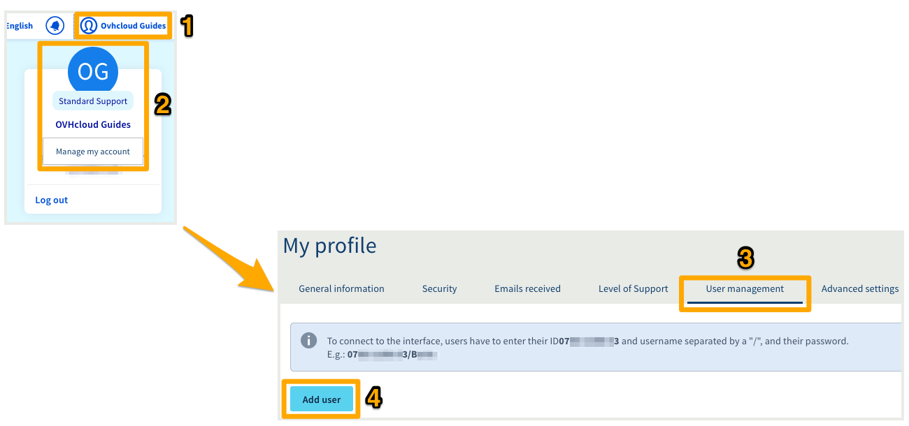
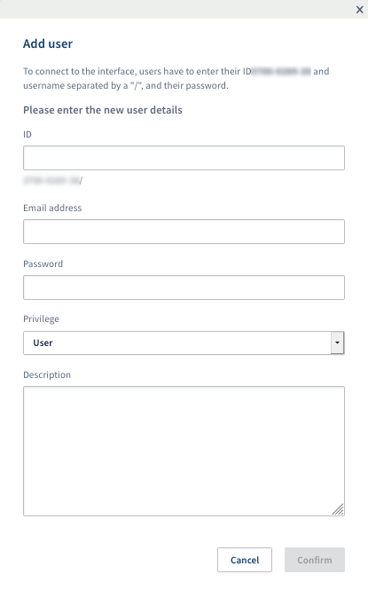
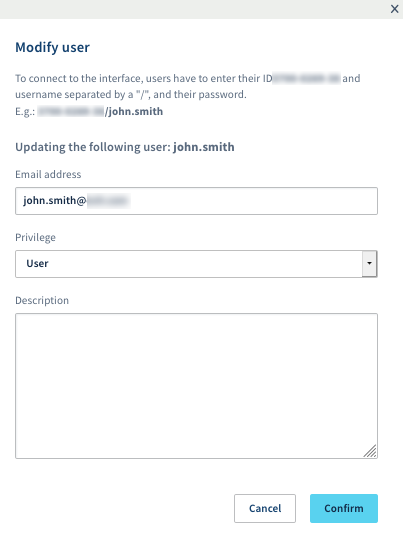

**Letzte Aktualisierung am 20.05.2020**

## Ziel

Bei OVHcloud haben Sie die Möglichkeit, Benutzer zu erstellen und diesen Lese- oder Schreibrechte für Ihren Kunden-Account zu erteilen. So können Sie Mitgliedern Ihres Unternehmens Zugriff auf Ihre OVHcloud Dienste gewähren, ohne einen riskanten Umweg zu nehmen, indem Sie etwa Ihr Passwort oder Login-Codes weitergeben.

> [!primary]
>
> Die Benutzerverwaltung unterscheidet sich von der Verwaltung der Kontakte. Ein Benutzer erhält mindestens *read-only*-Zugriff auf alle Bereiche Ihres Kundencenters.
>
> Bei der Kontaktverwaltung hingegen geht es darum, die vollständige Verwaltung der administrativen, technischen oder rechnungsrelevanten Aspekte eines oder mehrerer Dienste Ihres OVHcloud Accounts auf eine andere Person zu übertragen. Für weitere Informationen zur Verwaltung der Kontakte lesen Sie [diese Anleitung](../verwaltung-der-kontakte/).
>

**Diese Anleitung erlärt, über welche Rechte ein Benutzer verfügen kann und wie Sie Benutzer hinzufügen und verwalten.**

## Voraussetzungen

- Sie verfügen über einen aktiven OVHcloud Kunden-Account.
- Sie haben Zugriff auf Ihr [OVHcloud Kundencenter](https://www.ovh.com/auth/?action=gotomanager).

## In der praktischen Anwendung

### Schritt 1: die verschiedenen Benutzerrechte unterscheiden

Sie können aus drei Arten von Berechtigungen für jeden Ihrer Benutzer wählen.

| Rechte | Beschreibung |
|----------------|----------------------------------------------------------------------------------------------------------------------|
| Keine | Gewährt reinen Lese-Zugriff auf alle Bereiche des Kundencenters. |
| Benutzer | Gewährt Lese- und Schreib-Zugriff auf alle Bereiche des Kundencenters **mit Ausnahme** der Benutzerverwaltung. |
| Administrator | Gewährt Lese- und Schreib-Zugriff auf alle Bereiche des Kundencenters **inklusive** der Benutzerverwaltung. |

#### Beispiel zur Benutzerverwaltung

Der Inhaber des Accounts xx11111-ovh erstellt zwei Benutzer:

- Benutzer Jane erhält **Benutzer**-Rechte und hat somit Schreib-Zugriff auf alle Bereiche des Accounts mit Ausnahme der Benutzerverwaltung.
- Benutzer Martin erhält **Keine** Rechte und verfügt somit lediglich über *read-only*-Zugriff auf alle Bereiche des Accounts.

Der Inhaber des Accounts xx11111-ovh verfügt automatisch über **Administrator**-Rechte und hat somit Schreib-Zugriff auf sein gesamtes Kundencenter. Er kann auch neue Benutzer hinzufügen und/oder vorhandene Benutzer löschen.

{.thumbnail}

### Schritt 2: Benutzer hinzufügen

Wenn Sie in Ihrem [OVHcloud Kundencenter](https://www.ovh.com/auth/?action=gotomanager) eingeloggt sind, klicken Sie oben rechts auf `Ihren Namen`{.action} (1) und klicken Sie dann auf Ihre Initialen (2).
Klicken Sie anschließend auf den Tab `Benutzerverwaltung`{.action} (3) und dann auf `Einen Benutzer hinzufügen`{.action} (4).

{.thumbnail}

Füllen Sie im neu geöffneten Fenster alle erforderlichen Felder aus. Klicken Sie auf `Bestätigen`{.action}, um den Benutzer zu erstellen.

{.thumbnail}

| Feld | Beschreibung |
|--------------|----------------------------------------------------------------------------------------------------------------------------------------------------------------------------------------------------------------------------------------------------------------------------------------------------------|
| Kennung | Geben Sie zum Beispiel den Namen des Benutzers oder dessen Funktion ein. |
| E-Mail | Geben Sie die E-Mail-Adresse des Benutzers ein. |
| Passwort | Legen Sie das Passwort des Benutzers fest. Er kann dieses ändern, nachdem sein Zugang erstellt wurde.  Wir empfehlen Ihnen, hierzu [die Anleitung zur Passwortverwaltung](../Passwort-verwalten/) zu lesen. |
| Rechte | Wählen Sie aus Keine/Benutzer/Administrator. |
| Beschreibung | Sie können eine Benutzerbeschreibung hinzufügen, beispielsweise die Rolle in Ihrem Unternehmen. |

Der Benutzer erhält im Anschluss eine eigene Kundenkennung bestehend aus der numerischen ID Ihres Accounts (die Sie im Bereich „Verwaltung der Benutzer“ nachlesen können) und dem Benutzernamen, wobei beide Werte durch ein „/“ getrennt sind.

Beispiel: **1234-567-89/john.smith**.

{.thumbnail}

Der Benutzer kann sich von nun an mit dieser Kennung im [OVHcloud Kundencenter](https://www.ovh.com/auth/?action=gotomanager) einloggen. 

Darüber hinaus kann er sein Passwort ändern und seinen eigenen Zugang zu Ihrem Account mithilfe einer Zwei-Faktor-Authentifizierung zusätzlich schützen (diese betrifft nur seinen Zugriff als Benutzer). Um mehr über die Einrichtung der Zwei-Faktor-Authentifizierung zu erfahren, lesen Sie [diese Anleitung](../Account-mit-2FA-absichern/).

### Schritt 3: Benutzer verwalten

Sie können einen Benutzer bearbeiten, deaktivieren/aktivieren oder löschen, indem Sie rechts auf `...`{.action} klicken.

{.thumbnail}

Durch Bearbeiten des Benutzers können Sie dessen E-Mail-Adresse, Rechte und die Beschreibung aktualisieren.

{.thumbnail}

## Weiterführende Informationen

Für den Austausch mit unserer User Community gehen Sie auf <https://community.ovh.com/en/>.