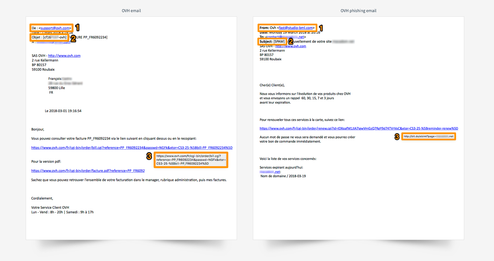

**Ultimo aggiornamento: 23/08/2018**

## Obiettivo

Il phishing consiste nell’invio di un’email contenente un link che ti reindirizza verso un form: quest’ultimo riprende in maniera fraudolenta i colori di una marca e ti invita a inserire informazioni personali.

**Questa guida ti mostra come riconoscere una email di phishing e cosa fare se si clicca su un link fraudolento.**

## Prerequisiti

- Nessun prerequisito specifico

## Procedura

### Se ricevi un’email di phishing a nome di OVH

#### Come individuare un’email di phishing

Hai ricevuto un’email a nome di OVH e vuoi essere sicuro che sia corretta? Ecco alcuni elementi che possono aiutarti a distinguere un’email OVH da un tentativo di phishing.

{.thumbnail}

> [!alert]
> 
> Accertati della presenza delle tre seguenti condizioni.
> 

|Numero - Descrizione|Email OVH|Email di phishing|
|---|---|---|
|1 - Mittente|Controlla che l’indirizzo utilizzato per l’invio dell’email termini per “@ovh.com”, “@soyoustart.com” o “@kimsufi.com”.|Il più delle volte, l’email sarà contrassegnata come spam tra parentesi e il tuo nome utente non comparirà oppure sarà errato.|
|2 - Oggetto|Verifica che il tuo nome utente **(che inizia con la prima lettera del cognome e la prima lettera del nome registrati su OVH)** e/o l’indirizzo email del tuo account figurino nell’oggetto del messaggio.|Il più delle volte, l’email sarà contrassegnata come spam tra parentesi e il tuo nome utente non comparirà oppure sarà errato.|
|3 - Link|Passa il mouse sul link in modo da visualizzarne direttamente il contenuto senza doverci cliccare (in fondo alla pagina del tuo browser). Il link dovrà reindirizzare alla pagina https://www.ovh.com/.|Nel nostro esempio, passando il mouse sul link, vedrai che quest’ultimo non ha niente a che vedere con OVH, pertanto non cliccarci.|

> [!primary]
> 
> Se sei un cliente Kimsufi o So you Start, non dovrai mai pagare alcuna somma a OVH. Quindi non considerare questo tipo di email.
> 

#### Segnalare una email di phishing

Se dopo aver verificato quanto sopra sei certo di aver effettivamente ricevuto una email di phishing, inoltra il maggior numero possibile di informazioni (almeno il contenuto dell’email) al seguente indirizzo email: fraud@ovh.com.

> [!primary]
> 
>  Le informazioni che ci comunicherai potranno essere condivise con terze parti per consentirci di lottare contro queste minacce.
> 

### Cosa fare se hai inserito i tuoi dati personali

#### Se hai registrato il numero della tua carta di credito su un sito fraudolento

L’unica cosa da fare è contattare rapidamente la tua banca per bloccare la carta. Indica loro la data e, se possibile, l’ora in cui hai inserito il numero della tua carta di credito.

**La tua banca è l’unica a poter annullare le transazioni fraudolente che potrebbero essere state effettuate a tua insaputa.**

#### Se hai inserito la password del tuo account OVH su un sito fraudolento

Accedi al tuo Spazio Cliente OVH e modifica immediatamente la password. Ti consigliamo inoltre di attivare la doppia autenticazione come ulteriore forma di protezione per il tuo account.

> [!primary]
>
> Per rendere più sicuri i tuoi dati, la tua password deve possedere le seguenti caratteristiche:
>
> - contenere almeno dodici caratteri
> - contenere almeno tre tipi di caratteri 
> - non essere tratta dal dizionario
> - non contenere informazioni personali (nome, cognome o data di nascita) 
> - non essere utilizzata per altri account
> - essere archiviata in un password manager
> - essere cambiata ogni tre mesi 
> - essere diversa dalle password precedenti
>

## Per saperne di più

Contatta la nostra Community di utenti all’indirizzo [https://www.ovh.it/community/](https://www.ovh.it/community/){.external}.