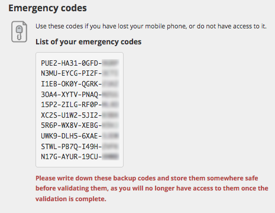
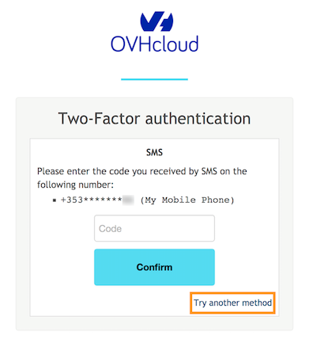
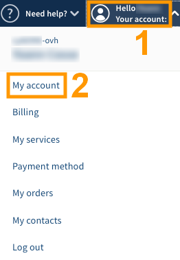
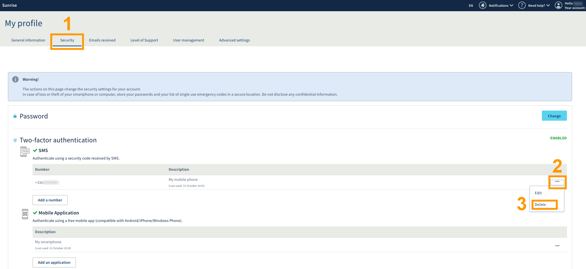

**Letzte Aktualisierung am 15.11.2019**

## Ziel

OVHcloud stellt Ihnen Instrumente zur Verfügung, um die Sicherheit Ihres Accounts und Ihrer Dienste zu erhöhen.
Sie können eine Zwei-Faktor-Authentifizierung aktivieren (2FA). Diese ergänzt Ihre Kennung und Passwort und wird von einem Ihrer Geräte generiert: ein Telefon, ein Tablet oder ein USB-Sicherheitsschlüssel.  

**Lernen Sie die verschiedenen Sicherheitsmethoden und ihre Aktivierung kennen.**

## Voraussetzungen

- Sie sind in Ihrem [OVHcloud Kundencenter](https://www.ovh.com/auth/?action=gotomanager) angemeldet.
- Sie haben ein Mobiltelefon (für die Methode per SMS), ein Smartphone oder Tablet (für die Methode über mobile Applikation) oder einen „Universal Second Factor (U2F)“ Sicherheitsschlüssel.
- Sie haben die [Empfehlungen zur Verwaltung des Zugangspassworts für Ihren Kunden-Account](https://docs.ovh.com/de/customer/Passwort-verwalten) zur Kenntnis genommen.

## In der praktischen Anwendung

Sie können die Zwei-Faktor-Authentifizierung auf eine oder mehrere Weisen aktivieren, um den Zugang zu Ihrem Kundencenter abzusichern und zu kontrollieren.
Hierzu stellen wir Ihnen drei verschiedene Methoden zur Verfügung:

- **per SMS**. Bitte geben Sie Ihre Mobilfunknummer ein. Ein Code zur einmaligen Verwendung wird Ihnen per SMS zugeschickt, wenn Sie sich bei Ihrem Account bei OVHcloud anmelden möchten. Der Hauptvorteil dieser Methode besteht in der Verwendung eines Codes, der auf ein Peripheriegerät gesandt wird, und nicht auf Ihren Computer. Bei Einbruch in Ihren Computer, z.B. per Schadsoftware, bleibt Ihr Account abgesichert. Die Netzabdeckung muss indes ausreichen, um Nachrichten per SMS zu empfangen;

- **per mobiler OTP-Applikation**. Installieren Sie eine mobile OTP-Applikation auf Ihrem Smartphone oder Tablet mit Android oder iOS. Ordnen Sie dann die Applikation Ihrem Account bei OVHcloud zu. Die Applikation generiert einen für kurze Zeit gültigen Code zur einmaligen Verwendung, wenn Sie sich bei Ihrem Account bei OVHcloud anmelden möchten.
Ist die Applikation Ihrem Account einmal zugewiesen, benötigen Sie keine Internetverbindung für Ihr Peripheriegerät mehr, um die Codes zu generieren;

- **per Sicherheitsschlüssel U2F**. Bei dieser Methode müssen Sie einen U2F-Sicherheitsschlüssel per USB an Ihren Computer anschließen, wenn Sie sich mit Ihrem Account bei OVHcloud verbinden. Die Authentifizierung geschieht nun automatisch. Diese Methode bietet eine höhere Sicherheitsstufe, da die Ausrüstung dafür unabhängig und völlig separat von Ihrem Computer, Smartphone oder Tablet ist. Sie ist Gefährdungen aufgrund von Hacking somit weniger ausgesetzt. 

### Schritt 1: Aktivieren Sie Ihre erste Methode der Zwei-Faktor-Authentifizierung

- [Zwei-Faktor-Authentifizierung per SMS aktivieren](https://docs.ovh.com/de/customer/die-zwei-Faktor-Authentifizierung-per-SMS-aktivieren).
- [Zwei-Faktor-Authentifizierung per mobiler Applikation aktivieren](https://docs.ovh.com/de/customer/die-Zwei-Faktor-Authentifizierung-per-mobiler-Applikation-aktivieren).
- [Zwei-Faktor-Authentifizierung per Sicherheitsschlüssel aktivieren](https://docs.ovh.com/de/customer/die-Zwei-Faktor-Authentifizierung-mit-Sicherheitsschl%C3%BCssel-aktivieren).

Nach Hinzufügen der ersten Methode können Sie weitere Methoden hinzufügen, um mehrere Möglichkeiten zu haben, sich mit ihrem Konto zu verbinden.

### Schritt 2: Speichern Sie die Sicherheitscodes

Wenn Sie erstmalig eine Zwei-Faktor-Authentifizierung hinzufügen, werden Ihnen die Notfall-Codes mitgeteilt. Bewahren Sie sie gut auf. Wir empfehlen Ihnen, sie in einem Passwort-Manager zu speichern.

{.thumbnail}

Sie können sie in ihrem Kundencenter löschen oder erneut erstellen:

{.thumbnail}

> [!warning]
>
> Wir möchten Sie daran erinnern, dass die Notfall-Codes unbedingt gespeichert und gültig sein müssen. Sollte(n) die von Ihnen gewählte(n) Sicherheitsmethode(n) nicht verfügbar sein (Diebstahl oder Verlust Ihres Telefons oder Ihres Sicherheitsschlüssels), kann der Zugang zu Ihrem Kundencenter gesperrt werden.
> 
> 
> 

### Schritt 3: Verbinden Sie sich unter Verwendung der Zwei-Faktor-Authentifizierung mit dem Kundencenter

Sobald die Zwei-Faktor-Authentifizierung aktiviert ist, zeigt das Anmeldefenster die gewählte Sicherheitsmethode an. Falls Sie eine andere Methode verwenden möchten, klicken Sie auf `Eine andere Methode wählen`{.action}.

{.thumbnail}

Alle von Ihnen aktivierten Methoden werden nun angezeigt:

{.thumbnail}

### Was soll ich tun, wenn eines meiner Peripheriegeräte verloren geht oder nicht mehr funktioniert?

Wenn Ihr Peripheriegerät (Mobiltelefon/Smartphone/Sicherheitsschlüssel) verloren geht oder nicht mehr funktioniert, empfehlen wir Ihnen, die anderen für Ihren Account aktiven Methoden der Zwei-Faktor-Authentifizierung zu nutzen.

Auch können Sie einen der Sicherheitscodes verwenden, die Ihnen zur Verfügung gestellt wurden. 

### Ein Peripheriegerät entfernen, das mit der Zwei-Faktor-Authentifizierung verbunden ist

> [!warning]
>
> Das Entfernen eines Peripheriegerätes deaktiviert nicht die Zwei-Faktor-Authentifizierung. 
> 
> Um den Zugang zu Ihrem Account nicht zu sperren, vergewissern Sie sich vor dem Entfernen eines Peripheriegeräts, dass Sie eine der folgenden Möglichkeiten zur Verfügung haben:
> 
> - ein funktionstüchtiges Peripheriegerät;
> 
> - eine alternative, funktionierende Methode der Zwei-Faktor-Authentifizierung;
> 
> - gültige Sicherheitscodes.
> 

Loggen Sie sich in Ihrem [OVHcloud Kundencenter](https://www.ovh.com/auth/?action=gotomanager) ein, um ein Peripheriegerät zu entfernen. Klicken Sie auf Ihren Namen oben rechts (Schritt 1 auf dem Bild unten), dann auf `Mein Account`{.action} (Schritt 2). 

{.thumbnail}

Klicken Sie danach auf `Sicherheit`{.action} (Schritt 1 auf dem Bild unten), dann auf `...`{.action} (Schritt 2) rechts vom Peripheriegerät, das Sie entfernen möchten, und schließlich auf `Löschen`{.action} (Schritt 3).

{.thumbnail}

## Weiterführende Informationen

Für den Austausch mit unserer User Community gehen Sie auf [https://community.ovh.com/en/](https://community.ovh.com).