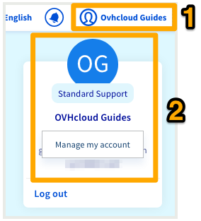
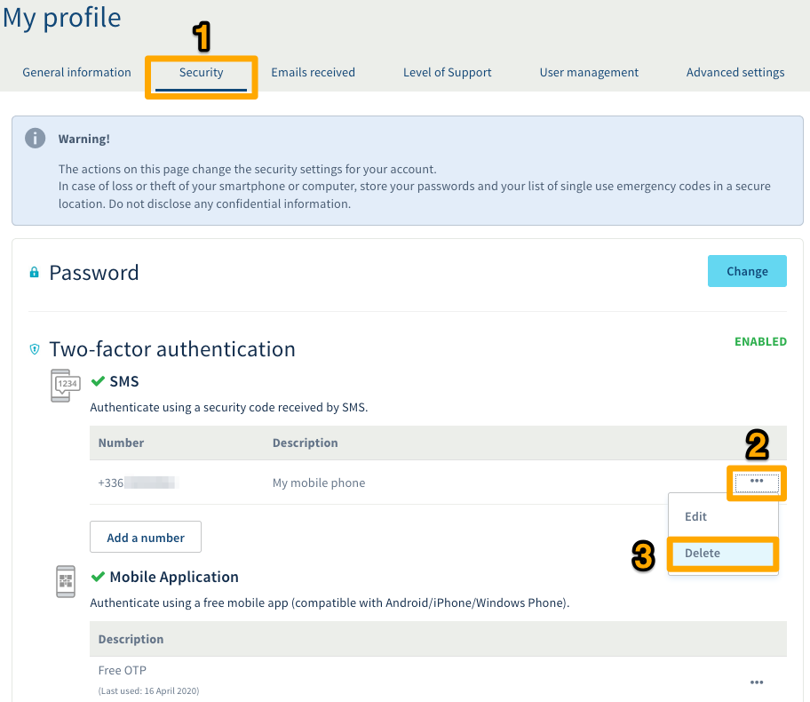

**Ostatnia aktualizacja z dnia 15-11-2019**

## Wprowadzenie

OVHcloud oddaje do Twojej dyspozycji narzędzia pozwalające zwiększyć bezpieczeństwo Twojego konta i naszych usług.
Możesz aktywować uwierzytelnianie z wykorzystaniem weryfikacji dwuetapowej (2FA). Metoda ta stanowi uzupełnienie loginu i hasła. Można z niej korzystać za pośrednictwem posiadanego urządzenia: telefonu, tabletu lub klucza sprzętowego. 

**Poznaj różne oferowane metody i sposoby ich aktywacji.**

## Wymagania początkowe

- Dostęp do [panelu klienta OVHcloud](https://www.ovh.com/auth/?action=gotomanager).
- Posiadanie telefonu komórkowego (w przypadku metody SMS-owej), smartfona lub tabletu (w przypadku aplikacji mobilnej), bądź klucza sprzętowego Universal Second Factor (U2F).
- Zapoznanie się z [zaleceniami dotyczącymi zarządzania hasłem dostępu do konta](../zarzadzanie-haslem/).

## W praktyce

Możesz aktywować jedną lub więcej metod weryfikacji dwuetapowej, aby zabezpieczyć i kontrolować dostęp do Twojego panelu klienta.
Oferujemy trzy różne metody:

- **przez SMS**. Wprowadź numer Twojego telefonu komórkowego. Otrzymasz kod jednorazowy SMS-em przy każdej próbie zalogowania się na Twoje konto OVHcloud. Główną zaletą tej metody jest korzystanie z kodu przesyłanego na inne urządzenie niż Twój komputer. W razie włamania na komputer, np. za sprawą oprogramowania malware, Twoje konto pozostanie bezpieczne. Musisz jednak dysponować wystarczającym zasięgiem sieci GSM, by móc otrzymywać SMS-y;

- **poprzez aplikację mobilną OTP**. Zainstaluj aplikację mobilną OTP na smartfonie lub tablecie z systemem Android lub iOS. Następnie powiąż aplikację ze swoim kontem OVHcloud. Przy każdej próbie logowania aplikacja wygeneruje kod jednorazowy, który będzie ważny przez krótki czas.
Po pierwszym powiązaniu aplikacji z Twoim kontem dostęp urządzenia do Internetu nie będzie już konieczny, aby wygenerować kody;

- **za pośrednictwem klucza sprzętowego U2F**. Metoda ta wymaga podłączenia do portu USB w komputerze klucza U2F przy każdym logowaniu do konta OVHcloud. Uwierzytelnienie przebiega wówczas automatycznie. Metoda ta zapewnia wyższy poziom bezpieczeństwa, ponieważ opiera się na niezależnym urządzeniu zabezpieczającym, całkowicie odseparowanym od komputera, smartfona lub tabletu, dzięki czemu jest mniej narażone na ryzyko włamania.

### Etap 1: aktywowanie Twojej pierwszej metody weryfikacji dwuetapowej

- [Aktywuj weryfikację dwuetapową przez SMS](../aktywacja-weryfikacji-dwuetapowej-przez-sms/).
- [Aktywuj weryfikację dwuetapową przy użyciu aplikacji mobilnej](../wlacz-weryfikacje-dwuetapowa-przez-aplikacje-mobilna/).
- [Aktywuj weryfikację dwuetapową za pomocą klucza sprzętowego](../aktywacja-weryfikacji-dwuetapowej-za-pomoca-klucza-sprzetowego/).

Po dodaniu pierwszej metody możesz dodać jeszcze jedną lub dwie kolejne, aby mieć więcej sposobów logowania się do swojego konta.

### Etap 2: zachowanie kodów bezpieczeństwa

Przy pierwszym dodaniu weryfikacji dwuetapowej otrzymasz kody zapasowe. Zachowaj je w bezpiecznym miejscu. Zalecamy, by przechowywać je w menedżerze haseł.

{.thumbnail}

Możesz je usunąć lub wygenerować ponownie w panelu klienta:

{.thumbnail}

> [!warning]
>
> Przypominamy o konieczności zachowania tych kodów bezpieczeństwa i upewnienia się, że są one prawidłowe. W razie niedostępności wybranej przez Ciebie metody/ metod zabezpieczeń (kradzież bądź utrata telefonu lub klucza sprzętowego), dostęp do Twojego panelu klienta może zostać uniemożliwiony.
> 

### Etap 3: zalogowanie się do panelu klienta z wykorzystaniem weryfikacji dwuetapowej

Po aktywacji weryfikacji dwuetapowej pojawi się ekran logowania z wybraną metodą zabezpieczeń. Jeśli chcesz skorzystać z innej metody, kliknij przycisk `Wypróbuj inną metodę`{.action}.

{.thumbnail}

Pojawią się wówczas wszystkie aktywowane przez Ciebie metody:

{.thumbnail}

### Co mogę zrobić, jeśli zgubię jedno z moich urządzeń lub też przestanie ono działać?

W razie zgubienia lub awarii Twojego urządzenia (telefon komórkowy/smartfon/klucz sprzętowy) zalecamy wykorzystanie innych metod weryfikacji dwuetapowej aktywnych w Twoim koncie.

Możesz także wykorzystać jeden z otrzymanych kodów bezpieczeństwa. 

### Usunięcie urządzenia służącego do weryfikacji dwuetapowej.

> [!warning]
>
> Usunięcie urządzenia nie powoduje dezaktywacji weryfikacji dwuetapowej. 
> 
> Aby nie zablokować dostępu do Twojego konta, przed usunięciem urządzenia upewnij się, że dysponujesz co najmniej jedną z poniższych metod:
> 
> - działającym urządzeniem;
> 
> - inną działającą metodą weryfikacji dwuetapowej; 
> 
> - prawidłowymi kodami bezpieczeństwa.
> 

Aby usunąć urządzenie, zaloguj się do [panelu klienta OVHcloud](https://www.ovh.com/auth/?action=gotomanager){.external}. Kliknij Twoją nazwę użytkownika w prawym górnym rogu (pierwszy etap na poniższym obrazie), a następnie `Moje konto`{.action} (drugi etap). 

{.thumbnail}

Następnie kliknij przycisk `Bezpieczeństwo`{.action} (pierwszy etap na poniższym obrazie), a później `...`{.action} (drugi etap) z prawej strony Twojego urządzenia do usunięcia, a na koniec wybierz opcję `Usuń`{.action} (trzeci etap).

{.thumbnail}

## Sprawdź również

Dołącz do społeczności naszych użytkowników na stronie [https://community.ovh.com](https://community.ovh.com/en)
