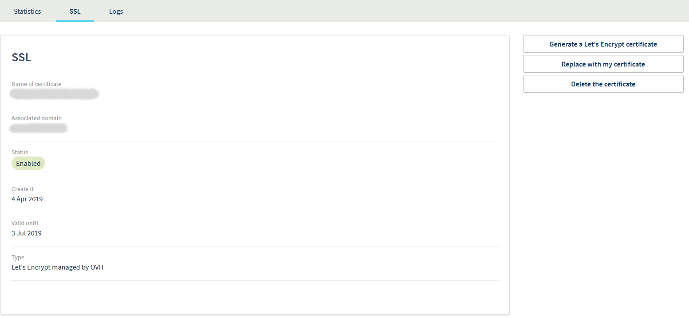

**Dernière mise à jour le 22/02/2018**

## Objectif

Il est possible d'ajouter un [certificat SSL](https://www.ovh.com/fr/ssl/){.external} à votre offre Content Delivery Network (CDN) afin que vos utilisateurs puissent effectuer des connexions sécurisées, même en passant par le CDN.

**Dans ce guide, nous allons vous détailler le fonctionnement du SSL Let's Encrypt fourni par OVH.**

## Prérequis

- Posséder l'[offre CDN d'OVH](https://www.ovh.com/fr/cdn/){.external}.
- Avoir accès à la gestion de la zone DNS de votre domaine.

## En pratique

### Obtenir le certificat Let's Encrypt fourni par OVH pour mes sous-domaines utilisant le CDN

- Si vous n'avez configuré aucun certificat et que vous ajoutez votre premier sous-domaine au CDN, un certificat Let's Encrypt sera automatiquement créé pour ce nom de domaine.
- Si vous ajoutez un autre sous-domaine au CDN, le certificat sera automatiquement régénéré afin d'y inclure le nouveau sous-domaine que vous venez de configurer.

Pour que la création du certificat se déroule correctement, il est nécessaire que le sous-domaine que vous venez d'ajouter pointe correctement vers le CDN. Pour cela référez-vous au guide vous indiquant comment effectuer une [première configuration d'un nom de domaine](https://docs.ovh.com/fr/cdn-infrastructure/premiere-configuration-domaine-sur-cdn/){.external}.

Le renouvellement du certificat est effectué de manière automatique dans les 20 jours précédant l'expiration du certificat.

> [!warning]
>
> Le certificat Let's Encrypt fourni par OVH peut prendre en charge les 100 premiers noms de domaine ou sous-domaines configurés sur le CDN. Si vous souhaitez la prise en charge de plus de 100 domaines, vous devrez configurer votre propre certificat Wildcard/Multi-domaines.
>

### Mon certificat est en cours de création, quels sont les délais ?

Une génération (ou régénération) de certificat, ainsi que son déploiement sur l'ensemble de nos points de présence, prend en moyenne deux heures.

{.thumbnail}

Si le processus de création semble bloqué, vérifiez bien que chaque nom de domaine configuré sur votre offre pointe vers le CDN. Si ce n'est pas le cas, notre robot ne parviendra pas à créer le certificat correctement.

Si vous avez effectué une correction de pointage durant la création du certificat, notre robot retentera régulièrement l'opération durant 48 heures. Passé ce délai, la tâche de création sera annulée.

Une nouvelle tentative de création sera alors effectuée dès que vous ajouterez un nouveau nom de domaine ou si vous demandez manuellement un certificat.

Une fois le certificat activé, voici ce que vous obtiendrez :

{.thumbnail}

### Ajouter son propre certificat

- Si vous n'avez pas encore ajouté de nom de domaine ou que vous ne possédez aucun certificat, vous pouvez utiliser l'option `Ajouter mon certificat`{.action} depuis l'onglet SSL du votre CDN :

{.thumbnail}

- Si vous possédez déjà un certificat Let's Encrypt, vous pouvez simplement utiliser l'option `Remplacer par mon certificat`{.action} :

{.thumbnail}

## Aller plus loin

[Première configuration d'un nom de domaine](https://docs.ovh.com/fr/cdn-infrastructure/premiere-configuration-domaine-sur-cdn/){.external}

Échangez avec notre communauté d’utilisateurs sur <https://community.ovh.com>.