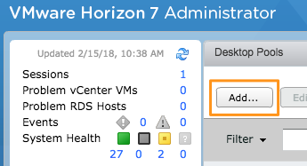
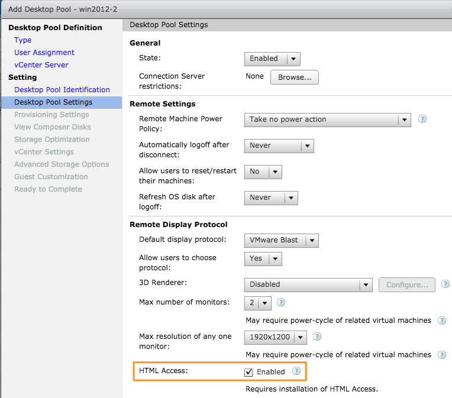
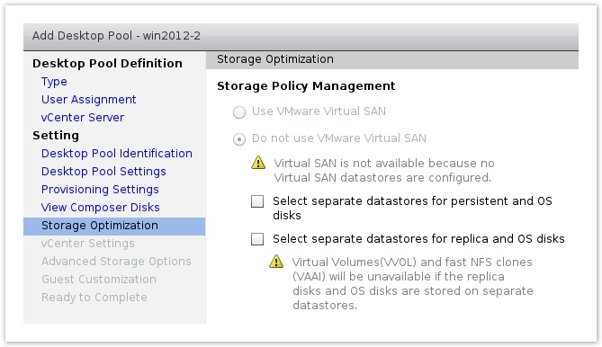

**Poslední aktualizace 23/03/2018**

## Cíl

Díky předcházejícím částem našeho seriálu již víte, jak se [přihlásit k platformě VMware Horizon](https://docs.ovh.com/cz/cs/cloud-desktop-infrastructure/platforma-horizon-7/){.external}, a Vaše [šablona skupiny virtuálních ploch](https://docs.ovh.com/cz/cs/cloud-desktop-infrastructure/jak-vytvorit-pool/){.external} je připravena k použití. Nyní tedy nastal čas k vytvoření Vaší první skupiny virtuálních ploch (poolu).

**Zjistěte, jak vytvořit svůj první pool virtuálních ploch za použití rozhraní VMware Horizon 7.1**.

## Prerekvizity

- Přístup do rozhraní VMware Horizon 7.1.

## Postup

Po přihlášení do rozhraní VMware Horizon postupujte podle následujících pokynů:

- Přejděte do sekce `Catalog`{.action}, pak `Desktop Pool`{.action} a klikněte na tlačítko `Add`{.action}. Otevře se formulář pro vytvoření skupiny virtuálních ploch (poolu).

{.thumbnail}

- Zvolte `pool type` (v našem příkladu *Automated*).

> [!primary]
>
> Existují tři hlavní typy skupin virtuálních ploch: *Automated*, *Manual* a *RDS*.
> 
> - *Automatizované pooly* jsou vytvářeny pomocí stejné šablony, nebo pomocí snapshotu virtuálního stroje (VM).
> 
> - *Manuální pooly* představují skupinu virtuálních strojů, fyzických strojů a virtuálních strojů třetích stran. V případě *automatizovaných* a *manuálních poolů* platí, že ke každému stroji může být vždy připojen pouze jeden vzdálený uživatel.
>
> - *RDS pooly* nepředstavují skupinu virtuálních strojů. Namísto toho poskytují relace virtuálních ploch na RDS hostitelích. V případě RDS může několik uživatelů navázat několik relací virtuálních ploch naráz.
> 

{.thumbnail}

- Zvolte `User Assignment` pro své pracovní plochy:

 - *Dedicated*: každá virtuální plocha bude přiřazena k unikátnímu uživateli.
 - *Floating*: virtuální plochy budou uživatelům přiřazovány v závislosti na aktuální dostupnosti v momentě přihlášení daného uživatele.

{.thumbnail}

- Vyberte typ klonu, který si přejete vytvořit pro zajištění poolu:

 - *Full virtual machines*: bude vytvořen plnohodnotný klon šablony virtuálního stroje.
 - *View Composer linked clones*: bude vytvořen klon z referenčního snapshotu. Tato možnost šetří úložný prostor, používá méně zdrojů a nabízí rychlejší spuštění. Zachovává však silné spojení mezi šablonou virtuálního stroje a spuštěným strojem virtuální plochy.

{.thumbnail}

- Zadejte název poolu (*Display name* může být později upraven, nikoli však ID).

{.thumbnail}

- Zvolte konfiguraci poolu (a zvažte aktivaci *HTML Access*, pokud je vyžadováno).

> [!primary]
>
> Doporučujeme použití protokolu **Blast**, jenž poskytuje rozpoznatelně vyšší výkon (nezávisle na šířce pásma), vyšší úroveň zabezpečení a mnohem delší výdrž baterie, pokud pracujete na mobilním zařízení. Více informací o tomto protokolu naleznete v [oficiální dokumentaci VMware (EN)](https://docs.vmware.com/en/VMware-Horizon-7/7.2/com.vmware.horizon-view.installation.doc/GUID-F64BAD49-78A0-44FE-97EA-76A56FD022D6.html){.external}.
> 

{.thumbnail}

- Nyní můžete vybrat způsob pojmenování svých virtuálních ploch a počet virtuálních strojů, které mají být spuštěny.

{.thumbnail}

- V následujícím okně můžete rozhodnout, zda mají být uživatelské profily ukládány na trvalé disky, a zda má být pro dočasné soubory Windows používán separovaný disk.

{.thumbnail}

- Následně můžete nadefinovat zásady pro ukládání dat, včetně toho, zda si přejete oddělit trvalé disky a disky s operačním systémem.

{.thumbnail}

- Následně vyberte *šablonu virtuálního stroje*, který si přejete spustit.

> [!primary]
>
> Pokud se virtuální stroj nezobrazí, zaškrtněte `Show all parent VMs`{.action} pro více informací.
> 

{.thumbnail}

- Následně lze vybrat *referenční snapshot* (můžete mít několik snapshotů, např. pro správu verzí, testování apod.).

{.thumbnail}

- Vyberte cílovou složku svého poolu (pro vSphere organizaci). Následně bude vytvořena podsložka s názvem Vašeho poolu - zde budou ukládány spuštěné virtuální stroje.

{.thumbnail}

- Vyberte Datastores (datová úložiště), která budou sloužit pro ukládání Vašich virtuálních strojů.

{.thumbnail}

- V následujícím okně budete moci zvolit pokročilé nastavení týkající se úložiště Vašich virtuálních ploch.

{.thumbnail}

- Následně můžete vybrat možnosti týkající se spuštění ActiveDirectory a přizpůsobení virtuálních strojů (vyberte sysprep přizpůsobení).

{.thumbnail}

- V tomto bodě můžete ke svému poolu přiřadit uživatele, nebo dokončit vytváření poolu a přidat uživatele později.

Doba vytváření poolu se může v závislosti na použité šabloně lišit. Pokud dojde k jakékoli chybě, přejděte do sekce `Inventory`, kde naleznete detailní informace o vytváření jednotlivých virtuálních strojů.

Pokračujte dále na [4. část - jak přidat uživatele k virtuální ploše](https://docs.ovh.com/fr/cloud-desktop-infrastructure/howto-create-pool/){.external}.

## Kam dál

Přidejte se k naší uživatelské komunitě na <https://community.ovh./en/>.