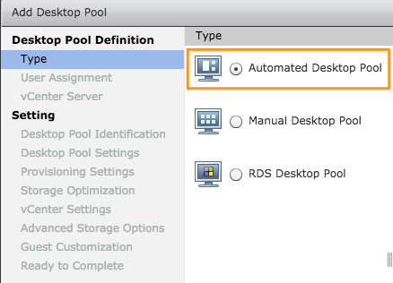
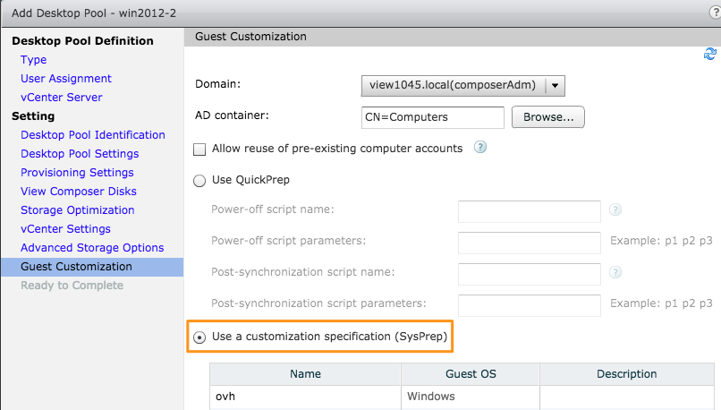

**Stand 24.08.2018**

## Einleitung

Sie wissen nun, wie Sie sich [in VMware Horizon einloggen](https://docs.ovh.com/de/cloud-desktop-infrastructure/horizon-7-plattform/){.external} und die [Pool-Vorlage](https://docs.ovh.com/de/cloud-desktop-infrastructure/pool-vorlage-erstellen/){.external} ist erstellt. Jetzt können Sie Ihren ersten Pool erstellen.

**In dieser Anleitung zeigen wir Ihnen, wie Sie Pools via VMware Horizon 7.1 erstellen.**

## Voraussetzungen

- Sie sind in VMware Horizon 7.1 eingeloggt.

## Beschreibung

Nachdem Sie sich in VMware Horizon eingeloggt haben, gehen Sie wie folgt vor:

- Gehen Sie im Bereich `Katalog`{.external} zu `Desktop-Pools`{.external} und klicken Sie auf `Hinzufügen`{.action}, um das Formular zur Erstellung eines Pools zu öffnen.

{.thumbnail}

- Wählen Sie den `Typ des Desktop-Pools` aus (in diesem Beispiel „Automatisierter Desktop-Pool“).

> [!primary]
>
> Es gibt drei Haupttypen der Desktop-Pools: *automatisiert*, *manuell* und *RDS*.
> 
> - Die *automatisierten* Desktop-Pool-Typen werden auf Basis einer Vorlage oder eines Snapshots einer virtuellen Maschine (VM) erstellt.
> 
> - Die *manuellen* Desktop-Pool-Typen sind eine Sammlung aus VMs, physischen Rechnern oder VMs Dritter. Bei *automatisierten* und *manuellen* Pools kann jede Maschine immer nur von einem Remotebenutzer gleichzeitig verwendet werden.
>
> - *RDS*-Desktop-Pools sind keine Sammlung von Maschinen. Stattdessen stellen Sie Benutzern Sitzungen auf RDS-Hosts zur Verfügung. So können mehrere Benutzer gleichzeitig mehrere Desktop-Sitzungen auf einem RDS-Host haben.
> 

{.thumbnail}

- Wählen Sie den `Zuweisungstyp` der virtuellen Desktops:

 - *Dediziert*: Die virtuellen Desktops werden einem bestimmten Benutzer zugewiesen.
 - *Dynamisch*: Die virtuellen Desktops werden je nach Verfügbarkeit zum Zeitpunkt des Logins beliebig den Benutzern zugewiesen.

{.thumbnail}

- Wählen Sie den Klontyp für die Bereitstellung des Pools:

 - *Vollständig virtuelle Maschinen*: Es wird ein vollständiger Klon der virtuellen Maschine erstellt.
 - *View Composer-Linked-Clones*: Es wird ein Klon vom übergeordneten Snapshot erstellt. Das verringert den notwendigen Datastore-Speicher, schont die Ressourcen und beschleunigt das Deployment, behält dabei jedoch eine starke Verbindung zwischen der Vorlagen-VM und der bereitgestellten Desktop-VM.

{.thumbnail}

- Wählen Sie den Pool-Namen (*Anzeigename*). Dieser kann im Nachhinein verändert werden, nicht jedoch die Pool-ID.

{.thumbnail}

- Legen Sie die Konfiguration fest und denken Sie daran, gegebenenfalls *HTML Access* zu aktivieren.

> [!primary]
>
> Wir empfehlen Ihnen, das **Blast**-Protokoll zu verwenden. Dieses gewährleistet eine gleichmäßigere Performance (unabhängig von der Bandbreite Ihrer Verbindung), erhöht die Sicherheit und schont die Batterie, wenn Sie ein mobiles Gerät verwenden. Weitere Informationen zum Blast-Protokoll finden Sie [hier](https://docs.vmware.com/de/VMware-Horizon-7/7.2/com.vmware.horizon-view.installation.doc/GUID-F64BAD49-78A0-44FE-97EA-76A56FD022D6.html){.external}.
> 

{.thumbnail}

- Anschließend können Sie das Benennungsmuster für Ihre virtuellen Maschinen sowie die maximale Anzahl der Desktop-VMs festlegen.

{.thumbnail}

- Im folgenden Fenster können sie festlegen, ob die Benutzerprofile auf einer persistenten Festplatte abgelegt werden und ob eine separate Festplatte für die temporären Windows-Dateien verwendet werden soll.

{.thumbnail}

- Danach können Sie unter Speicheroptimierung eine Richtlinie für die Speicherverwaltung auswählen, darunter auch die Trennung von persistenten und Betriebssystemfestplatten.

{.thumbnail}

- Wählen Sie im folgenden Fenster die *VM-Vorlage*, die Sie einrichten möchten.

> [!primary]
>
> Wenn die VM nicht angezeigt wird, wählen Sie `Alle übergeordneten VMs anzeigen`{.action} aus, um die Ursache zu ermitteln.
> 

{.thumbnail}

- Wählen Sie anschließend einen *Referenz-Snapshot* aus (Sie können zur Versionsverwaltung sowie aus Test- und Produktionsgründen auch mehrere Referenz-Snapshots auf verschiedenen Pools haben).

{.thumbnail}

- Wählen Sie nun den *Speicherort* Ihres Pools (für die vSphere-Organisation). Dort wird ein nach Ihrem Pool benannter Unterordner erstellt, um die eingerichteten VMs zu speichern.

{.thumbnail}

- Wählen Sie die *Datastores* aus, die für die Speicherung der VMs verwendet werden.

{.thumbnail}

- Im folgenden Fenster können Sie erweiterte Speicheroptionen für Ihre virtuellen Desktops festlegen.

{.thumbnail}

- Sie können nun die Deployment-Optionen für Active Directory und die Anpassung der VMs auswählen (wählen Sie eine der auf Ihrer Private Cloud erstellten sysprep-Anpassungen aus).

{.thumbnail}

- Außerdem können Sie Benutzer auch direkt mit dem Desktop-Pool verbinden oder die Erstellung des Pools abschließen und die Benutzer erst später zuweisen.

Je nach verwendeter Vorlage kann es etwas länger dauern, bis die Erstellung abgeschlossen ist. Im Fall eines Fehlers finden Sie im `Inventar`-Bereich des Pools weitere Details zur Erstellung jeder einzelnen VM, um die Ursache des Problems zu ermitteln.

Jetzt, da der Pool erstellt ist, zeigen wir Ihnen in der nächsten Anleitung, wie Sie [die virtuellen Desktops den Benutzern zuweisen](https://docs.ovh.com/de/cloud-desktop-infrastructure/virtuelle-desktops-zuweisen){.external}.

## Weiterführende Informationen

Für den Austausch mit unserer User Community gehen Sie auf <https://community.ovh.com/en/>.