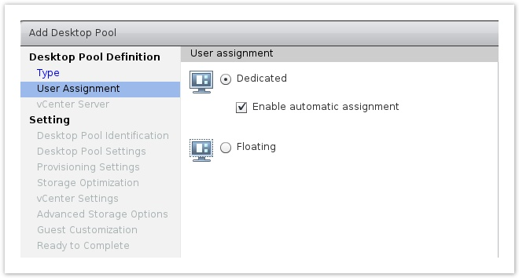
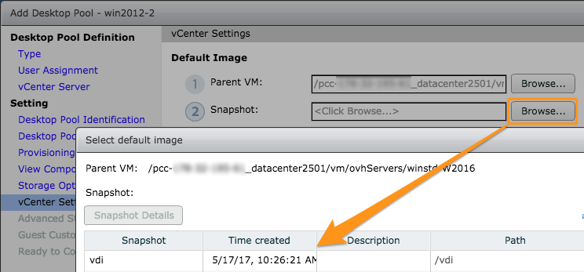
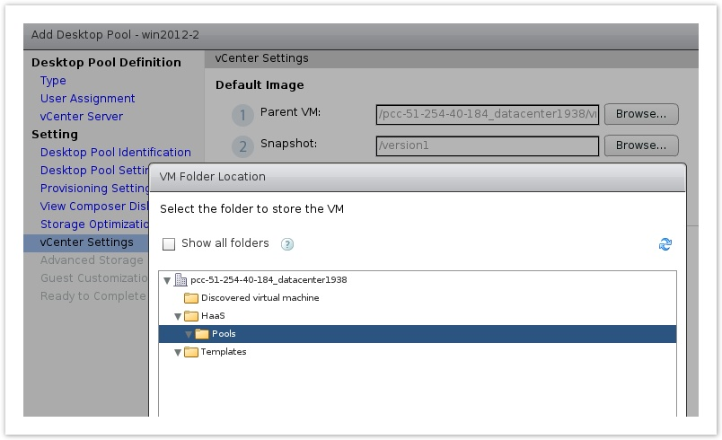
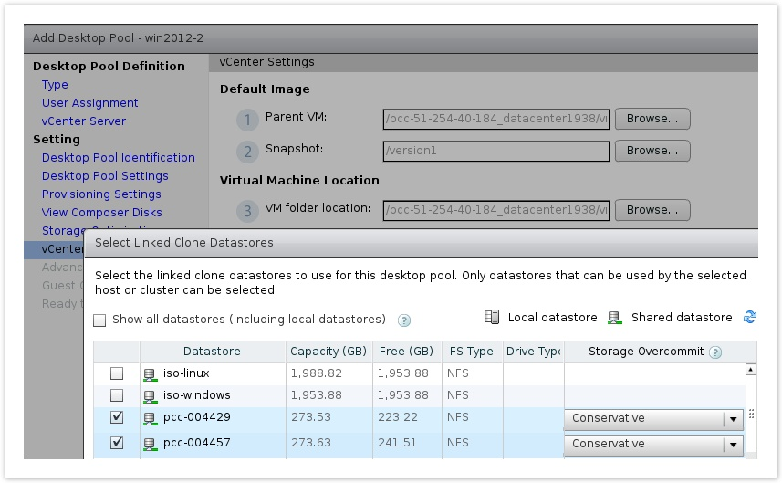

**Última actualización: 16/02/2018**

## Objetivo

Una vez [conectado a VMware Horizon](https://docs.ovh.com/es/cloud-desktop-infrastructure/plataforma-horizon-7/){.external}, y con su [modelo de *pool*](https://docs.ovh.com/es/cloud-desktop-infrastructure/crear-modelo-pool/){.external} listo, pasamos a crear un primer *pool*.

**Esta guía explica cómo crear un grupo de escritorios virtuales (*pool*) desde VMware Horizon 7.1.**

## Requisitos

- Estar conectado a VMware Horizon 7.1.

## Procedimiento

En VMware Horizon, realice las operaciones que se indican a continuación.

En `Catalog`{.action} > `Desktop Pools`{.action}, haga clic en `Add`{.action} para abrir el formulario de creación del pool.

{.thumbnail}

En la definición del grupo de escritorios, elija el **tipo de grupo** (por ejemplo, automatizado).

> [!primary]
>
> Hay tres tipos principales de grupos de escritorios: **automatizado**, **manual** y **RDS**.
> 
> - Los grupos de escritorios **automatizados** se crean a partir de un mismo modelo o de un snapshot de modelo de máquina virtual.
> 
> - Los grupos de escritorios **manuales** son una colección de máquinas virtuales, ordenadores físicos o máquinas virtuales de terceros. En los grupos automatizados y manuales, cada máquina está disponible para un solo acceso de usuario remoto al mismo tiempo.
>
> - Los grupos de escritorios **RDS** no son una colección de máquinas, sino que proporcionan sesiones de escritorio a hosts RDS. En un host RDS puede haber simultáneamente varias sesiones de escritorio de distintos usuarios.
> 

{.thumbnail}

Elija el modo de **asignación** de los escritorios virtuales:

- **Dedicated:** Los escritorios virtuales se asignarán a un único usuario.
- **Floating:** Los escritorios virtuales se distribuirán a los usuarios en función de la disponibilidad en el momento de cada conexión.

{.thumbnail}

Elija el tipo de clones que quiera realizar para aprovisionar el grupo de escritorios:

- **Full virtual machines:** Se realizará un clon completo del modelo de máquina virtual.
- **View Composer linked clones:** Se realizará un clon asociado al snapshot de referencia. Esto ahorra espacio en los datastores, permite economizar recursos y acelera el despliegue. En contrapartida, mantiene un vínculo estrecho entre la MV modelo y la MV del escritorio virtual desplegado.

{.thumbnail}

Asigne un nombre al grupo. El **display name** (nombre mostrado) podrá editarse más adelante, pero no así el ID.

{.thumbnail}

Elija la **configuración del grupo de escritorios** (no olvide activar el **acceso HTML** si es necesario).

> [!primary]
>
> Le recomendamos que utilice el protocolo **Blast**, que garantiza, entre otros, una mejor fluidez (sin importar el ancho de banda de su conexión), una mayor seguridad y, en caso de utilizar un dispositivo móvil, ahorro de batería. Para más información sobre este protocolo, consulte [esta página](https://docs.vmware.com/fr/VMware-Horizon-7/7.2/com.vmware.horizon-view.installation.doc/GUID-F64BAD49-78A0-44FE-97EA-76A56FD022D6.html){.external}.
> 

{.thumbnail}

Seleccione la forma en la que se llamarán los escritorios virtuales y el número de máquinas virtuales que se desplegarán.

{.thumbnail}

En la siguiente pantalla, indique si los perfiles de usuario estarán en un disco persistente y si es necesario un disco separado para los archivos temporales de Windows.

{.thumbnail}

A continuación elija la política de almacenamiento, como la posibilidad de separar los discos de sistema operativo y persistentes.

{.thumbnail}

En la siguiente pantalla, seleccione el **modelo de MV** que quiera desplegar.

> [!primary]
>
> Si la MV no aparece, seleccione `Show all parent VMs`{.action} para conocer el motivo.
> 

{.thumbnail}

Elija el **snapshot de referencia** (es posible tener varios por razones de control de versiones, de pruebas o de producción en grupos diferentes).

{.thumbnail}

Seleccione la **carpeta de destino** de su grupo (para la organización vSphere). Se creará una subcarpeta con el nombre del grupo en la que se almacenarán las MV desplegadas.

{.thumbnail}

Seleccione los **datastores** que se utilizarán para almacenar las MV.

{.thumbnail}

La siguiente pantalla permite configurar opciones avanzadas en relación con el almacenamiento de los escritorios virtuales.

{.thumbnail}

A continuación elija las opciones de despliegue relacionadas con el Active Directory y la personalización de las MV (seleccione una personalización **SysPrep** de las creadas en su Private Cloud).

{.thumbnail}

Puede optar por asociar usuarios directamente al grupo de escritorios virtuales, o bien finalizar la creación y asociar los usuarios más adelante.

La creación de un pool puede tardar un tiempo, en función del modelo utilizado. En caso de que aparezca un error, en la sección **Inventory** del grupo se muestran los detalles sobre la creación de cada MV para entender el origen del problema.

Ahora que ya hemos creado el grupo de escritorios virtuales, pasemos a [asignar escritorios virtuales a los usuarios](https://docs.ovh.com/es/cloud-desktop-infrastructure/asignar-escritorios-virtuales/){.external}.

## Más información

Interactúe con nuestra comunidad de usuarios en [ovh.es/community](https://www.ovh.es/community/){.external}.

