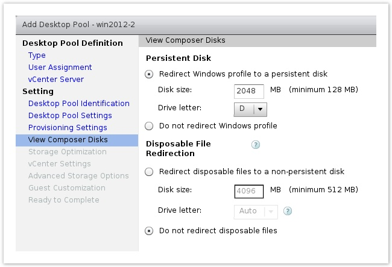
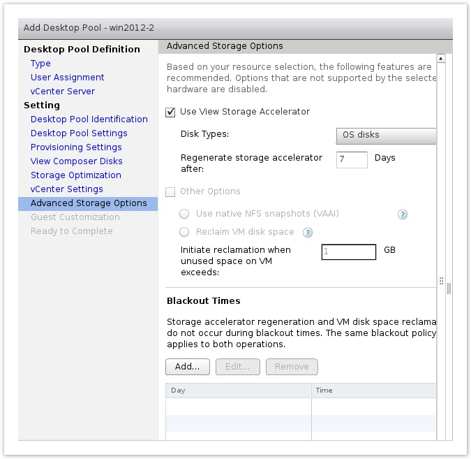

**Dernière mise à jour le 21/02/2018**

## Objectif

Vous savez désormais comment vous [connecter à votre VMware Horizon](https://docs.ovh.com/ca/fr/cloud-desktop-infrastructure/plateforme-horizon-7/){.external} et votre [modèle de pool](https://docs.ovh.com/ca/fr/cloud-desktop-infrastructure/create-pool/){.external} est prêt. Il est temps maintenant de créer votre premier pool.

**Ce guide va vous explique comment effectuer cette création depuis VMware Horizon 7.1.**

## Prérequis

- Être connecté à VMware Horizon 7.1.

## En pratique

Après vous être authentifié dans VMware Horizon, voici la marche à suivre :

- dans la partie `Catalog`{.action}, puis `Desktop Pool`{.action}, cliquez sur `Add`{.action} pour lancer le formulaire de création du pool ;

{.thumbnail}

- choisissez ensuite le `type de pool` (*Automatique* pour cet exemple).

> [!primary]
>
> Il existe trois principaux types de pools de postes de travail : *automatisé*, *manuel* et *RDS*.
> 
> - Les pools de postes de travail *automatisés* sont créés à partir d'un même modèle ou d'un snapshot de modèle de machine virtuelle (VM).
> 
> - Les pools de postes de travail *manuels* sont une collection de VM, d'ordinateurs physiques ou de VM tierces. Dans les pools *automatisés* et *manuels*, chaque machine est disponible pour un seul accès utilisateur à distance à la fois.
>
> - Les pools de postes de travail *RDS* ne sont pas une collection de machines. Ils fournissent plutôt des sessions de poste de travail sur des hôtes RDS. Plusieurs utilisateurs peuvent avoir plusieurs sessions de poste de travail simultanément sur un hôte RDS.
> 

{.thumbnail}

- Choisissez le `type d'assignation` des bureaux virtuels :

 - *Dedicated* : les bureaux virtuels seront assignés à un seul et unique utilisateur ;
 - *Floating* : les bureaux virtuels seront distribués aux utilisateurs en fonction de la disponibilité au moment de chaque connexion.

{.thumbnail}

- Choisissez le type de clone à réaliser pour provisionner le pool :

 - *Full virtual machines* : un clone complet de la VM modèle sera réalisé ;
 - *View Composer linked clones* : un clone lié au snapshot de référence sera effectué ; cela réduit la place sur les datastores, économise les ressources et améliore la rapidité de déploiement, mais maintient un lien fort entre la VM modèle et la VM du bureau virtuel déployé.

{.thumbnail}

- Choisissez le nom du pool (le *display name* pourra être édité par la suite, mais pas l'ID).

{.thumbnail}

- Choisissez la configuration du pool (pensez à activer le *HTML access* si besoin).

> [!primary]
>
> Nous vous conseillons d'utiliser le protocol **Blast**, ce dernier vous garantit notamment une meilleure fluidité (peu importe la bande passante de votre connexion), une sécurité accrue et, pour les utilisations sur appareil mobile, une économie de batterie importante. Pour plus d'informations concernant ce protocole, nous vous invitons à suivre [ce lien](https://docs.vmware.com/fr/VMware-Horizon-7/7.2/com.vmware.horizon-view.installation.doc/GUID-F64BAD49-78A0-44FE-97EA-76A56FD022D6.html){.external}.
> 

{.thumbnail}

- Vous avez ensuite la possibilité de sélectionner la façon dont les bureaux virtuels seront nommés, ainsi que le nombre de VM à déployer.

{.thumbnail}

- L'écran suivant permet de choisir si les profils utilisateur seront sur un disque persistant et si un disque séparé est nécessaire pour les fichiers temporaires Windows.

{.thumbnail}

- Il est possible de sélectionner ensuite la politique de stockage, dont la séparation des disques OS et persistants

{.thumbnail}

- Dans l'écran suivant, choisissez le *modèle de VM* que vous souhaitez déployer.

> [!primary]
>
> Si la VM n'apparaît pas, sélectionnez `Show all parent VMs`{.action} pour en connaître la raison.
> 

{.thumbnail}

- Choisissez ensuite le *snapshot de référence* (il est possible d'en avoir plusieurs pour des besoins de gestion de versions, de tests ou de production sur des pools différents).

{.thumbnail}

- Sélectionnez le *dossier de destination* de votre pool (pour l'organisation vSphere), un sous-dossier y sera créé au nom de votre pool pour y stocker les VM déployées.

{.thumbnail}

- Choisissez les *datastores* qui serviront au stockage des VM.

{.thumbnail}

- L'écran suivant permet de choisir des options avancées liées au stockage des bureaux virtuels.

{.thumbnail}

- Vous pouvez ensuite choisir les options de déploiement associées à l'Active Directory et à la personnalisation des VM (sélectionnez une personnalisation sysprep parmi celles [créées sur votre Private Cloud](https://docs.ovh.com/fr/cloud-desktop-infrastructure/create-sysprep/){.external}).

{.thumbnail}

- Vous pouvez également choisir d'associer directement des utilisateurs à ce pool de bureaux virtuels ou terminer la création et les associer plus tard.

La création du pool peut prendre un certain temps, cela dépend du modèle utilisé. En cas d'erreur, la partie `Inventory` du pool donne des détails sur la création de chacune des VM et vous permet de comprendre l'origine du problème.

Maintenant que le pool a été créé, voyons comment [attribuer des bureaux virtuels aux utilisateurs](https://docs.ovh.com/ca/fr/cloud-desktop-infrastructure/howto-create-pool/){.external}.

## Aller plus loin

Échangez avec notre communauté d'utilisateurs sur <https://community.ovh.com>.