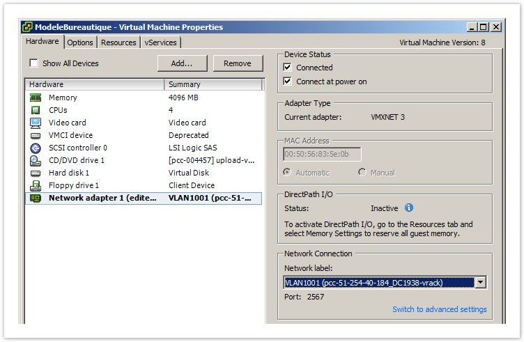

**Stand 24.08.2018**

## Einleitung

Sie können Ihre [Cloud Desktop Infrastructure](https://www.ovh.de/cloud/cloud-desktop/infrastructure/){.external} jetzt verwenden.

**In dieser Anleitung erfahren Sie, wie Sie einen automatisierten Pool von Linked-Clone-Maschinen einrichten.**

## Voraussetzungen

- Sie verwenden ein kompatibles Betriebssystem (OS). Eine Liste der kompatiblen Betriebssysteme für Horizon Agent finden Sie [hier](https://pubs.vmware.com/horizon-7-view/index.jsp?topic=%2Fcom.vmware.horizon-view.installation.doc%2FGUID-B45E1464-92B1-4AA8-B4BB-AD59EDF98530.html){.external}.
- Sie haben die Programme, die Sie im Pool verwenden möchten, installiert.
- Sie haben die Adresse der Netzwerkkarte via DHCP konfiguriert.
- Sie haben die Vorlage der virtuellen Maschine (VM) mit dem Zielnetzwerk des Pools (Portgruppe oder VLAN) verbunden.
- Sie haben die Installation von VMware Horizon 7.1 abgeschlossen.
- Sie haben bei ausgeschalteter VM einen Snapshot erstellt, der als unveränderlicher Referenzpunkt verwendet werden kann.  
- Sie haben ein Anpassungstemplate (sysprep) erstellt. 

## Beschreibung

### Vorlage einer virtuellen Maschine (VM) importieren

Sie können vollständige oder teilweise konfigurierte VM-Vorlagen auf der mit Ihrer VMware Horizon 7.1 Infrastruktur verbundenen Private Cloud erstellen oder auf diese importieren.

In dieser Dokumentation finden Sie eine Anleitung zur [Erstellung einer VM mithilfe eines OVH Templates](https://docs.ovh.com/gb/en/private-cloud/deploy-ovh-template/){.external} (Englisch).
 

### Vorlage mit dem Zielnetzwerk des Pools verbinden

Damit die virtuellen Desktops korrekt eingerichtet werden und für die Benutzer erreichbar sind, muss die VM-Vorlage mit dem richtigen virtuellen Netzwerk verbunden werden. Das Netzwerk wird Ihnen per E-Mail mitgeteilt (**DHCP-Netzwerk**) und im vSphere-Interface als eine `dvportgroup` angezeigt.

Um eine VM-Vorlage mit dem Pool-Netzwerk zu verbinden, befolgen Sie die nachstehenden Schritte:

- Klicken Sie mit der rechten Maustaste auf die VM und wählen Sie `Edit settings`{.action}.
- Wählen Sie das entsprechende Gerät zum Netzwerkinterface.
- Im Bereich `Network Connection`{.action} wählen Sie das in der Liefer-E-Mail unter **DHCP-Netzwerk** angegebene `Network Label`{.action} (siehe Abbildung).

{.thumbnail}

Falls Sie ein zusätzliches Netzwerk neben dem bereits existierenden benötigen, kann ein neuer Zugangspunkt mit einem dedizierten Netz eingerichtet werden.

### VMware Horizon 7.1 Agent installieren

> [!primary]
>
> Falls Sie die HaaS-Lösung gebrauchen, können Sie die Installationsdateien für den Horizon Agent hier herunterladen: <https://files.horizonaas.com/>.
> 

Doppelklicken Sie auf die Horizon-Agent-Installationsdatei und folgen Sie den Installationsschritten:

- Akzeptieren Sie die Lizenzvereinbarung von VMware.
- Wählen Sie `Install VMware Horizon Agent`{.action} in `desktop mode`{.action}.
- Wählen Sie als Protokoll IPv4 aus.
- Wählen Sie Ihre Installationsoptionen (die Standardeinstellungen sind in der Regel ein guter Ausgangspunkt).
- Wenn Sie dazu aufgefordert werden, aktivieren Sie RDP nicht.
- Akzeptieren oder ändern Sie den Zielordner.
- Schließen Sie die Installation ab.

Für weitere Informationen zur Installation des Horizon 7.1 Agents lesen Sie die [offizielle Dokumentation](http://pubs.vmware.com/horizon-7-view/index.jsp?topic=%2Fcom.vmware.horizon-view.desktops.doc%2FGUID-1F2D0C6E-6379-4B52-A7EA-C1EF09CE2F9B.html){.external}.

### Referenz-Snapshot erstellen

Um von einer unveränderlichen Version der virtuellen Maschine als Pool-Vorlage ausgehen zu können, verwendet VMware Horizon einen Snapshot. So wird sichergestellt, dass die an der Vorlage vorgenommenen Operationen nicht direkt den Inhalt der virtuellen Desktops betreffen.

- Wählen Sie auf dem vSphere-Client-Interface (hier die Web-Version) die VM-Vorlage und anschließend das Menü `Aktionen`{.action}. Klicken Sie dann auf `Snapshot erstellen`{.action}:

{.thumbnail}

- Geben Sie einen Namen für den Snapshot ein (hier die Nummer der Version):

{.thumbnail}

Jetzt, da Ihre Vorlage erstellt ist, zeigen wir Ihnen im nächsten Schritt, wie Sie [einen Pool erstellen](https://docs.ovh.com/de/cloud-desktop-infrastructure/pool-erstellen){.external}.

## Weiterführende Informationen

Für den Austausch mit unserer User Community gehen Sie auf <https://community.ovh.com/en/>.