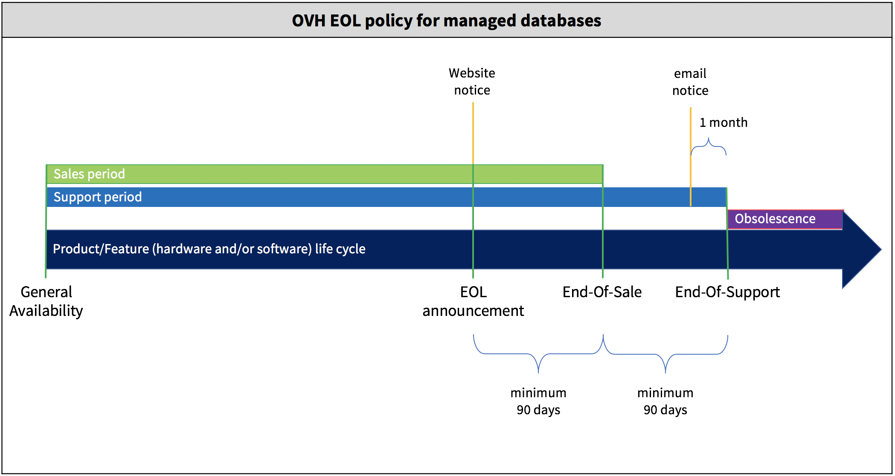

Les bases de données managées OVH sont basées sur plusieurs versions majeures de différents produits de Systèmes de Gestion de Bases de Données (SGBD). Ces SGBD sont des logiciels provenant de tiers, comme MySQL ou PostgreSQL. Les versions les plus vieilles des bases de données managées peuvent atteindre leur fin de vente, ou leur fin de vie, principalement à cause des cycles de vie des SGBD sous-jacents. Cette politique est fournie pour permettre aux clients de comprendre le cycle de vie des bases de données managées OVH, pour anticiper et préparer la transition vers de nouvelles versions.

# Produits couverts

Les produits couverts par cette politique de fin de vie sont :

- Les services Cloud Databases Publiques, instances SGBD dédiées joignables via le réseau publique ([voir les annonces](../clouddb-eos-eol/guide.fr-fr.md)).

- Les services Cloud Databases Web Hosting (également connues sous le nom de services SQLPrivé), instances SGBD dédiées joignables via le réseau Web Hosting ([voir les annonces](../privatesql-eos-eol/guide.fr-fr.md)).

Notez que les services SharedSQL Web Hosting, bases de données MySQL joignables via le réseau Web Hosting, ne sont pas encore couverts par cette politique de fin de vie.

# Définitions et lignes directrices de la politique de fin de vie

## Annonce de fin de vie

C'est la publication des dates de fin de vente et de fin de support. En règle générale, OVH respectera un délai de 90 jours entre l'annonce d'une fin de vie et son application.
Cette annonce apparaîtra sur le site web docs.ovh.com.

## Fin de vente

La dernière date pour commander un produit. Comme annoncé précédemment, cette date est au moins 90 jours après l'annonce de fin de vie.

## Fin de support

La date jusqu'à laquelle le client peut bénéficier d’une assistance pour le produit selon les modalités du contrat de service ou les conditions générales de la garantie.
Après cette date, le produit ne fait plus l'objet de services d'assistance et est considéré comme obsolète.
En règle générale, cette date est au moins 6 mois après l'annonce de fin de vie.

## Période d'obsolescence

C'est la période juste après la date de fin de support.

Quand un service de bases de données managées OVH devient obsolète, il peut entrer dans les deux cas listés ci-après.
Comme il peut y avoir un impact sur votre service, une notification vous sera envoyée par email au moins un mois avant la période d'obsolescence.

**Mise à jour majeure du service**

Votre service reste actif, et nous mettons à jour son SGBD vers une nouvelle version majeure.
Ce type de mise à jour peut induire des comportements non souhaités sur vos applications. C'est pourquoi nous conseillons aux clients de préparer la transition vers des versions plus récentes longtemps avant d'atteindre la fin de support.

**Cessation du service**

Au lieu de mettre à jour le SGBD de votre service vers la prochaine version majeure disponible, nous pouvons décider de cesser le service, pour plusieurs raisons telles que:

- La mise à jour est déconseillée par l'éditeur logiciel du SGBD sous-jacent,

- Le SGBD a lui-même pris fin,

- ...

La cessation peut être faite de deux façons, selon les cas:

- Nous arrêtons le renouvellement du service. Dans ce cas, le service sera suspendu à la fin de la période d'engagement.

- Nous suspendons le service et vous recréditons du surplus payé.
