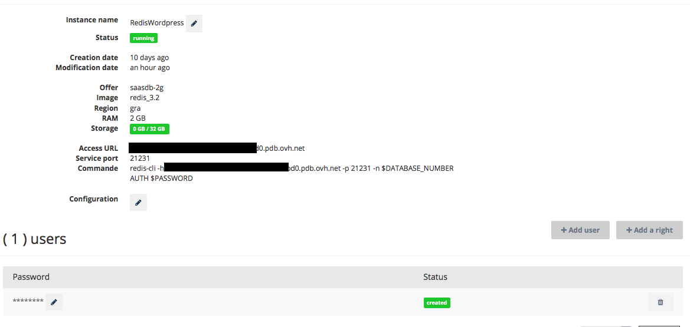
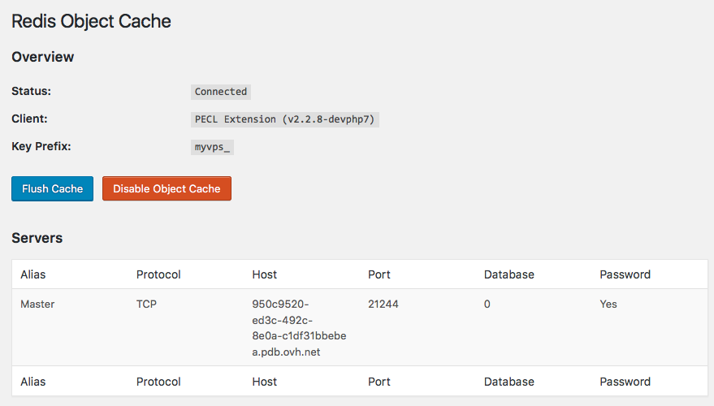
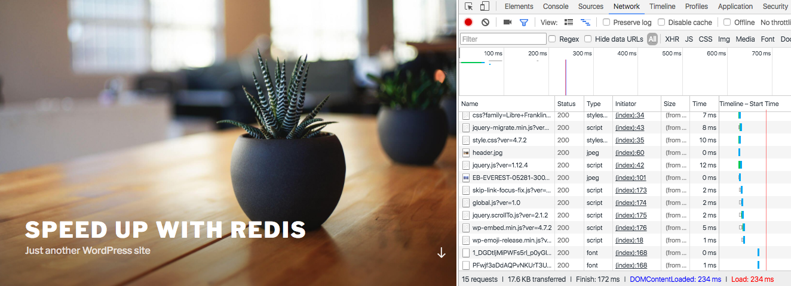

Vous disposez d'un site ou d'un blog propulsé par WordPress ? Découvrez comment accélérer son chargement, grâce à Redis ! Nous allons dans ce tutoriel mettre en place une base NoSQL Redis, et l'utiliser pour mettre en cache les objets WordPress. Les gains de chargement seront visibles sur votre site pour vos visiteurs, mais également dans l'administration de WordPress.


> [!alert]
>
> Ce guide est utilisable uniquement avec l'offre Beta SaaS Database du Lab Runabove
> 


> [!warning]
>
> Toutes les actions réalisées dans ce tutoriel sont de la responsabilité du Client.
> OVH ne sera tenu responsable d'une quelconque défaillance.
> Pensez à effectuer une sauvegarde de vos fichiers avant toute modification.
> 


> [!primary]
>
> Ce tutoriel nécessite :
> - un hébergement Web compatible et avec le module PHP-redis d'installé ou installable (un hébergement Web mutualisé OVH n'est pour l'instant pas compatible) : VPS, Serveur Dédié, Public Cloud.. chez OVH ou un autre prestataire.
> - un compte administrateur sur votre WordPress, afin d'installer un plugin.
> - WordPress en version 4.x ou supérieure
> - et bien sûr une base de données Redis, activable sur notre lab !
>

## WordPress + Redis = ??
Redis est un outil Open Source, permettant de maintenir des bases de données NoSQL en mémoire vive (RAM) et de mettre des objets en cache. L'objectif est la rapidité. Il est aujourd'hui en constante progression, adopté par Twitter, Github, Flickr, Pinterest et bien d'autres. Nous n'allons pas aborder ici plus amplement ce qu'est Redis, mais n'hésitez pas à lire la [documentation officielle](https://redis.io/documentation){.external} qui est très bien fournie.

WordPress, de son coté, peut être consommateur de ressources. Sessions utilisateurs, requêtes en base de données, ... Leurs développeurs nous permettent de mettre ces "objets" en cache, c'est à dire de les stocker de manière non persistente.

Vous l'aurez compris, les gains seront plus ou moins significatifs en fonction de votre usage des "objets". Un site avec du contenu statique, comme un blog, sera beaucoup moins optimisable qu'un site marchand, un portail d'information, etc.

Il existe une multitude de plugins permettant de gérer ce cache, le plus connu étant W3 Total Cache (W3TC). Cependant, il propose un cache d'objets en local (sur votre VPS, ou serveur), ce qui ne nous arrange parfois pas. Maintenir une base redis ou memcached peut être fastidieux et consommateur de mémoire.

Nous allons voir dans ce tutoriel comment configurer le Lab Redis proposé par OVH, et le relier à votre WordPress. L'objectif est de gagner en performance au chargement de WordPress pour les visiteurs, mais aussi pour ses administrateurs.

C'est parti !


## S'inscrire au Lab et tester sa base Redis
La première étape consiste à obtenir une base de données Redis et à vérifier son fonctionnement.

Direction [Runabove OVH labs](http://www.runabove.com.){.external} puis souscrivez au lab Redis. Une fois fait, via le [Manager OVH Sunrise](https://www.ovh.com/manager/sunrise/){.external}, créez une base Redis, changez de mot de passe, et gardez la page ouverte, nous allons nous en servir.


{.thumbnail}


### Tester la connexion a Redis depuis un terminal
Ouvrez votre terminal préféré, et connectez-vous à votre base Redis en ligne de commande :


```bash
redis-cli -h my-instance-url -p my-port
```

Pour ma part cela ressemble à :


```bash
redis-cli -h 950c9520-ed3c-492c-8e0a-c1xxxxxxxxxx.pdb.ovh.net -p 21244
```

Puis authentifiez-vous avec le mot de passe défini dans votre Manager OVH Sunrise. Redis fonctionne avec un mot de passe unique, aucun User requis..


```bash
auth MyPassWord
```

Et enfin, monitorons ce qui se passe sur votre base Redis :


```bash
monitor
```

On verra apparaitre ici ce qui ce passe en *Live* sur votre base.

A ce stade, la seule chose que l'on sait, c'est que la base Redis tourne ! Allons voir si l'on peut s'y connecter en PHP.


### Tester la connexion a Redis depuis son site WordPress
Sur votre instance hébergeant votre WordPress, nous allons tester la connexion à Redis avec un script très rapide.

Via le moyen de votre choix (FTP, SSH, ..) créez un fichier phpinfo.php à la racine de votre site wordpress et ajoutez dedans :


```php
1. <?php
2.     phpinfo();
3. ?>
```

Rendez-vous ensuite sur [http://www.mywebsite.com/wordpress/phpinfo.php](http://www.mywebsite.com/wordpress/phpinfo.php){.external} (à modifier selon votre configuration) et cherchez :


{.thumbnail}

Ce module permet à PHP de dialoguer avec la base Redis. Si vous ne trouvez pas de paragraphe parlant de Redis, c'est qu'il vous manque le composant. Installez-le (commande compatible Debian/Ubuntu) :


```bash
sudo apt-get install php-redis
```

Vous devriez voir l'encadré Redis (si besoin mettez à jour PHP et redémarrez votre instance).

Testons maintenant la connexion à Redis en PHP, depuis votre hébergement. Via le moyen de votre choix (FTP, SSH, ...), créez un fichier redis.php à la racine de votre site wordpress et ajoutez dedans :


```php
1.  <?php
2.      //Connecting to Redis server on OVH
3.      $redis = new Redis();
4.      $redis->connect('xxxxxxxxx-xxxxxx-xxxxx-xxxxxxxxx.pdb.ovh.net', 12345);
5.      $redis->auth('MyPassword');
6.      echo "Connection to server ongoing";
7.      //check whether server is running or not
8.      echo "Server is running: ".$redis->ping();
9. ?>
```

N'oubliez pas de renseigner l'URL d'accès, le port et le mot de passe de votre base, renseignés dans votre Manager OVH Sunrise. Rendez-vous ensuite sur [http://www.mywebsite.com/wordpress/redis.php](http://www.mywebsite.com/wordpress/redis.php){.external}.

Si la connexion est réussie, vous devriez voir "Server is running: +PONG"

Et dans votre terminal ouvert sur votre base Redis, un "PING"

Bravo ! tout fonctionne coté base. On passe maintenant à la configuration de WordPress.


## Configurer WordPress avec Redis
La base fonctionne, reste à configurer WordPress pour l'utiliser. Si vous avez déja un plugin de cache **pensez à désactiver l'Object Cache** (c'est le cas avec W3TC par exemple).


### Modification de WP-CONFIG.PHP
Via un Editeur de texte, ouvrez le fichier wp-config.php à la racine de votre WordPress. Nous allons rajouer ces 3 lignes juste après les Key Salts.


```php
1. define('WP_REDIS_HOST', '950c9520-ed3c-492c-xxxxx-xxxxxxxxxx.pdb.ovh.net');
2. define('WP_REDIS_PORT', '12345');
3. define('WP_REDIS_PASSWORD', 'MyPassword');
```

Optionnel : rajoutons une Key Salt. Quand on a une seule application qui utilise Redis ce n'est pas nécessaire, mais si par exemple vous avez plusieurs sites WordPress, cela sera obligatoire pour différencier *qui-pousse-quoi*.


```php
1. define('WP_CACHE_KEY_SALT', 'myvps_' );
```


### Installation du plugin Redis Object Cache

{.thumbnail}

Ensuite, afin de nous faciliter la tâche, nous allons installer le plugin [Redis Object Cache](https://wordpress.org/plugins/redis-cache/){.external} . Pour les curieux, c'est un fork du code d'Eric Mann et Erick Hitter : [Github Redis Object Cache](https://github.com/ericmann/Redis-Object-Cache){.external} .

Si vous êtes allergiques aux plugins, n'hésitez pas à faire une installation manuelle (attention aux noms des params qui sont sensiblement différents dans WP-CONFIG.PHP)

Ce plugin va rajouter un fichier (ou modifier) le fichier object-cache.php dans le dossier wp-content/ de votre WordPress. Si le plugin n'y arrive pas, rajoutez-le manuellement (confer la page du plugin pour plus de détails).


### Parametrage du plugin
Si tout est installé, rendez-vous sur votre Admin WordPress pour Redis.

Vous devriez voir quelque chose ressemblant à ceci :

Notez bien le statut "Connected" et votre Host, Port, Database et Password bien renseignés.


{.thumbnail}

Tout est clean coté configuration !


## Verification des gains de performances
Si vous n'avez pas fermé le monitoring de votre base Redis, vous devriez voir apparaître de l'activité sur votre base.

Ouvrez un second terminal ou stoppez ce monitoring, et sur votre base Redis entrez :


```bash
keys *
```

Vous pourrez ainsi analyser tous les ensembles clé-valeurs stockées dans Redis. Dans mon cas :


```bash
...
48) "myvpswp_:comment:get_comments:9503889e74633f729bf0ed7217c233a4:0.53134300 1486125318"
49) "myvpswp_:comment:1"
50) "myvpswp_:term_meta:1"
51) "myvps_wp_:userlogins:bastien"
52) "myvpswp_:transient:feed_b9388c83948825c1edaef0d856b7b109"
53) "myvpswp_:posts:1"
...
```

et pour analyser une clé précise à titre d'exemple :


```bash
get myvpswp_:posts:1
```

Au niveau performance, j'ai ouvert les outils de développement puis "Network". Etant parti d'un WordPress totalement propre et sans contenu, je n'ai pas un gain très significatif mais tout de même appréciable !

Le site s'affiche en 250ms en moyenne au lieu de 500ms (hébergé sur un [VPS SSD OVH](https://www.ovh.com/fr/vps/vps-ssd.xml){.external} situé à Strasbourg).


{.thumbnail}

Voila, n'hésitez pas à nous partagez vos feedbacks sur vos tests !


## Aide DBaaS
- Documentation: [Guides](../guide.fr-fr.md){.ref}
- Community hub: [https://community.ovh.com](https://community.ovh.com/c/mobile-hosting/database){.external}
- Mailing List: [paas.sql-subscribe@ml.ovh.net](mailto:paas.sql-subscribe@ml.ovh.net){.external}
- Create an account: [Try it free!](https://www.runabove.com){.external}