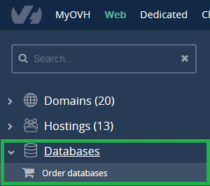
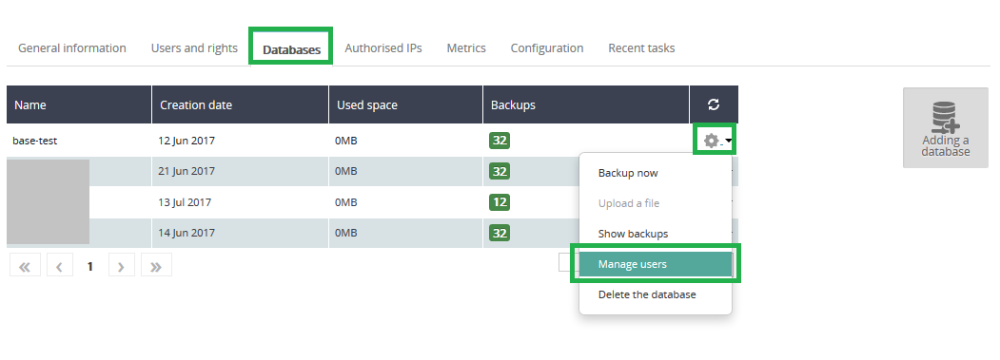

Sie brauchen eine Datenbank für Ihre Website oder eine Anwendung, haben aber keine Lust, diese zu verwalten? Dann ist das CloudDB Angebot genau das Richtige für Sie! OVH übernimmt die komplette Verwaltung Ihrer Datenbank.

## Allgemeine Informationen

### Warum sich fur eine gemanagte Datenbank entscheiden?
Dieses Angebot geht von einem ganz **einfachen Prinzip** aus: Nur, weil Sie **wissen, wie** man eine Datenbank verwaltet, heißt das noch lange nicht, dass das für Sie auch **Priorität** hat. Backups, Updates, Monitoring, Rechte verwalten, Performance anpassen, ... all das wird sehr schnell lästig.

**Warum also nicht diese unliebsame Aufgabe einfach OVH überlassen, damit Sie sich ganz auf Ihr Kerngeschäft konzentrieren können?**

Unser Ziel ist es, mit dieser Lösung den gesamten Markt anzusprechen - egal, ob Sie eine Privatperson sind oder die Datenbank professionell nutzen, CloudDB eignet sich genauso für den kleinen Bedarf wie auch für große Cluster.

### Die Vorteile von CloudDB
**Einfach und schnell**

- Erstellung von SQL Datenbanken über das Kundencenter
- Unbegrenzte Anzahl an Datenbanken (innerhalb des verfügbaren Storage)
- Bis zu 200 Simultanverbindungen
- Verwaltung der Benutzer und der entsprechenden Rechte über das Kundencenter
- Zugang zu den Metriken über das Kundencenter
- Zugang zu den Logs

**Hohe Performance**

- Garantierte RAM Ressourcen
- Bewährte Infrastruktur

**Sicherheit**

- Monitoring rund um die Uhr durch unsere Teams
- Täglich automatische Backups
- Obligatorische IP-Autorisierung

**Flexibilität**

- Kompatibel mit sämtlichen OVH Produkten (ausgenommen Shared Hosting) sowie mit allen Produkten, die mit dem öffentlichen Netz verbunden sind
- Freie Wahl der SQL Version und Upgrade auf eine höhere Version jederzeit möglich

### Unterstutzte Datenbanken
Wenn Sie sich für CloudDB entschieden haben, können Sie unter verschiedenen Datenbanksystemen wählen:

**SQL**

- MySQL
- PostgreSQL
- MariaDB

Jede Instanz verfügt über eigene, dedizierte Ressourcen. Die enthaltene(n) Datenbank(en) **teilen** sich die verschiedenen Ressourcen.

## Ihr CloudDB Angebot bestellen

### Verbindung mit dem Kundencenter
Begeben Sie sich in Ihr [Web Kundencenter](https://www.ovh.com/manager/web/){.external}, um Ihre Instanz und anschließend Ihre Datenbanken einzurichten.

### Bestellung
Im [Web Kundencenter](https://www.ovh.com/manager/web/){.external} klicken Sie auf **„Datenbanken“**, danach auf `„Datenbanken bestellen“`{.action}.

{.thumbnail}

Um zu bestellen, wählen Sie zunächst die folgenden Elemente:

- **„CloudDB“**
- **„Ihr Datenbanksystem“**
- Größe des **„RAM“**
- **„Rechenzentrum“**
- Gewünschte **„Dauer“**

{.thumbnail}

Dann akzeptieren Sie die AGB und Produktverträge und klicken auf `Bestellschein erstellen`{.action}.

{.thumbnail}

## Allgemeine Informationen
Im Kundencenter finden Sie eine Übersicht mit den allgemeinen Informationen zu Ihrer Instanz.

{.thumbnail}

## Erstellung von Datenbanken und Benutzern

### Eine Datenbank erstellen
Ihre Instanz wurde jetzt zwar erstellt, ist momentan jedoch noch leer.

Klicken Sie auf den Tab **„Datenbanken“** und danach auf den Button `+ Eine Datenbank hinzufügen`{.action}.

{.thumbnail}

Geben Sie einen Namen für Ihre Datenbank ein und klicken Sie dann auf `Bestätigen`{.action}.

{.thumbnail}

### Einen Benutzer erstellen
Um das CloudDB Angebot nutzen zu können, müssen zuerst Benutzer erstellt und mit spezifischen Zugriffsrechten für die jeweilige Datenbank versehen werden.

Klicken Sie hierzu auf den Tab **„Benutzer und Rechte“** und dann auf den Button `+ Einen Benutzer hinzufügen`{.action}.

{.thumbnail}

Geben Sie einen **Benutzernamen** und ein **Passwort** und klicken Sie danach auf `Bestätigen`{.action}.

{.thumbnail}

### Benutzerrechte verwalten
Klicken Sie auf den Tab **„Datenbanken“**, dann auf das **„Zahnrad“** der gewünschten Datenbank und anschließend auf den Button `+ Die Benutzer verwalten`{.action}.

{.thumbnail}

Dann können Sie dem jeweiligen Benutzer die gewünschten Rechte zuweisen.

{.thumbnail}

Die 3 Arten von Rechten sind:

- **Administrator:** Freigabe von Anfragen des Typs **Select / Insert / Update / Delete / Create / Alter / Drop**
- **Lesen/Schreiben:** Freigabe von Anfragen des Typs **Select / Insert / Update / Delete**
- **Lesen:** Freigabe von Anfragen des Typs **Select**
- **Keine:** Keine Rechte auf der Datenbank

## Zugangsrechte fur IP-Adressen

### Ihren Server hinzufugen
Damit Ihre CloudDB Instanz erreichbar ist, muss angegeben werden, welche IP-Adressen sich mit der Datenbank verbinden dürfen. Klicken Sie auf den Tab **„Autorisierte IPs“**, dann auf `+ IP-Adresse / Maske hinzufügen`{.action}.

{.thumbnail}

Geben Sie die IP-Adresse Ihres Servers oder eines Netzwerks an, fügen Sie, wenn sie möchten, eine Beschreibung hinzu und klicken Sie anschließend auf `Bestätigen`{.action}.

{.thumbnail}

## Ihre Datenbank verwenden
Sie sind fertig mit der Konfiguration? Perfekt!

Je nach Use Case und dem von Ihnen gewählten Datenbanksystem gibt es nun zahlreiche Möglichkeiten, Ihre Datenbank zu nutzen.

Als Beispiel finden Sie im Folgenden einen typischen Use Case.

### WordPress installieren mit dem DBaaS Lab und MySQL
- Erstellen Sie eine CloudDB MySQL Instanz.
- Erstellen Sie eine Datenbank und einen zugehörigen Benutzer. Weisen Sie diesem ADMIN-Rechte zu.
- Autorisieren Sie Ihre Server-IP, damit sie sich mit Ihrer CloudDB Instanz verbinden kann.

Sie benötigen folgende Informationen aus Ihrem Kundencenter:

- Host-Name
- SQL Port

{.thumbnail}

- Datenbanken

{.thumbnail}

- Benutzer

{.thumbnail}

Notieren Sie sich die URL sowie den zugehörigen Port. Die Informationen werden bei der Installation von WordPress benötigt.

{.thumbnail}

Wir füllen die Felder wie folgt aus:

- **Database Name**: *base-test*
- **User Name**: *user-1*
- **Password**: Das Passwort, das sie für den Benutzer *user-1* festgelegt haben
- **Database Host**: *xxx.dbaas.ovh.net:35102* (**host:port** notieren)
- **Table prefix**: In unserem Beispiel ist hier nichts zu ändern

Für andere Use Cases brauchen Sie nur die Standards der jeweiligen Systeme zu befolgen, um sich mit Ihren Datenbanken zu verbinden. Diese finden Sie in den zugehörigen offiziellen Dokumentationen.