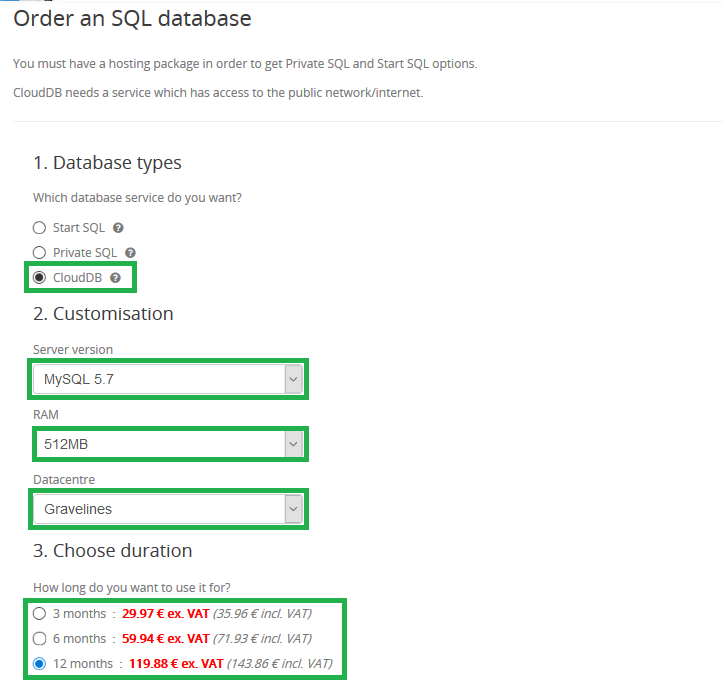
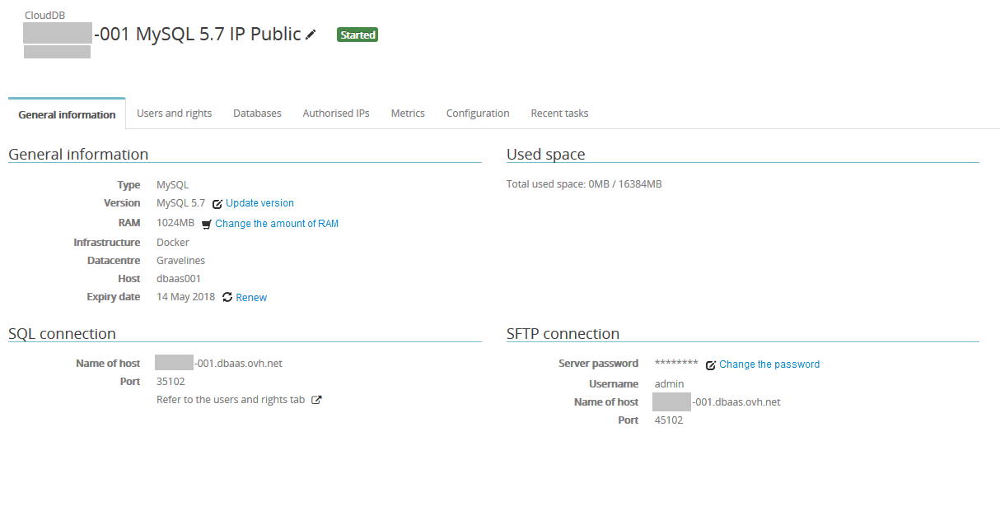

> [!faq]
>
> Have you got a website or application which needs a database, but you don't really want to have to manage it?
>> 
>> Discover the CloudDB service now! OVH takes care of everything!
>> 
>> 
>

## Overview

### Why use a managed database?
This service arose from a **simple truth**: even if you **know** how to do it, managing a database is not necessarily your **priority**. Security, updates, monitoring, rights management, performance, ... all of this can start to become a bit tricky!

**So why not leave this all to OVH so you can concentrate on your business or project?**

This is the aim. Whether you are an individual, a professional, with limited requirements or an entire cluster, our aim is to address the entire market.

### The advantages of CloudDB
**Simple and quick:**

- Create SQL databases via the Control Panel
- Unlimited number of databases (depending on the available disk space)
- Up to 200 concurrent connections
- Management of associated users and rights via the Control Panel
- Access to metrics via the Control Panel
- Acess to logs

**High performance:**

- Guaranteed RAM resources
- Approved infrastructure

**Security:**

- 24/7 monitoring from our teams
- Automatic daily backups
- Mandatory IP authorisation

**Flexibility:**

- Compatible with all OVH products (apart from web hosting), and more generally with all products connected to the internet
- Choice of SQL version and ability to change to a higher version at any time

### Databases offered
When you sign up for CloudDB, you can choose between multiple database systems

**SQL**

- MySQL
- PostgreSQL
- MariaDB

Each instance has its own dedicated resources. The database(s) that it contains, **share** their resources.

## Order CloudDB

### Log in to the Control Panel
In order to create your instance and then your databases, you have to go to [the Control Panel](https://www.ovh.com/manager/web/){.external}.

### Order
Once you are in [the Control Panel](https://www.ovh.com/manager/web/){.external}, click on **"Databases"**, then on `Order databases`{.action}.

{.thumbnail}

Place an order, choosing the elements below:

- **"CloudDB"**
- **"Your database system"**
- **"Your RAM"**
- **"Your datacentre"**
- **"The desired duration"**

{.thumbnail}

Confirm the Terms and Conditions and click on `+ Generate the purchase order`{.action}.

{.thumbnail}

## General information
Once you are in your customer account, you will be able to see general information about your instance.

{.thumbnail}

## Create your database and your users

### Create a database
Your instance will be created, but empty.

Click on the **"Database"** tab, then on the button `+ Add a database`{.action}.

{.thumbnail}

Enter a name for your database, and click `+ confirm`{.action}.

{.thumbnail}

### Create a user
To use a CloudDB offer, you have to create a user with specific rights for connecting to a database.

To do so, go to the **"Users and rights"** tab and click on `+ Add a user`{.action}.

{.thumbnail}

You will then be prompted to add a  **username** and a **password** then to click `Confirm`{.action}.

{.thumbnail}

### Manage user rights
Click on the **"Database"** tab, then on the **"cogwheel"** for the desired database, and then on `+ Manage users`{.action}.

{.thumbnail}

Then choose the rights for the user in question

{.thumbnail}

The different rights that you can choose are:

- **Administator:** The user can run **Select/Insert/Update/Delete/Create/Alter/Drop** queries
- **Read/Write:** The user can run **Select/Insert/Update/Delete**
- **Read :** The user can run **Select** queries
- **None:** No rights on the chosen database

## IP authorisation

### Adding your server
In order to make your CloudDB accessible, you have to specify which IPs are authorised to connect to your instance. Click on the **"Authorised IPs"** tab, then on `+ Add an IP address/mask`{.action}.

{.thumbnail}

Enter your server or network IP, plus a description if you want to, then click on `Valider`{.action}.

{.thumbnail}

## Use your database
Everything configured? Perfect!

Depending on your use case and the chosen database, there are multiple ways of using your database.

Let's look at a typical example.

### Install WordPress with the DBaaS lab and MySQL
- Create a MySQL CloudDB
- Create a database and a user linked to this database, assign the ADMIN user first.
- Authorise your server IP to contact your CloudDB service

Retrieve the following information from your Control Panel:

- Host name
- SQL Port

{.thumbnail}

- Databases

{.thumbnail}

- User

{.thumbnail}

Note the URL and associated port. You will need this information when installing WordPress.

{.thumbnail}

We will therefore fill in the fields as follows:

- **Database Name**: *base-test*
- **UserName**: *user-1*
- **Password**: the password chosen for *user-1* user
- **Database Host**: *xxx.dbaas.ovh.net:35102* (note: **host:port**)
- **Table prefix**: we will not change in this instance

For other use cases, just follow the standard connection methods for the databases used, found in official documentation.