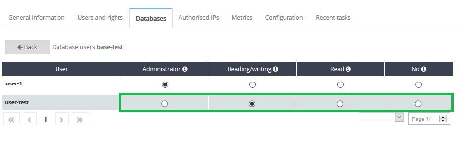

Il tuo sito Web o la tua applicazione richiedono un database, ma non hai il tempo di gestirlo? Scopri la soluzione CloudDB di OVH!

## Introduzione

### Perche utilizzare database gestiti?
Questo servizio è il risultato di una **semplice constatazione**: anche se **hai le competenze** necessarie, la gestione di un database non rappresenta necessariamente la tua **priorità**. Sicurezza, aggiornamenti, monitoraggio, gestione dei permessi e performance... queste operazioni possono diventare molto presto fastidiose.

**Perché non affidarti a OVH e concentrarti sul tuo core business?**

Il nostro obiettivo è rivolgerci a tutto il mercato: privati e professionisti, con esigenze infrastrutturali semplici o complesse.

### I vantaggi della soluzione CloudDB
**Semplicità e rapidità:**

- Creazione di database SQL direttamente dallo Spazio Cliente OVH
- Numero illimitato di database (in base allo spazio disco disponibile)
- Fino a 200 connessioni simultanee
- Gestione degli utenti e dei permessi ad essi associati tramite lo Spazio Cliente OVH
- Accesso alle metriche tramite lo Spazio Cliente OVH
- Accesso ai log

**Prestazioni:**

- Risorse RAM garantite
- Infrastruttura collaudata

**Sicurezza:**

- Monitoraggio 24/7 da parte dei team OVH
- Backup giornalieri automatici
- Autorizzazioni IP obbligatorie

**Scalabilità:**

- Compatibilità con tutti i prodotti OVH (esclusi hosting condivisi) e, più in generale, con qualsiasi prodotto connesso alla rete pubblica
- Possibilità di scegliere la versione SQL e di eseguire l'upgrade a una versione superiore in qualsiasi momento

### Motori disponibili
Al momento della sottoscrizione del servizio CloudDB, hai la possibilità di scegliere tra diversi sistemi di database:

**SQL**

- MySQL
- PostgreSQL
- MariaDB

Ogni istanza ha a disposizione risorse dedicate. I database in esse contenuti (uno o più) **condivideranno** le risorse disponibili.

## Ordina il tuo servizio CloudDB

### Accedi allo Spazio Cliente OVH
Per poter creare la tua istanza e i tuoi database, accedi alla sezione Web del tuo [Spazio Cliente OVH](https://www.ovh.com/manager/web/){.external}.

### Genera lordine
Una volta effettuato l’accesso allo [Spazio Cliente OVH Web](https://www.ovh.com/manager/web/){.external}, clicca su **"Database"** e poi su `Ordina database`{.action}.

{.thumbnail}

Procedi con il tuo ordine scegliendo questi elementi:

- **"CloudDB"**
- **"Sistema di database"**
- **"RAM"**
- **"Datacenter"**
- **"Durata desiderata"**

{.thumbnail}

Accetta i contratti e clicca su `Genera ordine`{.action}.

{.thumbnail}

## Informazioni generali
Nel tuo Spazio Cliente OVH è possibile visualizzare le informazioni generali relative alla tua istanza.

{.thumbnail}

## Crea i tuoi database e i tuoi utenti

### Crea un database
La tua istanza è stata creata, ma è ancora vuota.

Clicca sulla scheda **"Database"** e poi sul pulsante `Aggiungi un database`{.action}.

{.thumbnail}

Inserisci il nome del tuo database e clicca su `Conferma`{.action}.

{.thumbnail}

### Crea un utente
Per utilizzare la soluzione CloudDB, è necessario creare utenti e assegnare loro permessi specifici per accedere a un database.

Per farlo, clicca sulla scheda **"Utenti e diritti"** e poi su `Aggiungi un utente`{.action}.

{.thumbnail}

Ti verrà chiesto di inserire un **nome utente** e una **password**. Inserisci le informazioni e clicca su `Conferma`{.action}.

{.thumbnail}

### Gestisci i permessi degli utenti
Clicca sulla scheda **"Database"**, poi sull’icona a forma di **"ingranaggio"** in corrispondenza del tuo database e infine sul pulsante `Gestisci gli utenti`{.action}.

{.thumbnail}

Scegli quali permessi assegnare all’utente che hai scelto

{.thumbnail}

Ecco i 3 diritti proposti:

- **Amministratore**: autorizzazione delle richieste di tipo **Select/Insert/Update/Delete/Create/Alter/Drop**
- **Lettura/Scrittura**: autorizzazione delle richieste di tipo **Select/Insert/Update/Delete**
- **Lettura**: autorizzazione delle richieste di tipo **Select**
- **Nessuno**: nessun permesso sul database

## Autorizza i tuoi IP

### Aggiungi il tuo server
Per il corretto funzionamento dell'accesso alla tua istanza CloudDB, è necessario specificare in questo menu il o gli IP autorizzati. Clicca sulla scheda **"IP autorizzati"** e poi su `+ Aggiungi un indirizzo IP/mask`{.action}.

{.thumbnail}

Indica l'IP del tuo server oppure una rete e, se vuoi, inserisci una descrizione. Clicca su `Conferma`{.action}.

{.thumbnail}

## Utilizza il tuo database
A questo punto, la tua configurazione è completa.

In base alla destinazione d’uso e al motore che hai scelto, le possibilità di utilizzo del tuo database sono molteplici.

Vediamo un caso tipico.

### Installare WordPress con il lab DBaaS e il motore MySQL
- Crea un’istanza CloudDB MySQL
- Crea un database e un utente ad esso associato con i permessi di ADMIN
- Autorizza l'IP del tuo server a contattare la tua istanza CloudDB

Recupera queste informazioni nel tuo Spazio Cliente OVH:

- Hostname
- Porta SQL

{.thumbnail}

- Database

{.thumbnail}

- Utente

{.thumbnail}

Ricordati di annotare l'URL e la porta associata: WordPress richiederà queste informazioni al momento dell’installazione.

{.thumbnail}

Completa i campi in questo modo:

- **Database Name**: *base-test*
- **User Name**: *user-1*
- **Password**: la password che hai impostato per l’utente *user-1*
- **Database Host**: *xxx.dbaas.ovh.net:35102* (NB: **host:porta**)
- **Table prefix**: nel nostro caso, resta invariato

OVH rispetta i metodi di connessione di tutti i motori di database: per altri casi di utilizzo, consulta la documentazione ufficiale.