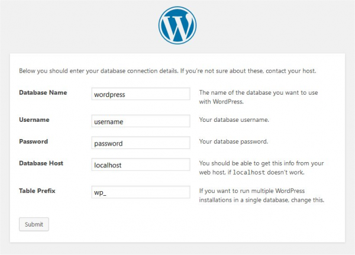

Heeft u een website of applicatie en daarbij een database nodig? U wilt de database liever niet zelf beheren? Ontdek dan nu onze CloudDB dienst! OVH verzorgt alles!

## Overzicht

### Waarom kiezen voor een beheerde database?
Deze dienst is ontstaan uit een **simpele waarheid**: zelfs als u **weet** hoe een database moet worden beheerd, betekent dit niet dat dit per sé uw **prioriteit** is. Beveiliging, updates, monitoring, toegangsbeheer, performance, ... dit kan allemaal nogal oplopen!

**Dus waarom zou u het niet aan OVH overlaten, zodat u zich kunt concentreren op uw bedrijf of project?**

Of het nu gaat om een individuele beginner of professional, met weinig vereisten of een hele cluster: wij staan de gehele markt ten dienst.

### De voordelen van CloudDB
**Eenvoudig en snel:**

- Creëer SQL databases via het Control Panel
- Onbeperkt aantal databases (afhankelijk van de beschikbare diskruimte)
- Tot 200 gelijktijdige verbindingen
- Beheer van geassocieerde gebruikers en rechten via het Control Panel
- Toegang tot metrics via het Control Panel
- Toegang tot logs

**High performance:**

- Gegarandeerde RAM resources
- Goedgekeurde infrastructuur

**Veiligheid:**

- 24/7 monitoring door onze teams
- Automatische dagelijkse backups
- Verplichte IP autorisatie

**Flexibiliteit:**

- Compatibel met alle OVH producten (behalve web hosting), en in het algemeen met alle producten verbonden met het internet
- SQL versie-keuze en de mogelijkheid om later te switchen naar een hogere versie

### Aangeboden databases
Wanneer u registreert voor CloudDB dan kunt u kiezen tussen meerdere database systemen

**SQL**

- MySQL
- PostgreSQL
- MariaDB

Elke instance heeft zijn eigen dedicated resources. De database(s) die het bevat, **delen** hun resources.

## CloudDB bestellen

### Log in op het Control Panel
Om uw instance en vervolgens uw databases te creëren gaat u naar [het Control Panel](https://www.ovh.com/manager/web/){.external}.

### Bestellen
Eenmaal in [het Control Panel](https://www.ovh.com/manager/web/){.external}, klikt u op **"Databases"**, en dan op `Order databases`{.action}.

{.thumbnail}

Plaats een bestelling en kies daarbij de volgende elementen:

- **"CloudDB"**
- **"Your database system"**
- **"Your RAM"**
- **"Your datacentre"**
- **"The desired duration"**

{.thumbnail}

Bevestig de Algemene Voorwaarden en klik op `+ Generate the purchase order`{.action}.

{.thumbnail}

## Algemene informatie
Zodra u in het klantaccount bent kunt u algemene informatie over uw instance zien.

{.thumbnail}

## Creeer uw database en uw gebruikers

### Creeer een database
Uw instance wordt aangemaakt, maar deze zal leeg zijn.

Klik op de **"Database"** tab, en daarna op de knop `+ Add a database`{.action}.

{.thumbnail}

Voer een naam in voor uw database, en klik `+ confirm`{.action}.

{.thumbnail}

### Creeer een gebruiker
Om gebruik te maken van CloudDB, creëert u een gebruiker met specifieke rechten voor verbinding met een database.

Hiervoor gaat u naar de **"Users and rights"** tab en klikt u op `+ Add a user`{.action}.

{.thumbnail}

Er zal van u worden gevraagd een  **gebruikersnaam** en **wachtwoord** in te voeren en te klikken op `Confirm`{.action}.

{.thumbnail}

### Beheer gebruiksrechten
Klik op de **"Database"** tab, dan op het **'tandwiel'** voor de gewenste database, en vervolgens op `+ Manage users`{.action}.

{.thumbnail}

Kies daarna de rechten voor de betreffende gebruiker

{.thumbnail}

U kunt kiezen uit de volgende rechten:

- **Administator:** De gebruiker kan **Select/Insert/Update/Delete/Create/Alter/Drop** taken uitvoeren
- **Read/Write:** De gebruiker kan **Select/Insert/Update/Delete** taken uitvoeren
- **Read :** De gebruiker kan **Select** taken uitvoeren
- **None:** Geen rechten op de gekozen database

## IP autorisatie

### Toevoeging van uw server
Om uw CloudDB toegankelijk te maken moet u vaststellen welke IP's geautoriseerd zijn om te verbinden aan uw instance. Klik op de **"Authorised IPs"** tab, en dan op `+ Add an IP address/mask`{.action}.

{.thumbnail}

Voer uw server of netwerk IP in, plus een beschrijving als u wilt, en klik op `Valider`{.action}.

{.thumbnail}

## Database gebruik
Alles geconfigureerd? Geweldig!

Afhankelijk van uw use case en gekozen database, zijn er verschillende manieren om uw database te gebruiken.

Laten we een kijkje nemen naar een typisch voorbeeld.

### WordPress installeren met de DBaaS lab en MySQL
- Creëer een MySQL CloudDB
- Creëer een database en gebruiker gelinkt aan deze database, wijs eerst de ADMIN gebruiker toe.
- Autoriseer uw server IP om uw CloudDB dienst te contacteren

Haal de volgende informatie via uw Control Panel:

- Host name
- SQL Port

{.thumbnail}

- Databases

{.thumbnail}

- Gebruiker

{.thumbnail}

Noteer de URL en bijbehorende port. U heeft deze informatie nodig bij het installeren van WordPress.

{.thumbnail}

We vullen de velden als volgt in:

- **Database Name**: *base-test*
- **UserName**: *user-1*
- **Password**: het wachtwoord voor *user-1* gebruiker
- **Database Host**: *xxx.dbaas.ovh.net:35102* (note: **host:port**)
- **Table prefix**: geen wijziging in deze instance

Voor andere use cases volgt u de standaard verbindingsmethoden voor de gebruikte databases, te vinden in officiële documentatie.