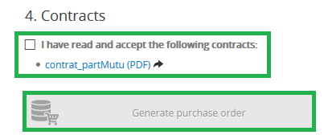
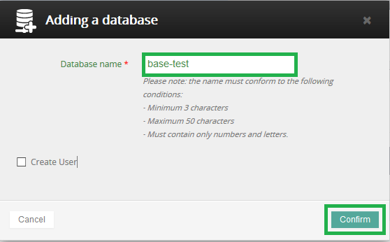

Posiadasz stronę www lub aplikację, która korzysta z bazy danych, ale nie chcesz nią zarządzać? Odkryj ofertę CloudDB!

## Informacje ogolne

### Dlaczego warto korzystac z zarzadzanych baz danych?
Operacje takie jak zabezpieczanie, aktualizowanie, monitorowanie, zarządzanie uprawnieniami i wydajnością bardzo szybko mogą stać się męczące.

**Dlaczego więc nie pozostawić tej pracy OVH i skupić się na swojej działalności?**

To nasz cel. Nasza oferta jest skierowana do wszystkich: do prywatnych użytkowników oraz do firm, do użytkowników o mniejszym i większym zapotrzebowaniu.

### Zalety oferty CloudDB
**Proste i szybkie użytkowanie:**

- Tworzenie baz danych SQL w panelu klienta
- Nieograniczona liczba baz danych (w ramach limitu przyznanej przestrzeni dyskowej)
- Do 200 jednoczesnych połączeń
- Zarządzanie użytkownikami i uprawnieniami w panelu klienta
- Dostęp do metryk w panelu klienta
- Dostęp do logów

**Wydajność:**

- Gwarantowane zasoby pamięci RAM
- Sprawdzona infrastruktura

**Bezpieczeństwo:**

- Usługa monitorowana 24 godziny na dobę przez 7 dni w tygodniu
- Automatyczne codzienne kopie zapasowe
- Obowiązkowa autoryzacja IP

**Kompatybilność:**

- Usługa kompatybilna z wszystkimi produktami OVH (poza hostingiem www)
- Wybór wersji SQL i zmiana na wyższą wersją możliwa w każdej chwili

### Proponowane silniki
Podczas zamawiania oferty CloudDB należy wybrać system baz danych:

**SQL**

- MySQL
- PostgreSQL
- MariaDB

Każda instancja dysponuje własnymi dedykowanymi zasobami. Bazy, które się na niej znajdują, będą **współdzielić** zasoby między sobą.

## Jak zamowic oferte CloudDB?

### Logowanie do panelu klienta
W pierwszej kolejności należy zalogować się do [Panelu klienta](https://www.ovh.com/manager/web/){.external}.

### Zamowienie
Po zalogowaniu do [Panelu klienta](https://www.ovh.com/manager/web/){.external}, kliknij na **"Bazy danych"**, i na `Zamów bazy danych`{.action}.

{.thumbnail}

Złóż zamówienie wybierając poniższe elementy:

- **"CloudDB"**
- **"System bazy danych"**
- **"RAM"**
- **"Datacenter"**
- **"Czas abonamentu"**

{.thumbnail}

Następnie zaakceptuj regulaminy i kliknij na `Złóż zamówienie`{.action}.

{.thumbnail}

## Informacje ogolne
W panelu klienta będą widoczne ogólne informacje na temat instancji.

{.thumbnail}

## Tworzenie baz i uzytkownikow

### Zakadanie bazy danych
Instancja została utworzona, ale jest ona pusta.

Kliknij na zakładkę **"Bazy danych"**, oraz na przycisk `Dodaj bazę danych`{.action}.

{.thumbnail}

Wskaż nazwę dla Twojej bazy danych i kliknij na `Zatwierdź`{.action}.

{.thumbnail}

### Dodawanie uzytkownika
Aby móc korzystać z oferty CloudDB, należy utworzyć użytkowników, którzy będą mieli specyficzne uprawnienia do logowania do bazy danych.

W tym celu należy przejść do zakładki **"Użytkownicy i uprawnienia"** i kliknąć na `Dodaj użytkownika`{.action}.

{.thumbnail}

Następnie zostaniesz poproszony o wpisanie **nazwy użytkownika** oraz **hasła** i o kliknięcie na `Zatwierdź`{.action}.

{.thumbnail}

### Zarzadzanie uprawnieniami uzytkownikow
Kliknij na zakładkę **"Bazy danych"**, i na ikonkę **"koła zębatego"** wybranej bazy danych. Kliknij na przycisk `Zarządzaj użytkownikami`{.action}.

{.thumbnail}

Następnie wybierz uprawnienia dla użytkownika.

{.thumbnail}

Poniżej znajduje się opis 3 proponowanych uprawnień:

- **Administrator:** Możliwość wykonywania zapytań typu **Select / Insert / Update / Delete / Create / Alter / Drop**
- **Odczyt / Zapis:** Możliwość wykonywania zapytań typu **Select / Insert / Update / Delete**
- **Odczyt:** Możliwość wykonywania zapytań typu **Select**
- **Brak:** Brak uprawnień do bazy danych

## Autoryzacja adresow IP

### Dodawanie serwera
Aby dostęp do instancji CloudDB działał, należy obowiązkowo określić autoryzowany adres lub adresy IP w tym menu.

Kliknij na zakładkę **"Autoryzowane IP"** i kliknij na `Dodaj adres IP / maskę`{.action}.

{.thumbnail}

Wskaż adres IP swojego serwera lub sieć oraz opis i kliknij na `Zatwierdź`{.action}.

{.thumbnail}

## Korzystanie z bazy danych
Po zakończeniu konfiguracji możesz rozpocząć korzystanie z bazy danych.

Sposób korzystania z bazy danych zależy od zastosowania oraz wybranego silnika.

Sprawdźmy typowy przypadek zastosowania.

### Instalacja moduu WordPress z DBaaS i silnikiem MySQL
- Utwórz instancję CloudDB MySQL.
- Utwórz bazę danych i użytkownika i przypisz mu uprawnienia ADMIN.
- Autoryzuj IP swojego serwera, aby logować się do usługi CloudDB.

Pobierz poniższe informacje z panelu klienta:

- Nazwa hosta
- Port SQL

{.thumbnail}

- Baza danych

{.thumbnail}

- Użytkownik

{.thumbnail}

Zapisz adres URL i przypisany port. WordPress wymaga tych informacji podczas instalacji.

{.thumbnail}

Następnie należy wypełnić poniższe pola:

- **Database Name**: *base-test*
- **User Name**: *user-1*
- **Password**: hasło wybrane dla użytkownika *user-1*
- **Database Host**: *xxx.dbaas.ovh.net:35102* (**host:port**)
- **Table prefix**: Tutaj nic nie zmieniamy.

W przypadku innych zastosowań należy przestrzegać oficjalnych metod logowania używanych silników. Zalecamy korzystanie z oficjalnej dokumentacji.