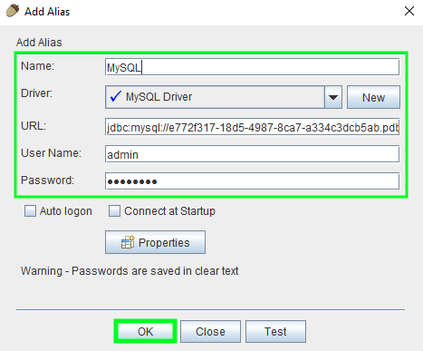

¿Quiere utilizar MySQL o MariaDB en CloudDB? Descubra cómo crear y administrar fácilmente sus bases de datos alojadas en esta solución.


## Introduccion

### Requisitos
Para seguir los pasos de esta guía, es necesario:

- tener una instancia CloudDB;
- haber consultado [esta guía](../empezar-con-clouddb/).


### Que es una base de datos MySQL
MySQL es un sistema de gestión de bases de datos relacionales desarrollado para obtener un rendimiento en lectura superior al que ofrecen otros sistemas.

Este motor es *open source*, y actualmente es desarrollado por Oracle.


### Que es una base de datos MariaDB
MariaDB es un derivado (*fork*) del sistema de gestión de bases de datos MySQL.

Este motor es 100% compatible y más «libre» que su hermano mayor MySQL. Al contrario que la versión de Oracle, todos los bugs y roadmaps están disponibles públicamente.

Además, la sustitución del motor de almacenamiento InnoDB por XtraDB sumada a otras optimizaciones prometen un mejor rendimiento.


## Conexion a la base de datos


> [!primary]
>
> Tenga en cuenta que la solución CloudDB no da acceso al servidor host, sino a las bases de datos alojadas en él. Los comandos SQL genéricos funcionan sin ningún problema, y los programas de tipo HeidiSQL o SQuirreL SQL son totalmente compatibles.
> 


> [!primary]
>
> Como MariaDB es un derivado de MySQL, los distintos comandos son exactamente los mismos para los dos tipos de bases de datos.
> 

Para conectarse a ella, es necesario disponer de la siguiente información relativa a la base de datos:

- la dirección de la instancia CloudDB en la que está alojada;
- el puerto;
- el nombre de usuario;
- la contraseña;
- el nombre;

Puede encontrar todos estos datos en el [área de cliente Web](https://www.ovh.com/manager/web/){.external}.

Para más información, puede consultar la guía [](debuter-avec-clouddbguide.es-es.md){.ref}.


### Conexion en linea de comandos

```bash
mysql --host=servidor --user=usuario --port=puerto --contraseña=contraseña nombre_de_la_BD
```


### Conexion mediante un script PHP

```php
1. <?php
2. $db = new PDO('mysql:host=host;port=port;dbname=dbname', 'username', 'password');
3. ?>
```


### Conexion a traves de la aplicacion SQuirreL SQL
Ejecute SQuirreL SQL, abra el menú `Aliases`{.action} y haga clic en `+`{.action}.


{.thumbnail}

Cumplimente los campos como se indica a continuación y acepte con el botón `OK`{.action}:

- **Name**: Indique un nombre.
- **Driver**: Seleccione `MySQL Driver`{.action}.
- **URL**: Indique la dirección del servidor y el puerto en formato jdbc:mysql://servidor:puerto.
- **User Name**: Indique el nombre de usuario.
- **Password**: Indique la contraseña.


{.thumbnail}

Confirme con el botón `Connect`{.action}.


{.thumbnail}

Se establecerá la conexión a la base de datos:


{.thumbnail}


### Conexion mediante phpMyAdmin
*Próximamente disponible en otra guía.*


## Exportar una base de datos MySQL o MariaDB

### Exportar la base de datos en linea de comandos

```bash
mysqldump --host=servidor --user=usuario --port=puerto --contraseña=contraseña nombre_de_la_BD > nombre_de_la_BD.sql
```


## Importar una base de datos MySQL o MariaDB

### Importar la base de datos en linea de comandos

```bash
cat nombre_de_la_BD.sql | mysql --host=servidor --user=usuario --port=puerto --contraseña=contraseña nombre_de_la_BD
```
