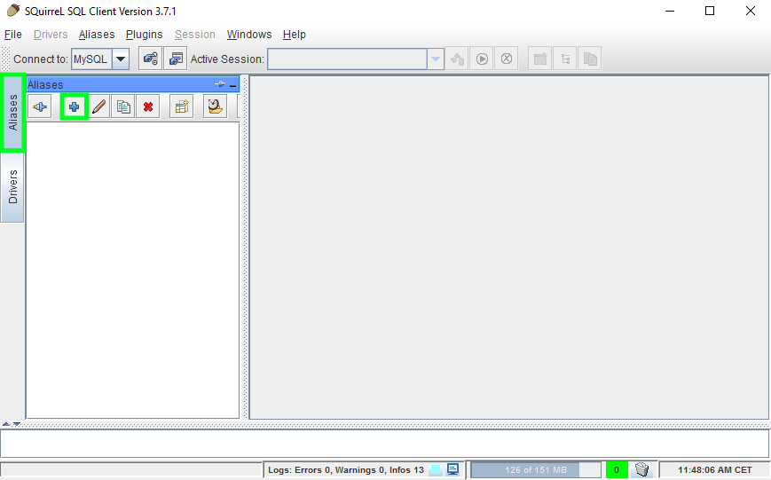

Vous désirez utiliser PostgreSQL ? Découvrez comment créer et gérer vos bases de données en toute simplicité !


## Généralités

### Prérequis


> [!primary]
>
> Ce tutoriel nécessite :
> - Une instance CloudDB
> - Avoir consulté le guide de démarrage de CloudDB : docs/cloud/clouddb/debuter-avec-clouddb
>

### Qu'est-ce qu'une base de donnees PostgreSQL ?
PostgreSQL est un système de gestion de bases de données relationnelles et objet (SGBDRO). C'est un système robuste et extensible, capable de manipuler en toute fiabilité de gros volumes de données. Il dispose également d'une communauté opensource très active.


## Connexion a la base de donnees


> [!primary]
>
> Il est à noter que cette offre ne donne pas accès au Host mais aux bases de données hébergées sur celui-ci. Les commandes SQL génériques fonctionnent sans aucun problème, et les logiciels type HeidiSQL ou SQuirreL SQL sont pleinement compatibles.
> 

Afin de vous connecter à votre base, assurez vous de ceci :

- Disposer de l'adresse de votre instance de base de données
- Disposer du port de votre base de données
- Disposer du nom d'utilisateur de votre base de données
- Disposer du mot de passe de votre base de données
- Disposer du nom de votre base de données

Toutes ces informations sont disponibles dans votre [Espace Client Web](https://www.ovh.com/manager/web/){.external}.

Un guide est également disponible : [](debuter-avec-clouddbguide.fr-fr.md){.ref}


### Connexion en ligne de commande

```bash
psql --host=serveur --port=port --user=utilisateur --password=password nom_de_la_base
```


### Connexion en script PHP

```php
1. <?php
2. $myPDO = new PDO('pgsql:host=host;port=port;dbname=dbname', 'username', 'password');
3. ?>
```


### Connexion par logiciel (SQuirreL SQL)
- Lancez SQuirreL SQL et cliquez sur `Aliases`{.action}, puis sur `+`{.action}


{.thumbnail}

- Remplissez les champs ci-dessous puis validez avec le bouton `OK`{.action} :
    - **Name** : Choisissez un nom
    - **Driver** : Choisissez "PostgreSQL"
    - **URL** : Indiquez l'adresse du serveur et le port sous la forme jdbc:postgresql://server:port/database
    - **User Name** : Indiquez le nom d'utilisateur
    - **Password** : Indiquez le mot de passe


{.thumbnail}

- Validez à nouveau avec le bouton `Connect`{.action}


{.thumbnail}

Vous êtes maintenant bien connecté à votre base de données :


{.thumbnail}


### Connexion par phppgAdmin
*Bientôt disponible dans un autre guide.*


## Exporter et importer une base de donnees PostgreSQL

- **Exporter ma base en ligne de commande**

```bash
pg_dump --host=serveur --port=port --user=utilisateur --password=password nom_de_la_base > nom_de_la_base.sql
```

- **Importer ma base en ligne de commande**

```bash
psql --host=serveur --port=port --user=utilisateur --password=password nom_de_la_base < nom_de_la_base.sql
```

> [!primary]
>
> Dans certains cas, il se peut que la RAM disponible dans votre instance CloudDB ne permette pas de réaliser l'export ou l'import souhaité. Si tel est le cas, nous vous recommandons d'utiliser l'outil OVH dans l'espace client. Reportez-vous à la documentation [« Premiers pas avec le service CloudDB »](https://docs.ovh.com/fr/clouddb/debuter-avec-clouddb/#importation-dune-base-de-donnees){.external} si nécessaire.
>