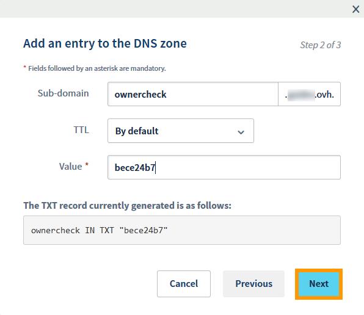
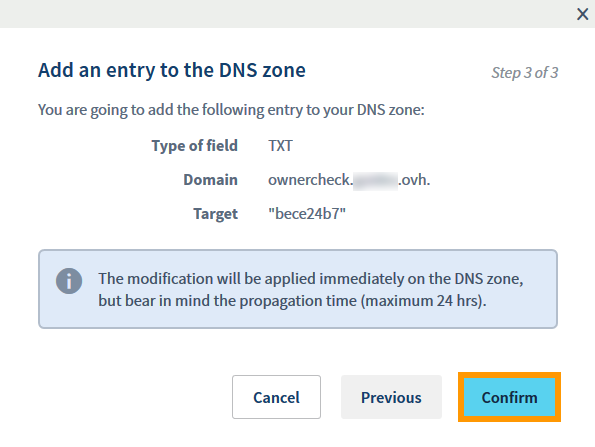

**Stand 02.04.2019**

## Einleitung

Wenn Sie Ihren [dedizierten Server](https://www.ovh.de/dedicated_server/){.external} als primären DNS für Ihre Domain verwenden möchten, können Sie die Domain als sekundären DNS zu Ihrem Server hinzufügen.

**In dieser Anleitung erfahren Sie, wie Sie einen sekundären DNS erstellen und zu Ihrem OVH Dedicated Server hinzufügen.**

## Voraussetzungen

* Sie verfügen über einen [Dedicated Server](https://www.ovh.de/dedicated_server//){.external}, auf dem Windows installiert ist.
* Sie besitzen eine [Domain](https://www.ovh.de/domains/){.external} und können diese über Ihr [OVH Kundencenter](https://www.ovh.com/auth/?action=gotomanager){.external} verwalten.
* Sie sind in Ihrem [OVH Kundencenter](https://www.ovh.com/auth/?action=gotomanager){.external} eingeloggt.

## Beschreibung

### Verifizierungscode für die Domain erhalten

Klicken Sie im Bereich `Bare Metal Cloud`{.action} in der linken Menüleiste auf `Dedicated Server`{.action}, um die Liste der Server Ihres Accounts anzuzeigen.

{.thumbnail}

Wählen Sie den entsprechenden Server aus, klicken Sie auf den Tab `Sekundärer DNS`{.action} und anschließend auf `Domain hinzufügen`{.action}.

{.thumbnail}

Geben Sie den Domainnamen im Feld `Domain` ein und klicken Sie auf `Weiter`{.action}.

{.thumbnail}

Es wird eine Nachricht angezeigt, in der Sie dazu aufgefordert werden, einen TXT-Eintrag für Ihre Domain zu erstellen. Notieren Sie sich die in der Anweisung enthaltene Subdomain sowie den Wert und klicken Sie auf `Abbrechen`{.action}.

{.thumbnail}

### Domain verifizieren

Wenn Sie in Ihrem [OVH Kundencenter](https://www.ovh.com/auth/?action=gotomanager){.external} eingeloggt sind, gehen Sie in den Bereich `Web Cloud`{.action} und klicken Sie in der linken Menüleiste auf `Domains`{.action}, um alle von Ihnen verwalteten Domains anzuzeigen.

{.thumbnail}

Wählen Sie die betreffende Domain aus und klicken Sie im Tab `DNS-Zone`{.action} auf `Eintrag hinzufügen`{.action}.

{.thumbnail}

Wählen Sie anschließend den Eintragstyp `TXT`{.action} aus und klicken Sie auf `Weiter`{.action}.

{.thumbnail}

Füllen Sie jetzt die Felder `Subdomain` und `Wert` mit den zuvor notierten Informationen aus. Wenn Sie fertig sind, klicken Sie auf `Weiter`{.action}.

{.thumbnail}

Bestätigen Sie anschließend Ihren Eintrag mit `Bestätigen`{.action}.

{.thumbnail}

> [!primary]
>
> Es ist eine Propagationszeit von 4 bis 24 Stunden erforderlich, bis der neue DNS-Eintrag auf allen Servern weltweit aktiv ist.
>

### Sekundären DNS zu Ihrem Server hinzufügen

Gehen Sie wie im ersten Schritt zurück in den Bereich `Bare Metal Cloud`{.action}, links auf `Dedicated Server`{.action} und zum Tab `Sekundärer DNS`{.action}. Klicken Sie auf `Domain Hinzufügen`{.action}.

{.thumbnail}

Geben Sie den Domainnamen im Feld `Domain` ein und klicken Sie auf `Weiter`{.action}.

{.thumbnail}

Da der TXT-Eintrag für Ihre Domain bereits erstellt ist, klicken Sie einfach auf `Weiter`{.action}.

{.thumbnail}

Um den Vorgang abzuschließen, klicken Sie auf `Hinzufügen`{.action}, um Ihren Eintrag zu bestätigen.

{.thumbnail}

## Weiterführende Informationen

[Bearbeiten der OVH DNS-Zone](https://docs.ovh.com/de/domains/webhosting_bearbeiten_der_dns_zone/){.external}

Für den Austausch mit unserer User Community gehen Sie auf <https://community.ovh.com/en/>.