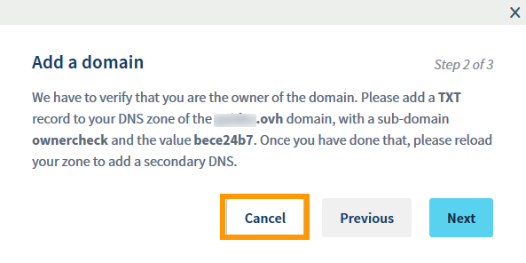

**Dernière mise à jour le 18/07/2018**

## Objectif

Si vous souhaitez utiliser votre [serveur dédié](https://www.ovh.com/fr/serveurs_dedies/){.external} en tant que DNS principal pour votre nom de domaine, vous pouvez ajouter celui-ci en tant que DNS secondaire à votre serveur.

**Ce guide vous montre comment créer un DNS secondaire et l'ajouter à votre serveur dédié OVHcloud.**

## Prérequis

* Disposer d'un [serveur dédié](https://www.ovh.com/fr/serveurs_dedies/){.external}.
* Disposer d'un [nom de domaine](https://www.ovh.com/fr/domaines/){.external} et pouvoir le gérer dans votre [espace client OVHcloud](https://www.ovh.com/auth/?action=gotomanager){.external}
* Être connecté à l’[espace client OVHcloud](https://www.ovh.com/auth/?action=gotomanager){.external}.

## En pratique

### Obtenir un code de vérification pour le nom de domaine

Cliquez sur le menu `Dédié`{.action}, puis sur `Serveurs Dédiés`{.action} dans la barre de menus à gauche de votre écran pour montrer la liste déroulante des serveurs de votre compte :

{.thumbnail}

Sélectionnez ensuite l'onglet `DNS Secondaire`{.action} et cliquez sur `Ajouter un domaine`{.action} :

{.thumbnail}

Entrez votre nom de domaine dans le champ `Domaine`, puis cliquez sur `Suivant`{.action} :

{.thumbnail}

Un message vous confirmant l'enregistrement de type TXT pour votre domaine apparaîtra. Prenez note du sous-domaine et de la cible dans les instructions, puis cliquez sur `Annuler`{.action} :

{.thumbnail}

### Procéder à la vérification du nom de domaine

Une fois connecté à l'[espace client OVHcloud](https://www.ovh.com/auth/?action=gotomanager){.external}, cliquez sur le menu `Web Cloud`{.action}, puis dans la section `Domaines`{.action} dans la colonne de gauche afin de faire apparaître tous les domaines que vous gérez :

{.thumbnail}

Après avoir sélectionné le nom de domaine souhaité, cliquez sur le bouton `Ajouter une entrée`{.action} :

{.thumbnail}

Sélectionnez ensuite le type d'enregistrement `TXT`{.action}, puis cliquez sur `Suivant`{.action} pour continuer :

{.thumbnail}

Remplissez maintenant les champs `Sous-domaine` et `Valeur` en utilisant les informations notées précédemment. Une fois cela fait, cliquez sur `Suivant`{.action} :

{.thumbnail}

Confirmez enfin votre entrée en cliquant sur le bouton `Confirmer`{.action} :

{.thumbnail}

> [!primary]
>
> Un temps de propagation DNS allant de 4 à 24 heures sera nécessaire pour que le champ soit actif pour tous les serveurs mondiaux.
>

### Ajouter le DNS secondaire à votre serveur

Revenez dans le menu `Dédié`{.action}, puis sur `Serveurs Dédiés`{.action} et `DNS Secondaire`{.action}, comme pour la première étape. Cliquez sur `Ajouter un domaine`{.action} :

{.thumbnail}

Entrez votre nom domaine dans le champ `Domaine`, puis cliquez sur `Suivant`{.action} :

{.thumbnail}

Comme que l'enregistrement TXT de votre domaine a déjà été créé, cliquez simplement sur `Suivant`{.action} pour continuer :

{.thumbnail}

Pour finir, cliquez sur `Ajouter`{.action} pour confirmer votre entrée :

{.thumbnail}

## Aller plus loin

[Éditer une zone DNS OVHcloud](https://docs.ovh.com/fr/domains/editer-ma-zone-dns/){.external}

Échangez avec notre communauté d'utilisateurs sur <https://community.ovh.com/>.
