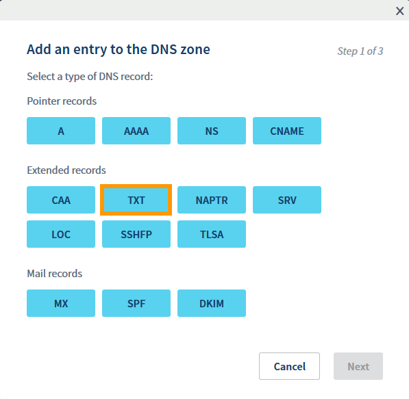

**Última atualização: 26/10/2018**

## Sumário

Se pretender utilizar o seu [servidor dedicado](https://www.ovh.pt/servidores_dedicados/){.external} enquanto DNS principal para o seu nome de domínio, pode adicioná-lo enquanto DNS secundário ao seu servidor.

**Este manual explica como criar um DNS secundário e adicioná-lo ao seu servidor dedicado da OVH.**

## Requisitos

* Dispor de um [servidor dedicado](https://www.ovh.pt/servidores_dedicados/){.external} com o Windows instalado.
* Dispor de um [nome de domínio](https://www.ovh.pt/dominios/){.external} e poder geri-lo através da [Área de Cliente OVH](https://www.ovh.com/auth/?action=gotomanager&from=https://www.ovh.pt/&ovhSubsidiary=pt){.external}
* Aceder à [Área de Cliente OVH](https://www.ovh.com/auth/?action=gotomanager&from=https://www.ovh.pt/&ovhSubsidiary=pt){.external}.

## Instruções

### Obter um código de verificação para o nome de domínio

Clique no menu `Serviços Dedicados`{.action} e, em seguida, em `Servidores Dedicados`{.action} na barra à esquerda do ecrã para apresentar o menu pendente dos servidores da sua conta:

{.thumbnail}

De seguida, selecione a janela `DNS secundário`{.action} e clique em `Adicionar domínio`{.action}:

{.thumbnail}

Insira o seu nome de domínio no campo `Domínio` e clique em `Seguinte`{.action}:

{.thumbnail}

Uma mensagem irá aparecer para confirmar o registo de tipo TXT para o seu domínio. Tome nota do subdomínio e do valor que aparecem nas instruções e, em seguida, clique em `Anular`{.action}:

{.thumbnail}

### Verificar o nome de domínio

Depois de aceder à [Área de Cliente OVH](https://www.ovh.com/auth/?action=gotomanager){.external}, clique no menu `Web`{.action} e selecione a secção `Domínios`{.action} na barra à esquerda para ver todos os domínios geridos por si:

{.thumbnail}

Após selecionar o nome de domínio pretendido, selecione a janela `Zona DNS`{.action} e clique no botão `Adicionar uma entrada`{.action}:

{.thumbnail}

De seguida, selecione o tipo de registo `TXT`{.action} e clique em `Seguinte`{.action} para continuar:

{.thumbnail}

Preencha os campos `Subdomínio` e `Valor` através das informações que anotou anteriormente. Após preencher esta informação, clique em `Seguinte`{.action}:

{.thumbnail}

Clique em `Validar`{.action} para adicionar a entrada:

{.thumbnail}

> [!primary]
>
> Será necessário um tempo de propagação DNS de 4 a 24 horas para que a entrada fique ativa em todos os servidores mundiais.
>

### Adicionar o DNS secundário ao servidor

No menu `Serviços Dedicados`{.action}, aceda à secção `Servidores Dedicados`{.action} e abra a janela `DNS secundário`{.action}. Clique em `Adicionar domínio`{.action}:

{.thumbnail}

Insira o seu nome de domínio no campo `Domínio` e clique em `Seguinte`{.action}:

{.thumbnail}

Uma vez que o registo TXT do seu domínio já foi criado, só precisa de clicar em `Seguinte`{.action} para continuar:

{.thumbnail}

Por fim, clique em `Adicionar`{.action} para confirmar a sua entrada:

{.thumbnail}

## Quer saber mais?

[Editar uma zona DNS OVH](https://docs.ovh.com/gb/en/domains/web_hosting_how_to_edit_my_dns_zone/){.external} (versão em inglês- Editing an OVH DNS zone).

Fale com a nossa comunidade de utilizadores em [https://community.ovh.com/en/](https://community.ovh.com/en/){.external}.