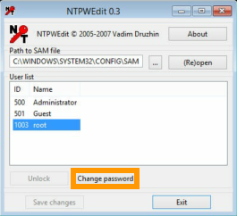

**Last updated 2018/06/21**

## Objective

When you install or reinstall a Windows operating system, you are given an admin access password. We strongly recommend that you change it, as detailed in our guide to [securing a Dedicated Server](../securing-a-dedicated-server/). You may also find that you have lost this password, and need to change it.

**This guide will take you through the process of changing your server's admin password.**

## Requirements

* a [Dedicated Server](https://www.ovh.com.au/dedicated-servers/){.external} with Windows installed
* access to the [OVHcloud Control Panel](https://ca.ovh.com/auth/?action=gotomanager){.external}

## Instructions

First, boot your server into [rescue mode](../ovh-rescue/){.external} using the WinRescue boot environment. Once the server has rebooted, select the `IPMI`{.action} tab on your server's page in your [OVHcloud Control Panel](https://ca.ovh.com/auth/?action=gotomanager){.external}.

> [!primary]
>
> For detailed information on how to use the IPMI feauture, please refer to our [IPMI guide](../use-ipmi-dedicated-servers/){.external}.
>

Next, activate the IPMI feature using either the Java applet or your browser. After the IPMI session has started, double-click the NTPWdi server tool on the WinRescue desktop.

{.thumbnail}

Next, click the `(Re)open`{.action} button to display a list of available user accounts.

{.thumbnail}

Now select the root user account from the list and click the `Change password`{.action} button.

{.thumbnail}

Finally, enter the new password twice and then click `OK`{.action}.

{.thumbnail}

Your password has now been changed. Exit the tool, close the IPMI session, and reboot your server back into normal mode.

## Go further

[Rescue mode](../ovh-rescue/){.external}.

[Using the IPMI with dedicated servers](../use-ipmi-dedicated-servers/){.external}.

Join our community of users on <https://community.ovh.com/en/>.
