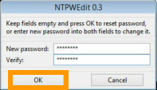

**Dernière mise à jour le 2018/08/24**

## Objectif

Lors de l’installation ou de la réinstallation d’un système d’exploitation Windows, un mot de passe pour l’accès administrateur vous est fourni. Nous vous conseillons vivement de le modifier, comme expliqué dans notre guide intitulé « [Sécuriser un serveur dédié](https://docs.ovh.com/ca/fr/dedicated/securiser-un-serveur-dedie/){.external} ». Il est également possible que vous ne retrouviez plus ce mot de passe et que vous ayez besoin de le modifier.

**Ce guide vous explique comment procéder à la modification du mot de passe administrateur de votre serveur.**

## Prérequis

* Posséder un [serveur dédié](https://www.ovh.com/ca/fr/serveurs-dedies/){.external} avec Windows installé.
* Être connecté à l'[espace client OVH](https://ca.ovh.com/auth/?action=gotomanager){.external}.

## En pratique

Pour commencer, démarrez votre serveur en mode rescue en utilisant l'environnement d'initialisation WinRescue. En cas de besoin, nous vous invitons à vous référer au guide relatif au [mode rescue](https://docs.ovh.com/ca/fr/dedicated/rescue-mode/){.external}. 

Une fois le serveur redémarré, sélectionnez l'onglet `IPMI`{.action} sur la page de votre serveur dans votre [espace client OVH](https://ca.ovh.com/auth/?action=gotomanager){.external}.

> [!primary]
>
> Pour des informations détaillées sur l'utilisation de la fonction IPMI, veuillez vous reporter à notre [guide relatif à l'utilisation de l'IPMI](https://docs.ovh.com/ca/fr/dedicated/utiliser-ipmi-serveurs-dedies/){.external}.
>

Activez ensuite la fonctionnalité IPMI à l'aide de l'applet Java ou de votre navigateur. Une fois la session IPMI démarrée, faites un double-clic sur l'outil NTPWdi du serveur sur le bureau WinRescue.

{.thumbnail}

Après cela, cliquez sur le bouton `(Ré)ouvrir`{.action} pour afficher la liste des comptes utilisateur disponibles.

{.thumbnail}

Maintenant, sélectionnez le compte utilisateur root dans la liste et cliquez sur le bouton `Changer le mot de passe`{.action}.

{.thumbnail}

Pour finir, entrez le nouveau mot de passe deux fois, puis cliquez sur `OK`{.action}.

{.thumbnail}

Votre mot de passe a maintenant été changé. Quittez l'outil, fermez la session IPMI et redémarrez votre serveur en mode normal.

## Aller plus loin

[Activer et utiliser le mode rescue](https://docs.ovh.com/ca/fr/dedicated/rescue-mode/){.external}.

[L’utilisation de l’IPMI pour les serveurs dédiés](https://docs.ovh.com/ca/fr/dedicated/utiliser-ipmi-serveurs-dedies/){.external}.

Échangez avec notre communauté d'utilisateurs sur <https://community.ovh.com/>.