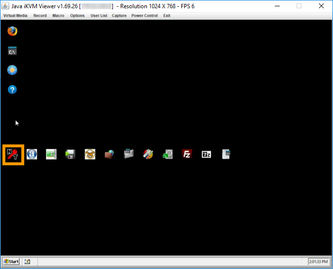

**Última atualização: 22/08/2018**

## Sumário

Quando instalar ou reiniciar um sistema operativo Windows, irá receber uma palavra-passe de acesso administrador. Para maior segurança, sugerimos a alteração da mesma, conforme as indicações apresentadas no manual "[Proteger um servidor dedicado](https://docs.ovh.com/pt/dedicated/proteger-um-servidor-dedicado/){.external}". Além disso, poderá também ter-se esquecido da palavra-passe e, por isso, precisa de a alterar.

**Este manual explica-lhe como alterar a palavra-passe de administrador no seu servidor.**

## Requisitos

* Possuir um [servidor dedicado](https://www.ovh.pt/servidores_dedicados/){.external} com o Windows instalado.
* Ter acesso à [Área de Cliente OVH](https://www.ovh.com/auth/?action=gotomanager){.external}.

## Instruções

Comece por iniciar o seu servidor em modo rescue através do ambiente de inicialização WinRescue. Caso seja necessário, sugerimos que consulte o manual sobre o [modo rescue](https://docs.ovh.com/pt/dedicated/rescue_mode/){.external}. 

Depois de reiniciar o servidor, selecione a janela `IPMI`{.action} na página do seu servidor da [Área de Cliente OVH](https://www.ovh.com/auth/?action=gotomanager){.external}.

> [!primary]
>
> Para obter mais informações sobre a utilização do IPMI, consulte o nosso manual sobre [Como utilizar o IPMI com servidores dedicados](https://docs.ovh.com/pt/dedicated/usar-ipmi-servidores-dedicados/){.external}.
>

De seguida, ative a funcionalidade IPMI através da applet Java ou do seu navegador. Depois de iniciar a sessão IPMI, clique duas vezes na ferramenta NTPWdi do servidor no ambiente de trabalho do WinRescue.

{.thumbnail}

Depois, clique no botão `(Re)open`{.action} ((Re)abrir) para apresentar a lista de contas de utilizadores disponíveis.

{.thumbnail}

A partir daí, selecione a conta de utilizador root e clique no botão `Change password`{.action} (Alterar palavra-passe).

{.thumbnail}

Finalmente, insira a nova palavra-passe duas vezes e clique em `OK`{.action}.

{.thumbnail}

A sua palavra-passe foi alterada. Feche a ferramenta, termine a sessão IPMI e reinicie o seu servidor em modo normal.

## Quer saber mais?

[Modo Rescue](https://docs.ovh.com/pt/dedicated/rescue_mode/){.external}

[Como utilizar o IPMI com servidores dedicados](https://docs.ovh.com/pt/dedicated/usar-ipmi-servidores-dedicados/){.external}.

Fale com a nossa comunidade de utilizadores: [Comunidade OVH](https://community.ovh.com/en/){.external}.