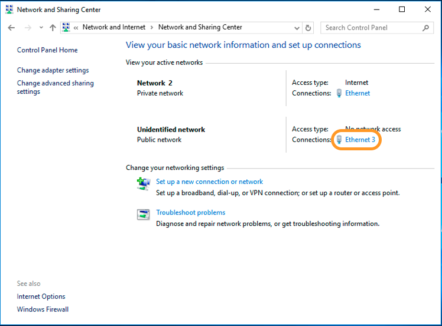
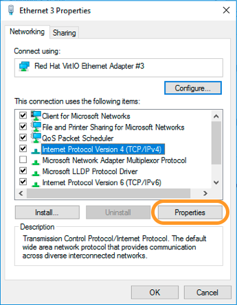
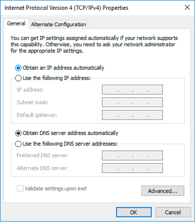
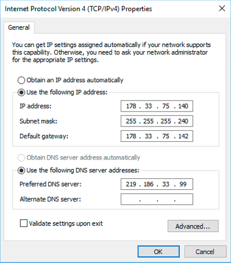
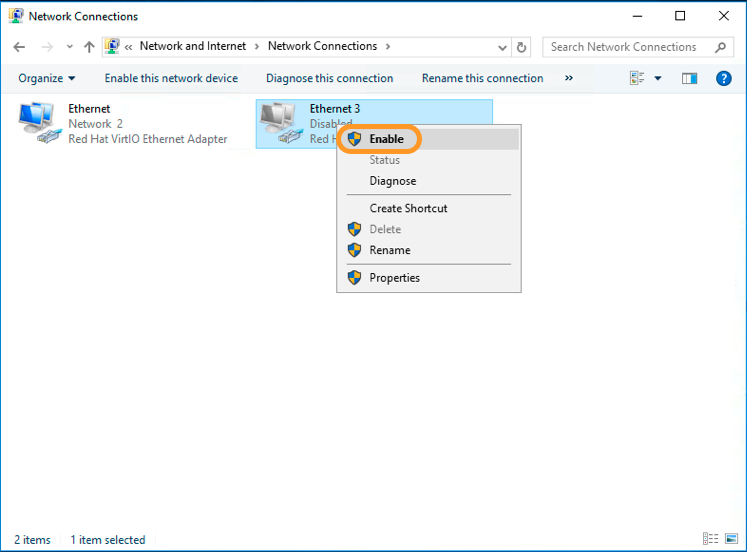

**Last updated 29th June 2018**

## Objective

As well as private IP addressing, the [vRack](https://www.ovh.co.uk/solutions/vrack/){.external} also allows you to route public IP traffic through your server's [vRack](https://www.ovh.co.uk/solutions/vrack/){.external} port using a public IP address block.

**This guide will show you how to configure a block of public IP addresses for use with the [vRack](https://www.ovh.co.uk/solutions/vrack/){.external}.**

## Requirements

* a public block of IP addresses in your account, with a minimum of four addresses
* your chosen private IP address range
* a [vRack compatible server](https://www.ovh.co.uk/dedicated_servers/){.external}
* a [vRack](https://www.ovh.co.uk/solutions/vrack/){.external} service activated in your account
* access to the OVH [Control Panel](https://www.ovh.com/auth/?action=gotomanager){.external}

## Instructions

> [!primary]
>
For example purposes we'll be using an IP block of 46.105.135.96/28 and eth1 for the secondary network interface, which is dedicated to the [vRack](https://www.ovh.co.uk/solutions/vrack/){.external}.
>

### Configure a usable IP address

For [vRack](https://www.ovh.co.uk/solutions/vrack/){.external} purposes, the first, penultimate, and last addresses in any given IP block are always reserved for the network address, network gateway, and network broadcast respectively. This means that the first useable address is the second address in the block, as shown below:

```sh
46.105.135.96   Reserved: Network address
46.105.135.97   First usable IP
46.105.135.98
46.105.135.99
46.105.135.100
46.105.135.101
46.105.135.102
46.105.135.103
46.105.135.104
46.105.135.105
46.105.135.106
46.105.135.107
46.105.135.108
46.105.135.109  Last usable IP
46.105.135.110  Reserved: Network gateway
46.105.135.111  Reserved: Network broadcast
```

To configure the first usable IP address, we need to edit the network configuration file, as shown below. In this example, we need to use a subnet mask of *255.255.255.240*.

> [!primary]
>
The subnet mask we've used in our example is appropriate for our IP block. Your subnet mask may differ depending on the size of your block. When you purchase your IP block, you'll receive an email that will tell you which subnet mask to use.
>

###Debian/Ubuntu

```sh
/etc/network/interfaces

auto eth1
iface eth1 inet static
address 46.105.135.97
netmask 255.255.255.240
broadcast 46.105.135.111
```
### Create a new IP routing table

First, we need to download and install iproute2, which is a package that will enable us to manually configure IP routing on the server.

Establish an SSH connection to your server and run the following command from the command line. This will download and install iproute2.

```sh
# apt-get install iproute2
```

Next, we need to create a new IP route for the [vRack](https://www.ovh.co.uk/solutions/vrack/){.external}. We'll be adding a new traffic rule by amending the file, as shown below:

```sh
/etc/iproute2/rt_tables

#
# reserved values
#
255	local
254	main
253	default
0	unspec
#
# local
#
#1	inr.ruhep
1 vrack
```

### Amend the network configuration file

> [!primary]
>
For example purposes, the network configuration file we refer to is located in /etc/network/interfaces. The equivalent file on your server may be located somewhere else, depending on your operating system.
>


Finally, we need to amend the network configuration file to account for the new traffic rule and route the [vRack](https://www.ovh.co.uk/solutions/vrack/){.external} traffic through the network gateway address of **46.105.135.110**.

```sh
/etc/network/interfaces

auto eth1
iface eth1 inet static
address 46.105.135.97
netmask 255.255.255.240
broadcast 46.105.135.111
post-up ip route add 46.105.135.96/28 dev eth1 table vrack
post-up ip route add default via 46.105.135.110 dev eth1 table vrack
post-up ip rule add from 46.105.135.96/28 table vrack
post-up ip rule add to 46.105.135.96/28 table vrack
```

Now reboot your server to apply the changes.

### CentOS 7

#### Step 1: Create and configure the file for the second network interface

First we can copy the main IP configuration for the new network interface file

```sh
sudo cp /etc/sysconfig/network-scripts/ifcfg-eth0 /etc/sysconfig/network-scripts/ifcfg-eth1
```
Then we access to the new file
```sh
sudo nano /etc/sysconfig/network-scripts/ifcfg-eth1
```
And we define the IP settings
```sh
# Created by cloud-init on instance boot automatically, do not edit.
#
BOOTPROTO=static
DEVICE=eth1
HWADDR=fa:16:3e:6c:98:57
ONBOOT=yes
TYPE=Ethernet
USERCTL=no
DEFROUTE=no
IPADDR=178.33.75.138
PREFIX=28
```
> [!primary]
>
We must to change the ```HWADDR``` field with the current Mac address of the second network physical interface of our server.
>

#### Step 2: Add the IP gateway route and the IP rule

With the follwoing command we are going to add the gateway IP on the routing table of the server:
```sh
sudo ip route add default via 178.33.75.142 dev eth1 table 1000
```
```sh
ip route
default via 51.83.104.1 dev eth0 proto dhcp metric 100 
51.83.104.1 dev eth0 proto dhcp scope link metric 100 
51.83.110.190 dev eth0 proto kernel scope link src 51.83.110.190 metric 100 
178.33.75.128/28 dev eth1 proto kernel scope link src 178.33.75.138 metric 101 
217.182.182.210 dev eth0 proto kernel scope link src 217.182.182.210 metric 100 
```
And this other one add the IP info to the network rules of the server:
```sh
sudo ip rule add from 178.33.75.138 lookup 1000
```
```sh
ip rule
0:	from all lookup local 
32765:	from 178.33.75.138 lookup 1000 
32766:	from all lookup main 
32767:	from all lookup default 
```

#### Step 3: Restar the network

```sh
sudo systemctl restart network
```

### Windows Server 2016EN

#### Step 1: Check and configure the second network interface

First we must to access to the new network interface information

{.thumbnail}

Then we must to check the properties

{.thumbnail}

{.thumbnail}

#### Step 2: IP Configuration

We must to activate the ```Use the following IP address```:

{.thumbnail}

And we define the IP information:

{.thumbnail}

#### Step 3: Rebooting the network interface

First we do the disabling process

{.thumbnail}

Then we do the enabling process

{.thumbnail}

#### Step 4: Checking the new network configuration

Using the console and the ___ipconfig___ command we can check the new network configuration

{.thumbnail}


## Go further

[Configuring the vRack on your dedicated servers](https://docs.ovh.com/gb/en/dedicated/configuring-vrack-on-dedicated-servers/){.external}

[Creating multiple vLANs in a vRack](https://docs.ovh.com/gb/en/dedicated/multiple-vlans/){.external}

[Configuring the vRack between the Public Cloud and a Dedicated Server](https://docs.ovh.com/gb/en/dedicated/vrack-pci-ds/){.external}

Join our community of users on <https://community.ovh.com/en/>.
