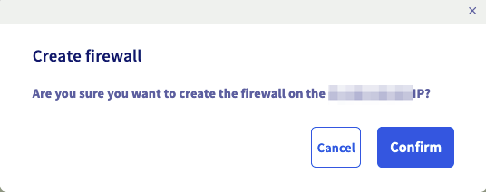

**Päivitetty 11.12.2017**

## Tavoite

Globaalin infrastruktuurinsa ja asiakkaidensa palvelinten suojaamiseksi OVH tarjoaa **Anti-DDoS**-ratkaisuun (VAC) integroidun Firewall Network -palomuurin, jonka asetuksia voidaan muokata. Se on lisäoptio, jonka avulla voidaan rajoittaa palvelun alttiutta joutua julkisesta verkosta tulevien verkkohyökkäysten kohteeksi.

**Tässä ohjeessa kerrotaan kuinka se konfiguroidaan**

> [!primary]
>
> VAC*: Lisätietoa palvelunestohyökkäysten VAC-estojärjestelmästämme täältä: <https://www.ovh-hosting.fi/anti-ddos/>.
> 

{.thumbnail}

## Edellytykset

- Sinulla on OVH:n palvelu, johon sisältyy Firewall Network ([kuten dedikoitu palvelin](https://www.ovh-hosting.fi/dedikoidut_palvelimet){.external}, [VPS](https://www.ovh-hosting.fi/vps/){.external}, [Public Cloud -instanssi](https://www.ovh-hosting.fi/public-cloud/instances/){.external}, [Private Cloud](https://www.ovh-hosting.fi/private-cloud/){.external}, [Fail-over IP](https://www.ovh-hosting.fi/dedikoidut_palvelimet/ip_failover.xml){.external})
- Sinulla on pääsyoikeudet [hallintapaneeliin](https://www.ovh.com/auth/?action=gotomanager){.external}.
- Sinulla on perustuntemusta verkosta.

## Käytännössä

### Firewall Network -palomuurin aktivointi

> [!primary]
>
> Firewall Network suojaa yhteen koneeseen liittyvät IP-osoitteet. Jokainen IP-osoite on siis konfiguroitava erikseen, mitään palvelimen yleistä konfigurointia ei ole mahdollista tehdä.
> 

Aktivointi ja konfigurointi tapahtuvat käsin hallintapaneelin `IP`{.action}-osiossa klikkaamalla kyseessä olevan IPv4:n oikealla puolella olevaa hammasratasta.

{.thumbnail}

- Tämän jälkeen pyydetään vahvistusta:

{.thumbnail}

- Tämän jälkeen palomuuri on aktivoitava `Aktivoi palomuuri`{.action} ja konfiguroitava `Konfiguroi palomuuri`{.action} klikkaamalla uudestaan IPv4-osoitteen vieressä olevaa hammasratasta.

{.thumbnail}

Voit asettaa jopa **20 sääntöä IP-osoitetta kohti**.

> [!warning]
>
> Palomuuri aktivoituu automaattisesti jokaisessa palvelunestohyökkäyksessä eikä sitä voida kytkeä pois päältä ennen hyökkäyksen päättymistä. Tästä syystä on tärkeää pitää palomuurin säännöt ajan tasalla. Oletuksena sinulla ei ole konfiguroituja sääntöjä, joten kaikki yhteydet voidaan muodostaa. Jos sinulla on niitä, muista tarkistaa palomuurisäännöt säännöllisesti, vaikka kytkisitkin palomuurin pois päältä.
> 

> [!primary]
>
> - UDP-fragmentointi on oletuksena estetty (DROP). Mikäli käytät Firewall Network -palomuurin aktivoinnin yhteydessä VPN-yhteyttä, muista konfiguroida oikein maksimaalinen sanomansiirtoyksikkösi (MTU). Esimerkiksi OpenVPN:ssä voit rastittaa kohdan `MTU test`{.action}.
> - Firewall Network -palomuuria ei huomioida OVH:n verkossa. Asetetut säännöt eivät siis vaikuta sisäisen verkon yhteyksiin.
>

### Konfiguroi Firewall Network

Sääntö lisätään klikkaamalla oikealla `Lisää sääntö` {.action}:

{.thumbnail}

Voit valita jokaiselle säännölle:

- prioriteetin (asteikolla 0 - 19, jossa 0 on ensimmäisenä käytettävä sääntö jne.)
- toiminnan (`Hyväksytty`{.action} tai `Hylätty`{.action})
- protokollan
- IP-osoitteen (valinnainen)
- lähdeportin (vain TCP)
- kohdeportin (vain TCP)
- TCP-lisäoptiot (vain TCP)

{.thumbnail}

> [!primary]
>
> - Prioriteetti 0: on suositeltavaa sallia TCP-protokolla kaikilla IP-osoitteilla lisäoptiolla `established`{.action}. `Established`-lisäoptiolla voidaan tarkistaa, että paketti kuuluu aiemmin avattuun istuntoon (jo käynnistettyyn). Jos et salli sitä, palvelin ei vastaanota TCP-protokollan vastauksia SYN/ACK-kyselyihin.
> - Prioriteetti 19: kaikkien IPv4-protokollien esto mikäli yhtään sääntöä ennen 19\. sääntöä (viimeinen mahdollinen sääntö) ei ole täytetty.
> 

### Esimerkki konfiguraatioista

Jotta jätät avoimeksi ainoastaan SSH (22), HTTP (80), HTTPS (443), UDP (portissa 10000) -portit ICMP:n hyväksymällä, on seurattava seuraavia sääntöjä:

{.thumbnail}

Säännöt ovat kronologisessa järjestyksessä nollasta (ensimmäisenä luettava sääntö) 19\. sääntöön (viimeisenä luettu sääntö). Ketjun läpikäynti keskeytyy sillä hetkellä, kun jotakin sääntöä sovelletaan saapuneeseen pakettiin.

Esimerkki porttiin 80/TCP tarkoitettu paketti napataan säännön 2 mukaisesti eikä seuraavia sääntöjä enää testata. Porttiin 25/TCP osoitettu paketti pysähtyy vasta viimeiseen sääntöön (19), joka estää sen, sillä OVH ei salli mitään viestintää porttiin 25 edellisissä säännöissä.

> [!warning]
>
> Mikäli Anti-DDoS-mitigaatio aktivoituu, aktivoituvat myös Firewall Network -säännöt vaikka olisit kytkenyt ne pois päältä. Mikäli palomuuri kytketään pois päältä, muista poistaa säännöt.
> 

## Lue lisää aiheesta

Viesti käyttäjäyhteisömme kanssa osoitteessa: <https://ovh-hosting.fi/community/foorumi>.
