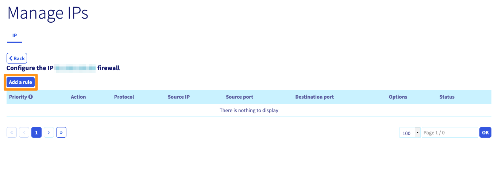

**Dernière mise à jour le 16/08/2018**

## Objectif

Afin de protéger son infrastructure globale et les serveurs de ses clients, OVH propose un pare-feu paramétrable intégré à la solution **Anti-DDoS** : le Firewall Network. Il s'agit d'une option permettant de limiter l’exposition des services aux attaques provenant du réseau public.

**Ce guide vous explique comment configurer le Firewall Network.**

> [!primary]
>
> Pour plus d'informations sur notre solution Anti-DDoS, consultez cette page : <https://www.ovh.com/fr/anti-ddos/>.
> 

{.thumbnail}

## Prérequis

- Posséder un service OVH bénéficiant du Firewall Network ([serveur dédié](https://www.ovh.com/fr/serveurs_dedies/){.external}, [VPS](https://www.ovh.com/fr/vps/){.external}, [instance Public Cloud](https://www.ovh.com/fr/public-cloud/instances/){.external}, [Private Cloud](https://www.ovh.com/fr/private-cloud/){.external}, [IP fail-over](https://www.ovh.com/fr/serveurs_dedies/ip_failover.xml){.external}, etc.).
- Être connecté à l'[espace client OVH](https://www.ovh.com/auth/?action=gotomanager){.external}.

## En pratique

### Activer le Firewall Network

> [!primary]
>
> Le Firewall Network protège les adresses IP associées à une machine. Vous devez donc paramétrer chaque IP indépendamment ; aucune configuration globale du serveur n'est possible.
> 

Une fois connecté à l'[espace client OVH](https://www.ovh.com/auth/?action=gotomanager){.external}, rendez-vous dans la section `IP`{.action} et cliquez sur `...`{.action} pour activer le pare-feu sur l'IPv4 souhaitée.

{.thumbnail}

Une confirmation vous est alors demandée.

{.thumbnail}

Cliquez ensuite sur `Activer le firewall`{.action} (1), puis choisissez `Configurer le Firewall`{.action} (2) pour commencer le paramétrage.

{.thumbnail}

Vous pouvez mettre en place jusqu'à **20 règles par IP**.

> [!warning]
>
> Le pare-feu s'active automatiquement à chaque attaque DDoS et il n'est pas possible de le désactiver avant la fin de l'attaque. C'est pourquoi il est important de garder des règles de pare-feu à jour.
> Par défaut, vous n'avez pas de règles configurées donc toutes les connexions peuvent être établies.
> Si vous en avez, pensez à les vérifier régulièrement même si vous désactivez le pare-feu.
> 

> [!primary]
>
> - Par défaut, la fragmentation UDP est bloquée (DROP). Lors de l'activation du Firewall Network, si vous utilisez un VPN, pensez à configurer correctement votre maximum transmission unit (MTU). Par exemple, sur OpenVPN, vous pouvez cocher `MTU test`{.action}.
> - Le Firewall Network n'est pas pris en compte au sein du réseau OVH. Les règles mises en place n'affectent donc pas les connexions dans ce réseau interne.
>

### Configurer le Firewall Network

Ajoutez une règle en cliquant sur `Ajouter une règle`{.action}.

{.thumbnail}

Pour chaque règle, vous devez choisir :
- une priorité (de 0 à 19, 0 étant la première règle appliquée) ;
- une action (`Autorise`{.action} ou `Refuse`{.action}) ;
- le protocole ;
- une IP (facultatif) ;
- le port source (TCP uniquement) ;
- le port de destination (TCP uniquement) ;
- les options TCP (TCP uniquement).

{.thumbnail}

> [!primary]
>
> - Priorité 0 : il est conseillé d'autoriser le protocole TCP sur toutes les IP avec une option `established`{.action}. Celle-ci permet de vérifier que le paquet fait partie d’une session précédemment ouverte (déjà initiée). Si vous ne l'autorisez pas, le serveur ne recevra pas les retours du protocole TCP des requêtes SYN/ACK.
> - Priorité 19 : un refus sur tout le protocole IPv4 si aucune règle avant la 19e (la dernière possible) n'est remplie.
> 

### Exemple de configuration

Pour ne laisser ouverts que les ports SSH (22), HTTP (80), HTTPS (443) et UDP (10000) en autorisant l’ICMP, suivez les règles suivantes :

{.thumbnail}

Les règles s'ordonnent chronologiquement de 0 (première règle lue) à 19 (dernière règle lue). La chaîne arrête d’être parcourue à partir du moment où une règle s’applique au paquet reçu.

Par exemple, un paquet destiné au port 80/TCP sera attrapé par la règle 2 et les règles suivantes ne seront pas testées. Un paquet destiné au port 25/TCP ne sera attrapé qu’à la dernière règle (19) qui le bloquera, car OVH n'autorise aucune communication sur le port 25 dans les règles précédentes.

> [!warning]
>
> En cas d'activation de la mitigation anti-DDoS, vos règles de Firewall Network seront activées même si vous avez désactivé celui-ci. En cas de désactivation, pensez donc bien à supprimer vos règles.
> 

## Aller plus loin

Échangez avec notre communauté d'utilisateurs sur <https://community.ovh.com>.