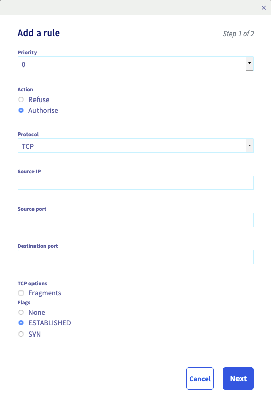

**Dernière mise à jour le 05/08/2020**

## Objectif

Pour protéger son infrastructure globale et les serveurs de ses clients, OVHcloud propose un pare-feu paramétrable et intégré à la solution **Anti-DDoS** : le Firewall Network. Cette option vous permet de limiter l'exposition de votre service aux attaques provenant du réseau public.

**Ce guide vous explique comment configurer votre Firewall Network.**

> [!primary]
>
> Pour plus d'informations sur notre solution Anti-DDoS, cliquez ici : <https://www.ovh.com/fr/anti-ddos/>.
> 

{.thumbnail}

## Prérequis

- Posséder un service OVHcloud bénéficiant d’un Firewall Network ([serveur dédié](https://www.ovh.com/fr/serveurs_dedies/){.external}, [VPS](https://www.ovh.com/fr/vps/){.external},[instance Public Cloud](https://www.ovh.com/fr/public-cloud/){.external}, [Private Cloud](https://www.ovhcloud.com/fr/enterprise/products/hosted-private-cloud/), [IP fail-over](https://www.ovh.com/fr/serveurs_dedies/ip_failover.xml){.external}, etc.)
- Avoir accès à votre [espace client OVHcloud](https://www.ovh.com/auth/?action=gotomanager){.external}.

## En pratique

### Activer le Firewall Network

> [!primary]
>
> Le Firewall Network protège les adresses IP associées à une machine. Vous devez donc configurer chaque adresse IP indépendamment. Une configuration globale du serveur est impossible.
> 

Connectez-vous à[ l’espace client OVHcloud](https://www.ovh.com/auth/?action=gotomanager){.external}, accédez à la section `IP`{.action} et cliquez sur `...`{.action} pour activer le pare-feu sur une adresse IPv4.

{.thumbnail}

Confirmez votre action.

{.thumbnail}

Cliquez ensuite sur `Activer le firewall`{.action} (1), puis sur ` Configurer le firewall`{.action} (2) pour commencer le paramétrage.

{.thumbnail}

Vous pouvez configurer jusqu'à **20 règles par adresse IP**.

> [!warning]
>
> Le pare-feu s’active automatiquement à chaque attaque DDoS et ne peut pas être désactivé avant la fin de l'attaque. C'est pourquoi il est important de maintenir à jour les règles de pare-feu.
> Par défaut, vous n’avez pas de règles configurées. Toutes les connexions peuvent donc être établies.
> Si vous avez déjà des règles, nous vous recommandons de les vérifier régulièrement, même si le pare-feu est désactivé.
> 

> [!primary]
>
> - La fragmentation UDP est bloquée (DROP) par défaut. Lorsque vous activez le Firewall Network, n'oubliez pas de configurer correctement votre unité de transmission maximale (<i>Maximum Transmission Unit</i> ou MTU) si vous utilisez un VPN. Par exemple, sur OpenVPN, vous pouvez cocher `MTU test`{.action} .
> - Le Firewall Network n'est pas pris en compte au sein du réseau OVHcloud. Par conséquent, les règles configurées n'affectent pas les connexions de ce réseau interne.
>

### Configurer le Firewall Network

Pour ajouter une règle, cliquez sur ` Ajouter une règle`{.action}.

{.thumbnail}

Pour chaque règle, vous devez choisir :
- une priorité (de 0 à 19, 0 étant la première règle à appliquer) ;
- une action (`Autoriser`{.action} ou `Refuser`{.action}) ;
- le protocole ;
- une adresse IP (facultatif) ;
- le port source (TCP uniquement) ;
- le port de destination (TCP uniquement) ;
- les options TCP (TCP uniquement).

{.thumbnail}

> [!primary]
>
> - Priorité 0 : nous vous conseillons d'autoriser le protocole TCP sur toutes les adresses IP avec une option `établie`{.action}. Celle-ci vous permet de vérifier que le paquet fait partie d'une session précédemment ouverte (déjà initiée). Si vous ne l'autorisez pas, le serveur ne recevra pas les retours du protocole TCP des requêtes SYN/ACK.
> - Priorité 19 : nous vous conseillons de refuser tout trafic de protocole IPv4 qui n'a été accepté par aucune règle antérieure.
> 

### Exemple de configuration

Pour vous assurer que seuls les ports SSH (22), HTTP (80), HTTPS (443) et UDP (10 000) restent ouverts lors de l'autorisation de l'ICMP, suivez les règles ci-dessous :

{.thumbnail}

Les règles sont triées de 0 (la première règle lue) à 19 (la dernière). La chaîne cesse d'être analysée dès qu'une règle est appliquée au paquet reçu.

Par exemple, un paquet pour le port 80/TCP sera capturé par la règle 2 et les règles qui suivent ne seront pas appliquées. Un paquet pour le port 25/TCP ne sera attrapé qu'à la dernière règle (19) qui le bloquera, car le pare-feu n'autorise pas la communication sur le port 25 dans les règles précédentes.

> [!warning]
>
> Si notre solution anti-DDoS limite une attaque, votre Firewall Network sera activé, même si vous l'avez désactivé par défaut. Si vous souhaitez le désactiver, n'oubliez pas de supprimer vos règles.
> 

## Aller plus loin

Échangez avec notre communauté d'utilisateurs sur <https://community.ovh.com>.
