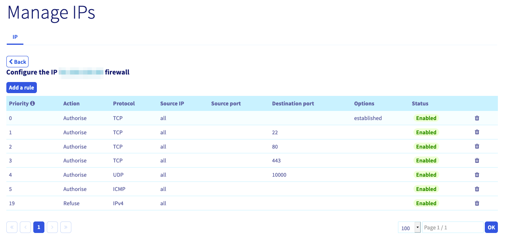

**Laatste update 18-01-2018**

## Introductie

Om de wereldwijde infrastructuur en servers van zijn klanten te beschermen, biedt OVH een configureerbare firewall die kan worden geïntegreerd met de **Anti-DDoS** (VAC) -oplossing: Firewall Network. Deze optie beperkt de gevoeligheid van diensten voor aanvallen vanaf het openbare netwerk.

**Deze handleiding beschrijft hoe u het kunt configureren**.

> [!primary]
>
> VAC*: Meer informatie over VAC, onze interne anti-DDoS: <https://www.ovh.nl/anti-ddos/>.
> 

{.thumbnail}

## Vereisten

- U moet geabonneerd zijn op een OVH-dienst met de optie Firewall Network: ([Dedicated server](https://www.ovh.nl/dedicated_servers/){.external}, [VPS](https://www.ovh.nl/vps/){.external}, [Public Cloud instance](https://www.ovh.nl/public-cloud/instances/){.external}, [Private Cloud](https://www.ovh.nl/private-cloud/){.external}, [Failover-IP](https://www.ovh.nl/dedicated_servers/ip_failover.xml){.external}...)   
- U moet toegang hebben tot een [OVH Control Panel](https://www.ovh.com/auth/?action=gotomanager){.external}.
- U moet basiskennis hebben van netwerken. 

## Instructie

### Activeer Firewall Network

> [!primary]
>
> Het firewallnetwerk beschermt de IP-adressen die op een computer zijn aangesloten. Elk IP-adres moet daarom afzonderlijk worden geconfigureerd, er kan geen algemene serverconfiguratie worden gemaakt.
> 

Activering en configuratie vinden handmatig plaats in het `IP`{.action}-gedeelte in het Control Panel door op het tandwiel rechts van de betreffende IPv4 te klikken.

{.thumbnail}

- Er wordt vervolgens om een bevestiging gevraagd:

{.thumbnail}

- Vervolgens moet u de Firewall `activeren`{.action} en `configureren`{.action} door nogmaals op de tandwieliconen naast het IPv4-adres te klikken.

{.thumbnail}

U kunt maximaal **20 regels per IP-adres** instellen.

> [!warning]
>
> De firewall wordt automatisch geactiveerd voor elke Denial-of-Service-aanval en kan niet worden uitgeschakeld voor het einde van een aanval. Om deze reden is het belangrijk om de firewallregels up-to-date te houden. Standaard hebt u geen geconfigureerde regels, dus alle verbindingen kunnen worden gemaakt. Als u deze hebt, moet u de firewallregels regelmatig controleren, zelfs als u de firewall uitschakelt.
> 

> [!primary]
>
> - UDP-fragmentatie is standaard uitgeschakeld (DROP). Als u een VPN gebruikt, vergeet dan niet - na activering van het firewallnetwerk - om uw maximale transmissie-eenheid (MTU) correct te configureren. Op OpenVPN kunt u bijvoorbeeld de `MTU-test` aanvinken.
> - Firewall Network heeft geen invloed op het OVH-netwerk. De gedefinieerde regels hebben daarom geen effect op de verbindingen in het interne netwerk.
>

### Configureer Firewall Network

Regel wordt toegevoegd door rechts te klikken op `Regel toevoegen`{.action}:

 {.action}:

Voor elke regel moet u het volgende specificeren:

- prioriteit (op een schaal van 0 tot 19, waarbij 0 de eerste regel is om te gebruiken, etc.)
- taken (`Autoriseren`{.action} of `Weigeren`{.action});
- protocol;
- IP-adres (optioneel)
- bronpoort (alleen TCP)
- bestemmingspoort (alleen TCP)
- extra TCP-opties (alleen TCP)

 {.thumbnail}

> [!primary]
>
> - Prioriteit 0: Het is aanbevolen om het TCP-protocol toe te staan op alle IP's met de `established`{.action}-optie . Met de `established`{.action}-optie kunt u controleren of het pakket deel uitmaakt van een (reeds eerder gestarte) open sessie hoort. Als u deze optie niet toestaat, ontvangt de server geen TCP-feedback voor SYN/ACK-aanvragen.
> - Prioriteit 19: het volledige IPv4-protocol wordt geweigerd als vóór nummer 19 (de laatste mogelijk) geen regel is gedefinieerd.
> 

### Configuratievoorbeeld

Om alleen de SSH-poorten (22), HTTP (80), HTTPS (443), UDP (op poort 10000) te openen en via ICMP toe te staan, moet u de volgende regels definiëren:

{.thumbnail}

De regels worden chronologisch gerangschikt van 0 (eerste toegepaste regel) tot 19 (laatst toegepaste regel). De chronologische controle van de regelketen wordt afgebroken zodra een regel van toepassing is op het ontvangen pakket.

Een pakket voor poort 80 / TCP wordt bijvoorbeeld opgevangen door regel nummer 2, dus de volgende regels worden niet getest. Een pakket bestemd voor poort 25 / TCP wordt alleen onderschept door de laatste regel (nummer 19). Regel 19 blokkeert dan het pakket, omdat OVH geen communicatie toestaat op poort 25 in de vorige regels.

> \[!warning]
>
> Als u anti-DDOS inschakelt, worden de regels van uw firewallnetwerk automatisch geactiveerd, zelfs als u deze regels elders hebt uitgeschakeld. Vergeet niet, in het geval van deactivering, om uw regels te verwijderen.
> 

## Verder

Ga in gesprek met onze communitygebruikers via <https://community.ovh.com>.