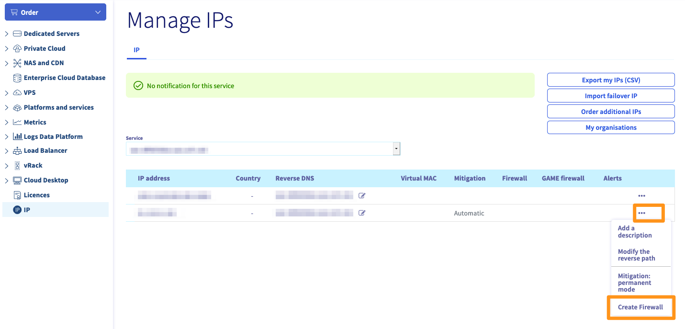

**Última atualização 03/01/2018**

## Sumário

O sistema **Anti-DDoS** (VAC) inclui a Firewall Network, uma firewall com várias opções de configuração. A Firewall Network ajuda a proteger a infraestrutura global da OVH e os servidores dos clientes, reduzindo a exposição aos ataques provenientes da rede pública.

**O presente guia explica como configurar a Firewall Network**.

> [!primary]
>
> VAC*: Para mais informações sobre o VAC, o nosso sistema de proteção contra ataques DDoS, clique em: https://www.ovh.pt/anti-ddos/
> 

{.thumbnail}

## Requisitos

- Dispor de um serviço OVH com Firewall Network incluída: [Servidor Dedicado](https://www.ovh.pt/servidores_dedicados/), [VPS](https://www.ovh.pt/vps/), [Instância Public Cloud](https://www.ovh.pt/public-cloud/instances/), [Private Cloud](https://www.ovh.pt/private-cloud/), [IP Failover](https://www.ovh.pt/servidores_dedicados/ip_failover.xml)...)
- Ter acesso à [Área de Cliente OVH](https://www.ovh.com/auth/?action=gotomanager).
- Ter conhecimentos básicos de rede.

## Instruções

### Ativar a Firewall Network

> [!primary]
>
> A Firewall Network foi concebida para proteger os IP associados a uma máquina. Cada IP deverá ser configurado de forma independente. Neste momento, não é possível fazer uma configuração simultânea dos IP do servidor.
> 

A ativação e a configuração são efetuadas manualmente a partir da Área de Cliente, secção `IP`{.action} (serviço dedicado). Primeiro, clique na roda dentada à direita do IPv4 para criar a firewall.

{.thumbnail}

- De seguida, deverá confirmar a opção.

{.thumbnail}

- Clique novamente na roda dentada para `Ativar a Firewall`{.action}  `e Configurar a Firewall`{.action}.

{.thumbnail}

Pode definir até **20 regras para cada IP**.

> [!warning]
>
> A Firewall é ativada automaticamente sempre que houver um ataque DDoS, só podendo ser desativada depois de o ataque ter terminado. Por isso, é necessário manter as definições da firewall sempre atualizadas. Inicialmente, o serviço não tem qualquer regra definida. Logo todas as ligações são permitidas. Se tiver regras definidas, estas deverão ser verificadas com regularidade, mesmo que a firewall esteja desativada.
> 

> [!primary]
>
> - O serviço vem com a UDP fragmentation bloqueada (DROP). Após a ativação da Firewall Network, e se usar uma VPN, deverá configurar corretamente a maximum transmission unit (MTU). Por exemplo, em Open VPN, pode selecionar `MTU test`{.action}.
> - A Firewall Network não produz efeitos dentro da rede OVH. Ou seja, as regras implementadas não irão afetar as ligações dentro da rede OVH.
>

### Configurar a Firewall Network

Para criar uma regra deverá clicar em `Adicionar regra`{.action}:

{.thumbnail}

Para cada regra deverá selecionar:

- o nível prioridade (de 0 a 19: quanto mais baixo o valor, maior o nível de prioridade de uma regra relativamente às outras);
- uma ação (`Autorizar`{.action} ou `Recusar`{.action});
- o protocolo;
- um IP (opcional);
- a porta de origem (apenas TCP);
- a porta de destino (apenas TCP);
- as opções TCP (apenas TCP);

{.thumbnail}

> [!primary]
>
> - Prioridade 0: é aconselhável autorizar o protocolo TCP para todos os IP com uma opção `established`{.action}. A opção `established`{.action} permite verificar se o pacote faz parte de uma sessão já iniciada. Se não der autorização, o servidor não irá receber as respostas do protocolo TCP aos pedidos de ligação (requests) SYN/ACK.
> - Prioridade 19: se não tiver sido definida nenhuma regra com prioridade inferior a 19 (a última possível), os protocolos para IPv4 serão todos recusados.
> 

### Exemplo de configuração

Para garantir que só ficarão abertas as portas SSH (22), HTTP (80), HTTPS (443), UDP (na porta 10 000) ao autorizar o ICMP, devemos seguir as seguintes regras:

{.thumbnail}

As regras são ordenadas sequencialmente de 0 (primeira regra lida) a 19 (última regra lida). A sequência de leitura é interrompida a partir do momento em que uma regra é aplicada ao pacote recebido.

Por exemplo, um pacote destinado à porta 80/TCP é identificado pela regra 2 e esta é executada. As regras seguintes não já não serão acionadas. Um pacote destinado à porta 25/TCP só poderá ser identificado pela última regra (19), e será bloqueado. Nas regras precedentes, a OVH não autoriza qualquer comunicação na porta 25.

> [!warning]
>
> Em caso de ativação da mitigação Anti-DDoS, as regras da Firewall Network serão ativadas, mesmo tendo sido desativadas anteriormente. Se optar  pela desativação, não se esqueça de eliminar as regras.
> 

## Para saber mais

Fale com a nossa comunidade de utilizadores: <https://community.ovh.com/en/>.