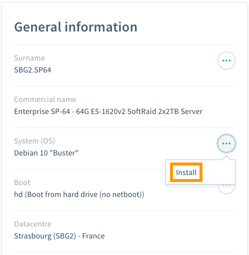
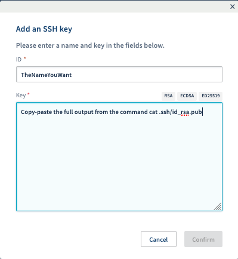

**Letzte Aktualisierung am 2 April 2020**

> [!primary]
> Diese Übersetzung wurde durch unseren Partner SYSTRAN automatisch erstellt. In manchen Fällen können ungenaue Formulierungen verwendet worden sein, z.B. bei der Beschriftung von Schaltflächen oder technischen Details. Bitte ziehen Sie beim geringsten Zweifel die englische oder französische Fassung der Anleitung zu Rate. Möchten Sie mithelfen, diese Übersetzung zu verbessern? Dann nutzen Sie dazu bitte den Button «Mitmachen» auf dieser Seite.
>

## Ziel

Ein dedizierter Server ist ein physischer Server in einem unserer Rechenzentren. Im Gegensatz zu Webhosting-Lösungen (die als "Shared Hosting" bezeichnet werden), die technisch von OVHcloud verwaltet werden, sind Sie vollständig für die Administration Ihres Dedicated Servers verantwortlich.

**Hier erfahren Sie, wie Sie Ihren neuen Dedicated Server verwalten.**

<iframe width="560" height="315" src="https://www.youtube.com/embed/I2G6TkKg0gQ" frameborder="0" allow="accelerometer; autoplay; encrypted-media; gyroscope; picture-in-picture" allowfullscreen></iframe>

> [!warning]
>
> OVHcloud stellt Ihnen Dienste zur Verfügung, für die Sie die alleinige Verantwortung tragen. Da wir keinen Zugriff auf diese Maschinen haben, können wir hierfür keinerlei Administrator-Aufgaben übernehmen oder sonstige Hilfeleistung anbieten. Es liegt daher in Ihrer Verantwortung, das Softwaremanagement und die tägliche Sicherheit zu gewährleisten.
>
> Wir stellen Ihnen diese Anleitung zur Verfügung, um Ihnen bei der Bewältigung alltäglicher Verwaltungsaufgaben zu helfen. Wir empfehlen Ihnen jedoch, sich an einen spezialisierten Dienstleister zu wenden, wenn Sie Schwierigkeiten oder Zweifel hinsichtlich der Verwaltung, Nutzung oder Sicherheit eines Servers haben. Genauere Informationen finden Sie im Teil „Weiterführende Informationen" dieser Anleitung.
>

## Voraussetzungen

- Sie verfügen über einen [dedizierten Server](https://www.ovhcloud.com/de/bare-metal/){.external}.
- Sie sind via SSH (Root-Zugang) unter Linux oder als Administrator unter Windows eingeloggt.
- Sie sind in Ihrem [OVHcloud Kundencenter](https://www.ovh.com/auth/?action=gotomanager) angemeldet.

## In der praktischen Anwendung

Wenn Ihr dedizierter Server zum ersten Mal konfiguriert ist, können Sie das zu installierende Betriebssystem auswählen.

### Ihren dedizierten Server installieren oder reinstallieren

Sie können Ihren Server einfach reinstallieren und ein anderes Betriebssystem-Modell in Ihrem OVHcloud Kundencenter [auswählen](https://www.ovh.com/auth/?action=gotomanager). Klicken Sie im Tab `Allgemeine`{.action} Informationen auf `...`{.action} neben `System (OS)` und danach auf `Installieren`{.action}.

{.thumbnail}

Wählen Sie im folgenden Fenster `Mithilfe eines OVH Template`{.action} (zur Verwendung eines unserer Installationsmodelle) oder `Installation einer Ihrer Vorlagen`{.action} (zur Verwendung Ihres Templates) aus und klicken Sie dann auf `Weiter`{.action}.

{.thumbnail}

Wählen Sie das zu installierende Betriebssystem aus und klicken Sie auf `Weiter`{.action}.

{.thumbnail}

Wenn Sie das Partitionsschema Ihres Betriebssystems ändern müssen, setzen Sie einen Haken in dem Feld "Konfiguration der Partitionen anpassen" und klicken Sie dann auf `Weiter`{.action}.

{.thumbnail}

Klicken Sie nach Abschluss der Anpassungen auf `Weiter`{.action}, um zur Zusammenfassung zu gelangen.

### Hinzufügen eines SSH-Schlüssels (optional)

Wenn Sie ein Linux-Betriebssystem installieren, können Sie Ihren SSH-Schlüssel im letzten Schritt des Installationsprozesses hinzufügen.

{.thumbnail}

Wenn ein SSH-Schlüssel bereits gespeichert ist, erscheint er unten im Drop-down-`Menü unter SSH`-Schlüsseln. Falls nicht, fügen Sie zuerst einen Eintrag in den Bereich "Meine Dienstleistungen" ein.

Öffnen Sie hierzu die Seitenleiste, indem Sie oben rechts auf Ihren Namen klicken und die Shortcut Produkte `und Dienstleistungen verwenden`{.action}.

{.thumbnail}

Gehen Sie in "Meine Dienste"auf den Tab `SSH`{.action}-Schlüssel und klicken Sie auf `SSH-Schlüssel hinzufügen`{.action}.

{.thumbnail}

Da Sie einen Dedicated Server (oder einen VPS) installieren möchten, wählen Sie im Drop-down-Menü "Dedicated"aus.

Geben Sie im neuen Fenster eine ID (Name Ihrer Wahl) und den Schlüssel selbst (vom Typ RSA, ECDSA oder Ed25519) in die entsprechenden Felder ein.

{.thumbnail}

Weitere Informationen zur Erstellung von SSH-Schlüsseln finden Sie in [dieser Anleitung](https://docs.ovh.com/de/public-cloud/create-ssh-keys/).


> [!primary]
>
> Einige Betriebssysteme oder Plattformen wie Plesk und Windows benötigen vor der Installation eine Lizenz. Sie können diese [Lizenz bei OVHcloud](https://www.ovhcloud.com/de/bare-metal/os/) oder einem Reseller kaufen. Anschließend müssen Sie es manuell über das Betriebssystem selbst oder über Ihr [OVHcloud Kundencenter integrieren](https://www.ovh.com/auth/?action=gotomanager). Sie können Ihre Lizenzen im Konfigurationspanel der Rubrik `Bare Metal Cloud unter `{.action}Lizenzen verwalten` `{.action}. In diesem Bereich können Sie auch Lizenzen bestellen (über den Button `Bestellen`{.action} links) oder Ihre eigene SQL oder Windows SPLA Server Lizenz hinzufügen (über `den Button SPLA`{.action} Lizenz links hinzufügen).
>

### Verbindung zu Ihrem Server

#### Linux

Sobald die Installation abgeschlossen ist, erhalten Sie eine E-Mail mit Ihrem Passwort für den Root-Zugriff. Mit Root-Zugriff können Sie sich über SSH, einem gesicherten Kommunikationsprotokoll, mit Ihrem Server verbinden. Sie können auf Ihren Server über ein Kommandoterminal (Linux oder MAC) oder über ein Drittpartei-Programm unter Windows zugreifen (zum Beispiel: PuTTy).

Geben Sie nach dem Öffnen des Terminals folgenden Befehl ein, um sich mit Ihrem Server zu verbinden, indem Sie den Text hinter dem @-Zeichen durch die erforderlichen Angaben (IP-Adresse oder Serverreferenzname) ersetzen. Der Referenzname Ihres Servers beginnt immer mit *ns*.

**Beispiel unter Verwendung einer IP-Adresse**

```sh
ssh root@IPv4_Ihres_Servers
```

**Beispiel mit Serverreferenz**

```sh
ssh root@Referenzname_Ihres_Servers
```

#### Windows

Sobald die Installation abgeschlossen ist, erhalten Sie eine E-Mail mit Ihrem Passwort für den Administrator-Zugang (Root). Verwenden Sie diese Login-Daten, um sich via RDP (**R**emote **D**esktop **P**rotocol) mit dem Server zu verbinden. Wenn Sie eingeloggt sind, wird Windows Sie während der gesamten Erstinstallation unterstützen.


### Absicherung Ihres Dedicated Servers

Wie im Abschnitt „Einleitung“ dieser Anleitung erläutert, sind Sie der Administrator Ihres dedizierten Servers. Dadurch sind Sie allein für Ihre Daten und die Sicherheit Ihrer Maschine verantwortlich. Folgende Tipps helfen Ihnen dabei, Ihren Server zu sichern:

* Halten Sie Ihr Betriebssystem immer auf dem neuesten Stand.
* Halten Sie Ihre Software auf dem neuesten Stand.
* Ändern Sie Ihren Standard-SSH-Port (Port 22) und wählen Sie einen anderen Port.
* Ändern Sie Ihr Root-Passwort.
* Erstellen Sie einen neuen Systembenutzer mit eingeschränktem Zugriff für die tägliche Nutzung.

Weitere Informationen finden Sie in unserer zugehörigen [Anleitung](../dedizierten-server-sichern/){.external}.

### Netzwerkkonfiguration

#### IP-Bridge-Modus

Der Bridge-Modus wird von Unternehmen verwendet, um ein globales Netzwerk aus zwei oder mehr Kommunikationsnetzwerken, bzw. zwei oder mehr Netzwerksegmenten zu erstellen. Der Bridge Modus unterscheidet sich vom Routing, das es Netzwerken erlaubt, unabhängig zu kommunizieren, während sie voneinander getrennt bleiben.

Diese Konfiguration wird vor allem in der Virtualisierung verwendet, damit jede virtuelle Maschine über eine eigene öffentliche IP-Adresse verfügt.

Weitere Informationen finden Sie in unserer Anleitung: [IP Bridge Modus](https://docs.ovh.com/gb/en/dedicated/network-bridging/){.external}.

#### IP Alias Modus

Im IP-Alias-Modus werden zwei oder mehr IP-Adressen mit demselben Netzwerkinterface verknüpft. So kann Ihr Server mehrere Verbindungen zu einem Netzwerk herstellen, die jeweils einen anderen Zweck erfüllen.

Detaillierte Anweisungen zur Konfiguration des IP-Alias finden Sie in der Anleitung [IP-Adresse als Alias konfigurieren](../network-ipaliasing).

#### IPv6 Konfiguration

Alle OVHcloud Dedicated Server beinhalten einen /64 IPv6 Block. Um die Adressen dieses Blocks zu verwenden müssen Sie die Netzwerkkonfiguration ändern. Lesen Sie unsere Anleitung: [IPv6 auf einem dedizierten Server konfigurieren](../netzwerk-ipv6/).


### Fehlerdiagnose

OVHcloud stellt alle Dedicated Server mit einer IPMI-Konsole (Intelligent Platform Management Interface) ein, die in Ihrem Browser oder über ein Java-Applet ausgeführt wird. Sie können sich direkt mit Ihrem Server verbinden, auch wenn dieser über keine Netzwerkverbindung verfügt. So können die Probleme, die zur Trennung Ihres Servers geführt haben, gelöst werden.

Weitere Informationen finden Sie in unserer Anleitung: [Verwendung der IPMI-Konsole für Dedicated Server](../verwendung-ipmi-dedicated-server/).

### Rescue-Modus

Bei Problemen mit Ihrem Server besteht der erste Schritt der Fehlerbehebung darin, Ihren Server im Rescue-Modus neu zu starten. Um den Rescue-Modus zu aktivieren, loggen Sie sich [in Ihrem OVHcloud Kundencenter ein](https://www.ovh.com/auth/?action=gotomanager) und greifen Sie auf die Seite Ihres Servers zu. Klicken Sie im `Menü` Allgemeine Informationen auf `...`{.action} und dann auf `Ändern`{.action}, um den Startmodus zu ändern.

{.thumbnail}

Wählen Sie im folgenden Fenster `Im Rescue-Modus booten`{.action} und in der Drop-down-Liste `rescue64-pro`{.action} aus. Geben Sie Ihre E-Mail-Adresse im Textfeld ein und klicken Sie dann auf `Weiter`{.action}. Wenn Sie das Feld der E-Mail leer lassen, wird standardmäßig die E-Mail-Adresse Ihres OVHcloud-Accounts verwendet.

{.thumbnail}

Bestätigen Sie im nächsten Fenster die von Ihnen gewählten Optionen und starten Sie Ihren Server neu, um die Änderungen anzuwenden.

{.thumbnail}

Ihr Server wird nun im Rescue-Modus neu gestartet und Sie erhalten die Login-Daten, um sich über die von Ihnen angegebene E-Mail-Adresse einzuloggen. Um den Rescue-Modus zu verlassen genügt es, den Netboot-Modus erneut zu ändern, um diesen auf `Auf der Festplatte booten`{.action} zu lassen und Ihren Server anschließend neu zu starten.

Mehr Informationen zur Verwendung des Rescue-Modus zur Lösung von Problemen mit Ihrem Server finden Sie in unserer Anleitung zum [Rescue-Modus](../ovh-rescue/).


#### Hardwarediagnose

Im Rescue-Modus verfügbare Hardwaretests können Ihnen helfen, Hardwarefehler zu diagnostizieren, die Probleme auf Ihrem Server verursachen können.

Nachdem Sie sich im Webinterface des Rescue-Modus eingeloggt haben, können Sie folgende Hardwarekomponenten testen:

* RAM
* Festplatten
* Baie RAID
* Prozessor
* Netzwerkanbindung

#### Webinterface des Rescue-Modus

{.thumbnail}

## Weiterführende Informationen

Für den Austausch mit unserer User Community gehen Sie auf <https://community.ovh.com/en/>.
