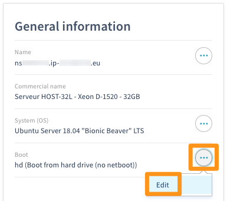

**Päivitetty 27.8.2018**

## Tavoite

Dedikoitu palvelin on fyysinen palvelin, joka sijaitsee jossakin konesaleistamme. Toisin kuin niin kutsuissa “jaetuissa” webhotellipalveluissa, jotka ovat teknisesti OVH:n hallinnoimia, sinä olet täysin vastuussa dedikoidun palvelimesi hallinnoinnista.

**Katso, kuinka dedikoidun palvelimen käyttö aloitetaan.**

> [!warning] 
>
> OVH tarjoaa käyttöösi palveluja, jotka ovat sinun vastuullasi. Koska meillä ei ole minkäänlaisia käyttöoikeuksia koneisiin, emme ole niiden administraattoreja emmekä voi avustaa niiden käytössä. Siksi sinun tehtävänäsi on varmistaa ohjelmistojen hallinta sekä suojaus päivittäin.
> 
> Tämän ohjeen tarkoituksena on auttaa sinua yleisimmissä tehtävissä. Suosittelemme kuitenkin ottamaan yhteyttä erikoistuneeseen palveluntarjoajaan, mikäli sinulla on vaikeuksia tai epäselvyyksiä palvelimen hallintaan, käyttöön tai suojaamiseen liittyen. Lisätietoa tämän ohjeen kohdasta “Lisää aiheesta”.
>


## Edellytykset

* Sinulla on [dedikoitu palvelin](https://www.ovh-hosting.fi/dedikoidut_palvelimet/){.external}, joka on näkyvissä [hallintapaneelisi](https://www.ovh.com/auth/?action=gotomanager){.external} osion `Dedikoidut`{.action} kohdassa `Dedikoidut palvelimet`{.action}.


## Käytännössä

### Kirjautuminen palvelimellesi

#### Linuxilla

Kun dedikoitu palvelimesi on konfiguroitu ensimmäisen kerran, saat salasanasi ja pääkäyttäjätunnuksesi sisältävän sähköpostiviestin. Pääkäyttäjän tunnuksella voit kirjautua palvelimellesi SSH-yhteydellä, joka on suojattu tiedonsiirtoprotokolla. Voit myös kirjautua palvelimellesi komentopäätteen kautta (Linux tai Mac) tai kolmannen osapuolen Windows-sovelluksen kautta (esimerkiksi PuTTy).

Kun pääte on avoinna, naputtele palvelimelle kirjautumista varten seuraava komento korvaamalla teksti @-symbolin jälkeen tarvittavilla tiedoilla (IP-osoite, palvelimen viitteen nimi). Palvelimesi viitteen nimi on aina **ns**-alkuinen.

- Esimerkki IP-osoitetta käyttäen:

```sh
ssh root@palvelimesi_IPv4
```

- Esimerkki käyttäen palvelimesi viitettä:

```sh
ssh root@palvelimesi_viitteen_nimi
```

#### Windows-käyttöjärjestelmässä

Kun dedikoitu palvelimesi on konfiguroitu ensimmäisen kerran, saat salasanasi ja käyttäjätunnuksesi sisältävän sähköpostiviestin pääkäyttäjän yhteyttä varten. Käytä näitä tunnuksia kirjautuaksesi palvelimelle RDP-protokollalla (*Remote Desktop Protocol*). Kun olet kirjautunut, Windows ohjaa sinut aloituskonfiguraatioon.

### Dedikoidun palvelimen asennus tai uudelleenasennus

Mene [hallintapaneelissa](https://www.ovh.com/auth/?action=gotomanager){.external} palvelimesi sivulle ja valitse siellä `Yleiset tiedot`, klikkaa kohtaa `...`{.action} ja sitten `Uudelleenasenna`{.action} osiossa `Järjestelmä (OS)`.

{.thumbnail}

Valitse seuraavalla näytöllä `Asenna OVH:n mallipohjasta`{.action} (käyttääksesi jotain asennusmalleistamme) tai `Asenna oma mallipohja`{.action} (omaa mallipohjaa käyttääksesi) ja klikkaa sitten `Seuraava`{.action}.

{.thumbnail}

Valitse käyttöjärjestelmä, jonka haluat asentaa ja klikkaa sitten `Seuraava`{.action}.

{.thumbnail}

Seuraa loput ohjeet kuvaruudulta ja klikkaa sitten `Vahvista`{.action} asennuksen jatkamiseksi.


> [!primary]
>
> Tietyt käyttöjärjestelmät tai alustat, kuten Plesk tai Windows, edellyttävät lisenssin ostoa ennen niiden asennusta. Voit hankkia sellaisen OVH:n kautta [hallintapaneelisi](https://www.ovh.com/auth/?action=gotomanager){.external} osiosta `Dedikoidut`{.action} ja sitten `Lisenssit`{.action} tai jälleenmyyjältä. Tämän jälkeen on sisällytettävä se käsin joko käyttöjärjestelmän itsensä kautta tai [hallintapaneelisi](https://www.ovh.com/auth/?action=gotomanager){.external} kautta. 
> 


### Dedikoidun palvelimen suojaaminen

Kuten tämän ohjeen “Tavoitteet”-osiossa selitettiin, olet dedikoidun palvelimesi administraattori. Tästä syystä olet vastuussa tiedostasi sekä koneesi tietoturvasta. Seuraavat vinkit auttavat kuitenkin palvelimen suojaamisessa:

* pidä käyttöjärjestelmäsi ajan tasalla
* pidä ohjelmistosi ajan tasalla
* vaihda oletuksena oleva SSH-porttisi (portti 22) joksikin muuksi
* vaihda pääkäyttäjäsi salasana
* luo päivittäistä käyttöä varten uusi käyttäjä rajoitetuin käyttöoikeuksin.

Lisätietoa [ohjeessa](https://docs.ovh.com/fi/dedicated/dedikoidun-palvelimen-suojaaminen){.external}.


### Verkon konfigurointi

#### Bridge-IP-tila

Bridge-IP-tila on laitteen tekemä toimenpide globaalin verkon luomiseksi kahdesta tai useammasta verkosta tai kahdesta tai useammasta verkon segmentistä.

Kyseessä on konfiguraatio, jota käytetään useimmiten virtualisoinnissa, jotta jokaiselle virtuaalikoneelle saadaan oma julkinen IP-osoite.

Lisätietoa voit katsoa [Bridge-IP-tilaa](https://docs.ovh.com/gb/en/dedicated/network-bridging/){.external} käsittelevästä ohjeesta (EN link).

#### IP-osoitteen tila aliaksena

IP-osoitteen tila aliaksena liittää kaksi IP-osoitetta tai useampia yhteen verkkokäyttöliittymään. Tämän ansiosta palvelimesi voi luoda useita yhteyksiä verkkoon, joilla jokaisella on eri tarkoitus.

Voit lukea lisää IP-osoitteen konfiguroinnista aliaksena [tästä ohjeesta](https://docs.ovh.com/fi/dedicated/network-ipaliasing/){.external}.

#### IPv6-konfigurointi

Kaikissa OVH:n dedikoiduissa palvelimissa on /64 IPv6 -lohko. Käyttääksesi tämän lohkon osoitteita sinun on tehtävä tiettyjä muokkauksia verkon konfiguraatioon. Katso ohjetta (EN): [IPv6-konfigurointi](https://docs.ovh.com/gb/en/dedicated/network-ipv6/){.external}.


### Konfigurointipulmien ratkaiseminen IPMIllä

OVH käyttää kaikilla dedikoiduilla palvelimillaan IPMI-konsolia (Intelligent Platform Management Interface), joka toimii selaimessa tai Java-sovelmassa. Sen avulla voidaan kirjautua suoraan palvelimelle, vaikka sillä ei olisi verkkoyhteyttä. Sen avulla voidaan ratkaista ongelmia, jotka ovat voineet johtaa palvelimesi yhteyskatkoon.

Lisätietoa voit lukea ohjeesta [IPMIn käyttö dedikoiduilla palvelimilla](https://docs.ovh.com/fi/dedicated/ipmi-konsolin-kaytto-dedikoidut-palvelimet/){.external}.


### Rescue-tila

Jos palvelimellasi on ongelma, ensimmäinen askel korjauksessa on sen uudelleenkäynnistäminen rescue-tilassa. Kirjaudu sen aktivoimiseksi [hallintapaneeliisi](https://www.ovh.com/auth/?action=gotomanager){.external} ja mene palvelimesi sivulle. Mene sitten kohtaan `Palvelimen tila`{.action} ja sitten `Yleiset tiedot`{.action} ja `Uudelleenkäynnistä`{.action}. Klikkaa painiketta `Muokkaa`{.action} käynnistystilan vaihtamiseksi.

{.thumbnail}

Valitse seuraavassa näkymässä `Uudelleenkäynnistä rescue-tilassa`{.action} ja valitse sitten alasvetovalikosta `rescue64-pro`{.action}. Lisää sähköpostiosoitteesi tekstikenttään ja klikkaa Seuraava.

{.thumbnail}

Vahvista lisävalinnat seuraavassa näkymässä ja käynnistä sitten palvelimesi uudelleen muokkausten soveltamiseksi.

{.thumbnail}

Palvelimesi uudelleenkäynnistyy nyt rescue-tilassa, minkä jälkeen saat antamaasi sähköpostiosoitteeseen tunnistautumistiedot kirjautumista varten. Rescue-tilasta poistumista varten vaihda vain käynnistystilaksi Uudelleenkäynnistä kovalevyllä ja käynnistä palvelimesi sitten uudelleen.

Lisätietoa rescue-tilan käyttämisestä palvelimella kohdattujen ongelmien ratkaisussa voit lukea aihetta käsittelevästä [ohjeestamme](https://docs.ovh.com/fi/dedicated/ovh-rescue/){.external}.


#### Laitteiston (hardware) vianhaku

Rescue-tilassa saatavilla olevat laitteistotestit (hardware) voivat auttaa mahdollisesti palvelimen toimintahäiriöitä aiheuttavien fyysisten laitteistovikojen selvittämisessä.

Kun olet kirjautunut verkkokäyttöliittymään rescue-tilassa, voit suorittaa testejä seuraavissa laitteistokomponenteissa:

* RAM
* kovalevyt
* RAID-räkki
* suoritin
* verkkoyhteys.

#### Rescue-tilan verkkokäyttöliittymä

{.thumbnail}

## Lue lisää aiheesta

Viesti käyttäjäyhteisömme kanssa osoitteessa <https://community.ovh.com/en/>.
