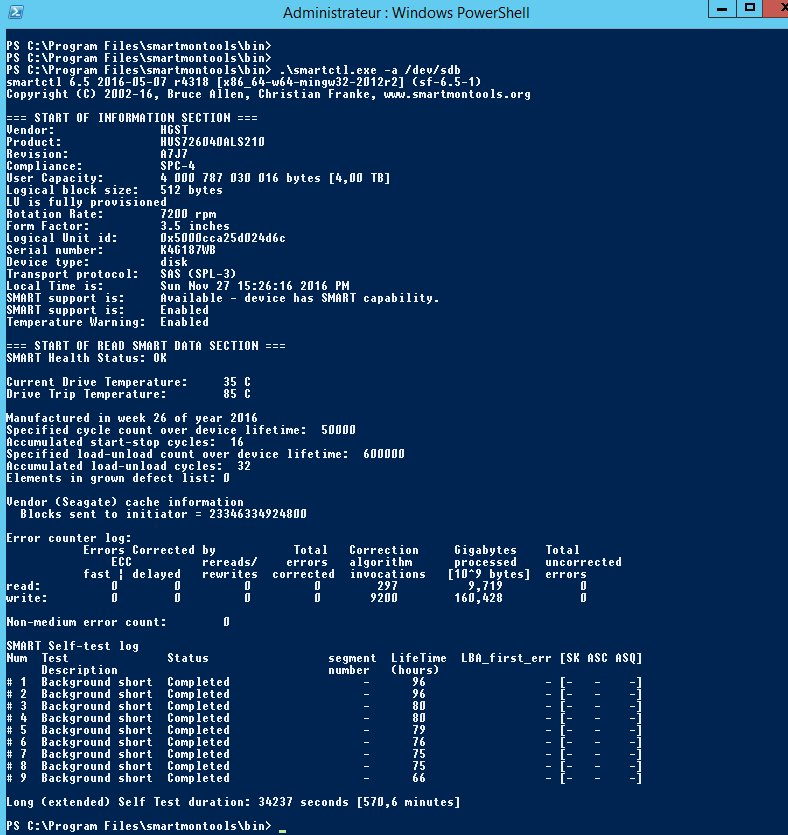

**Ultimo aggiornamento: 05/12/2018**

## Obiettivo

Per ridurre al minimo il rischio di errori durante la sostituzione di un hard disk, chiediamo ai nostri clienti di fornirci il numero di serie del disco che desiderano sostituire. Se non l’hai ancora fatto, consulta la nostra guida su [come sostituire un hard disk](https://docs.ovh.com/it/dedicated/sostituzione-disco/){.external} per comprenderne meglio la procedura.

Nella maggior parte dei casi, è possibile recuperare il numero di serie testando i tuoi hard disk uno ad uno con il tool **smartmontools**. 

**Questa guida ti mostra come recuperare il numero di serie di un hard disk per richiederne la sostituzione.**


## Prerequisiti

* Essere connesso in SSH con l’identificativo root (Linux) o con l’account amministratore (Windows)
* Sui server Windows, aver installato il programma **sas2ircu** (disponibile tramite il motore di ricerca [Broadcom](https://www.broadcom.com/support/download-search/?dk=sas2ircu){.external})


## Procedura

> [!primary]
>
> Nel caso di un disco NVMe, è necessario mettere il server in modalità [Rescue64](https://docs.ovh.com/it/dedicated/rescue_mode/){.external} e utilizzare il tool nvme-cli installato di default.
> 

### Recupera il numero di serie di un hard disk con un RAID software

Per recuperare il numero di serie del tuo hard disk configurato con un RAID software, puoi semplicemente utilizzare il comando`smartctl`:

```sh
smartctl -a /dev/sdX | grep Serial Serial Number:    XXXXXXX
```

Il dispositivo viene individuato dal sistema operativo (es.: `/dev/sda`, `/dev/sdb`, ecc...).


### Recupera il numero di serie di un disco NVMe

In questo caso è necessario usare il comando `nvme list`:

```sh
nvme list

Node          SN                  Model                Namespace  Usage                      Format   FW Rev
/dev/nvme0n1  CVPF636600YC450RGN  INTEL SSDPE2MX450G7  1          450.10 GB / 450.10 GB 512  B + 0 B  MDV10253
/dev/nvme1n1  CVPF6333002Y450RGN  INTEL SSDPE2MX450G7  1          450.10 GB / 450.10 GB 512  B + 0 B  MDV10253
```

Nella risposta puoi visualizzare i numeri di serie dei tuoi diversi dischi NVMe («nvme0» e «nvme1»).


### Recupera il numero di serie di un disco con Windows

Il procedimento da seguire per Windows è, nel complesso, simile a quello per Linux. Utilizzeremo il programma **sas2ircu** con gli stessi comandi usati per Linux.

> [!primary]
>
> È necessario eseguire il comando via terminale come amministratore per evitare errori.
> 

Per recuperare il numero di serie di una configurazione RAID software, utilizzare il seguente comando:

```sh
.\smartctl -a /dev/sdX Serial Number: 1234567890
```

Il dispositivo viene individuato dal sistema operativo e mostrato come segue: `/dev/sda`, `/dev/sdb`, ecc...

{.thumbnail}


### Recupera il numero di serie di un hard disk con un RAID hardware

Per avere un’idea più dettagliata di questi comandi e del modo per testare i tuoi hard disk, consulta questa [guida](https://docs.ovh.com/gb/en/dedicated/raid-hard/){.external} (in inglese).


#### **Controller MegaRaid**

##### **Step 1: recupera gli insiemi di RAID**

Puoi trovare i numeri di serie dei dischi utilizzando il comando `smartctl`, ma prima è necessario capire quanti insiemi RAID (o dischi virtuali) si trovano sul server.

Puoi ottenere questa informazione utilizzando il seguente comando:

```sh
MegaCli -LDInfo -Lall -aALL | egrep 'Adapter|Size' | grep -v Strip

Adapter 0

Virtual Drive Information: Size: 36.321 GB

Adapter 1

Virtual Drive Information: Size: 2.727 TB
```

In questo esempio, sono presenti due RAID configurati sul server (**Adapter 0** e **Adapter 1**), che dovrebbero essere individuati come `/dev/sda` e `/dev/sdb`.


##### **Step 2: recupera le informazioni dei dischi**

Successivamente, riunisci le informazioni sul disco fisico utilizzando il comando seguente:

```sh
 MegaCli -PDList -aAll | egrep 'Slot\ Number|Device\ Id|Inquiry\ Data|Raw|Firmware\ state' | sed 's/Slot/\nSlot/g'

Slot Number: 0
Device id: 1.4.
Raw Size: 279.460 GB [0x22eec130 Sectors]
Firmware state: Online, Spun Up
Inquiry Data: BTWL3450062J300PGN  INTEL SSDSC2BB300G4                     D2010355

Slot Number: 5.1.
Device id: 1.5.
Raw Size: 279.460 GB [0x22eec130 Sectors] 
Firmware state: Online, Spun Up 
Inquiry Data: BTWL345003X6300PGN  INTEL SSDSC2BB300G4                     D2010355

Slot Number: 1.2.
Device id: 7
Raw Size: 2.728 TB [0x15d50a3b0 Sectors] 
Firmware state: Online, Spun Up 
Inquiry Data:       PN2234P8K2PKDYHGST HUS724030ALA640                    MF8OAA70

Slot Number: 1.3. 
Device id: 6 
Raw Size: 2.728 TB [0x15d50a3b0 Sectors] 
Firmware state: Online, Spun Up 
Inquiry Data:       PN2234P8JYP59YHGST HUS724030ALA640                    MF8OAA70
```

##### **Step 3: recupera il numero di serie**

Gli ID del dispositivo e dell’adattatore saranno utilizzati per indicare a **smartctl** quale disco cercare e in quale insieme di RAID.

Il comando dovrà essere simile al seguente:

```sh
smartctl -d megaraid,N -a /dev/sdX | grep Serial Serial Number: 1234567890
```

L’ID del dispositivo RAID verrà mostrato come indicato qui di seguito: `/dev/sda` = 1° RAID, `/dev/sdb` = 2° RAID, ecc...


> [!primary]
>
> In certi casi puoi ottenere il seguente risultato:
> 
> ```
> /dev/sda [megaraid_disk_00] [SAT]: Device open changed type from 'megaraid' to 'sat'
> ```
> 
> A questo punto sostituisci `megaraid` con `sat+megaraid`:
>
> ```
> smartctl -d sat+megaraid,N -a /dev/sdX | grep Serial Serial Number:    1234567890
> ```
>

#### Recupera il numero di serie di un disco (Controller RAID LSI)

Il controller RAID LSI utilizza un modulo chiamato **sg-map**, che identifica i dispositivi come `/dev/sgX` (**X** è il numero che definisce il dispositivo).

Per capire quale hard disk corrisponde a un determinato dispositivo sg puoi fare riferimento a [questa guida](https://docs.ovh.com/gb/en/dedicated/raid-hard/){.external} (in inglese).

Una volta trovato il dispositivo sg associato all’hard disk che intendi analizzare, utilizza il seguente comando:

```sh
smartctl -a /dev/sgX | grep Serial Serial Number:    1234567890
```

Il numero del dispositivo sg sarà visualizzato come indicato qui di seguito: `/dev/sg0`, `/dev/sg1`, ecc...


## Per saperne di più

[Sostituire un disco difettoso](https://docs.ovh.com/it/dedicated/sostituzione-disco/){.external}

[Configura un RAID hardware](https://docs.ovh.com/gb/en/dedicated/raid-hard/){.external} (in inglese)

[Configura un RAID software](https://docs.ovh.com/gb/en/dedicated/raid-soft/){.external} (in inglese)

Contatta la nostra Community di utenti all’indirizzo <https://www.ovh.it/community/>.