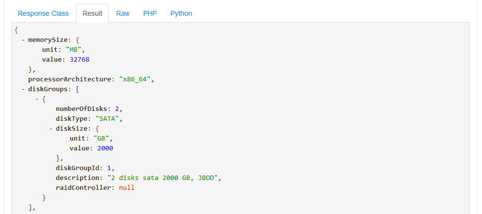

## Requirements
At OVH, you can rent servers with one SATA disk group and one SSD disk group. We call them "Hybrid servers".

To follow this guide, you need to :

- Possess an OVH Hybrid server.
- Have access to the OVH API.

> [!warning]
>
> This procedure only works for Linux systems (except ESXi, and XenServer), and only for Soft RAID, NoRAID, or Hard RAID (default only) configuration.
> 

## Step 1 &#58; Retrieve the server name
First, go to the OVH API, in the /dedicated/server section.

Then, retrieve the name of your hybrid server using the following API Call :

> [!api]
>
> @api {GET} /dedicated/server
> 

## Step 2 &#58; Retrieve the diskGroupId
The diskGroupId is what will allow us to define the disk group on which we want the operating system to be installed.

Then go to the following API call

> [!api]
>
> @api {GET} /dedicated/server/{serviceName}/specifications/hardware
> 
Enter the name of your server, and you will see the hardware information about it.

What we are interested in here is diskGroupId that you will find in diskGroup as shown in the following image :

{.thumbnail}

On a Hybrid server, SSD disks are mostly placed in second. So, the diskGroupId will be 2.

> [!primary]
>
> By default, the operating system is installed on the diskGroupId 1.
> 

## Step 3 &#58; Start the installation
Once you have the diskGroupId, you can proceed to the last step which consists in installing your operating system.

To do this, go to the following API call :

> [!api]
>
> @api {POST} /dedicated/server/{serviceName}/install/start
> 

> [!primary]
>
> The templateName is retrieved on the following API call:
> 
> > [!api]
> >
> > @api {GET} /dedicated/server/{serviceName}/install/compatibleTemplates
> > 
> 