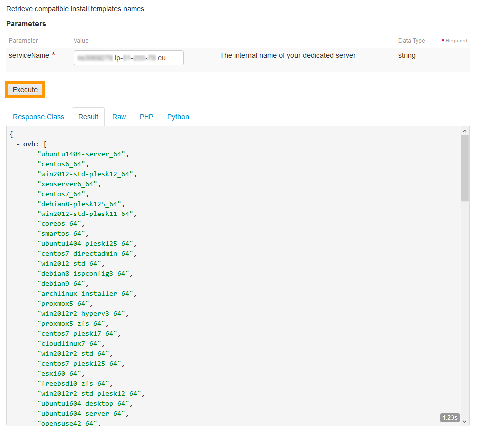

**Dernière mise à jour le 18/07/2018**

## Objectif

Chez OVH, vous pouvez louer des [serveurs dédiés](https://www.ovh.com/fr/serveurs_dedies/){.external} possédant une grappe de disques SATA et une grappe de disques SSD. Nous appelons ces types de serveurs des **serveurs hybrides**.

**Ce guide vous explique comment spécifier la grappe de disques sur laquelle installer le système d'exploitation.**

> [!warning]
> 
> OVH met à votre disposition des services dont la responsabilité vous revient. En effet, n’ayant aucun accès à ces machines, nous n’en sommes pas les administrateurs et ne pourrons vous fournir d'assistance. Il vous appartient de ce fait d’en assurer la gestion logicielle et la sécurisation au quotidien.
> 
> Nous mettons à votre disposition ce guide afin de vous accompagner au mieux sur des tâches courantes. Néanmoins, nous vous recommandons de faire appel à un prestataire spécialisé si vous éprouvez des difficultés ou des doutes concernant l’administration, l’utilisation ou la sécurisation d’un serveur. Plus d’informations dans la section « Aller plus loin » de ce guide.
>

## Prérequis

* Disposer d’un [serveur hybride OVH](https://www.ovh.com/fr/serveurs_dedies/){.external}.
* Avoir accès à l’[API OVH](https://api.ovh.com/console/){.external}.
* Être connecté à l'[espace client OVH](https://www.ovh.com/auth/?action=gotomanager){.external}.

> [!warning]
>
> Cette procédure ne fonctionne que pour les systèmes Linux (à l’exception des systèmes ESXi et XenServer) et uniquement sur des configurations en RAID Soft, NoRAID ou RAID Hard (configuration par défaut).
> 

## En pratique

### Se connecter à l'API OVH et récupérer le nom du serveur

Une fois connecté sur <https://api.ovh.com/console/>, vous pourrez récupérer le nom du serveur via l'API suivante :

> [!api]
>
> @api {GET} /dedicated/server
> 

Ensuite, récupérez le nom de votre serveur hybride en cliquant sur `Execute`{.action}:

{.thumbnail}

### Récupérer le DiskGroupId

Le `DiskGroupId` est l'élément qui vous permettra de définir la grappe de disques sur laquelle l'installation du système d'exploitation sera effectuée. 

Voici l'appel API à réaliser pour cela :

> [!api]
>
> @api {GET} /dedicated/server/{serviceName}/specifications/hardware
> 

Entrez le nom de votre serveur récupéré précédemment dans le champ **serviceName**, puis cliquez sur le bouton `Execute`{.action}. Vous verrez alors les informations sur le matériel de votre serveur, comme indiqué ci-dessous :

{.thumbnail}

Ce qui nous intéresse ici, c'est `diskGroupId`, que vous trouverez dans `diskGroups`.

Sur un serveur hybride, les disques SSD sont généralement placés en deuxième position. `DiskGroupId` sera donc 2.

> [!primary]
>
> Par défaut, le système d’exploitation est installé sur le `diskGroupId` 1.
> 

### Lancer l'installation du système d'exploitation

Une fois le `diskGroupId` en votre possession, vous pouvez passer à la dernière étape qui consiste à installer votre système d’exploitation.

Pour cela, effectuez l’appel d’API suivant pour récupérer la liste des systèmes d’exploitation compatibles :

> [!api]
>
> @api {GET} /dedicated/server/{serviceName}/install/compatibleTemplates
> 

{.thumbnail}

Notez le nom du modèle correspondant au système d'exploitation que vous avez choisi, puis passez à l'appel API suivant :

> [!api]
>
> @api {POST} /dedicated/server/{serviceName}/install/start
> 

Entrez la référence de votre serveur dans le champ **serviceName**, entrez « diskGroupId » (2) dans le champ **diskGroupId**, puis entrez le nom du modèle dans le champ **templateName** (tous les autres champs sont facultatifs).

Après avoir spécifié toutes vos options, cliquez sur le bouton `Execute`{.action} :

{.thumbnail}

Votre système d'exploitation va maintenant être installé. Vous pouvez vérifier la progression cette installation en actualisant la page de votre serveur dans l’[espace client OVH](https://www.ovh.com/auth/?action=gotomanager){.external} ou en effectuant l'appel API suivant, en saisissant les références de votre serveur dans le champ **serviceName**, puis en cliquant sur le bouton `Execute`{.action}:

> [!api]
>
> @api {GET} /dedicated/server/{serviceName}/install/status
> 

## Aller plus loin

Échangez avec notre communauté d'utilisateurs sur <https://community.ovh.com/>.