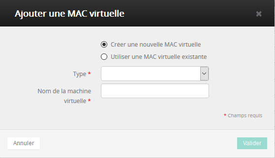

## Requirements
To assign a virtual MAC to a Failover IP, you must:

- Have a dedicated server.
- Have a Failover IP address, or a Failover IP block (RIPE).
- Access to the Customer area.

## Assign a MAC address
To assign a Virtual MAC address to a Failover IP, you first need to connect to your customer area.

Once connected, go to the section `IP`{.action}.

Then select the server concerned so that the Failover IP, or IP block, attached to it will appear.

- For a Failover IP :

{.thumbnail}

- For a Failover IP block :

{.thumbnail}

> [!primary]
>
> A down arrow symbol is present for an IP block, click on it to display each IP address of the block. This will be necessary to assign a virtual MAC address for each IP of the block.
> 

Next, click the gear on the right, then select `Add Virtual MAC`{.action}.

{.thumbnail}

**Type** : Corresponds to the virtual MAC address type (VmWare will be a MAC address made for the VmWare ESXi system, and OVH will be for any other type of virtualization system). **Nom de la machine virtuelle** : Corresponds to the desired name for the virtual MAC address, in order to find this IP/MAC pair more easily.

> [!primary]
>
> Do not forget to assign the virtual MAC address created in your virtual machine configuration.
> 

## Delete a MAC address

> [!warning]
>
> When a MAC address is deleted, it will not be recoverable.
> 

To remove a Virtual MAC address associated with a Failover IP, you must first connect to your client area.

Once connected, go to the section `IP`{.action}.

Then select the server concerned so that the Failover IP, or IP block, attached to it will appear.

Finally, click on the gear on the right, then select `Delete a Virtual MAC`{.action}.